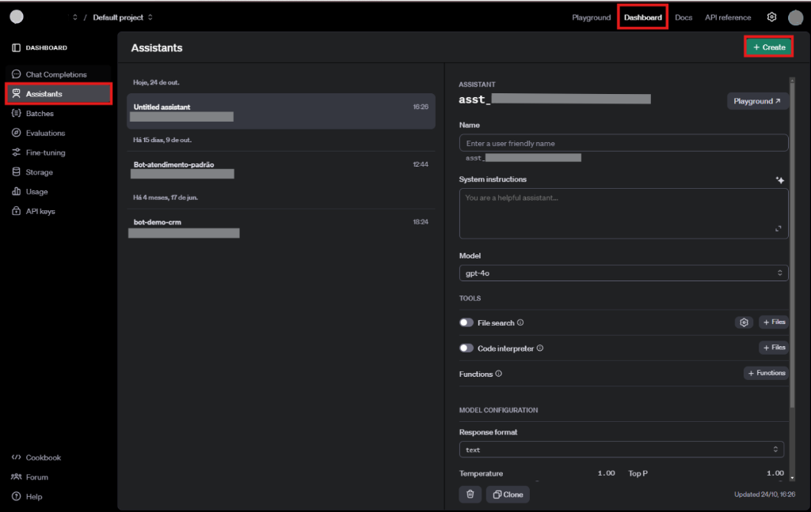
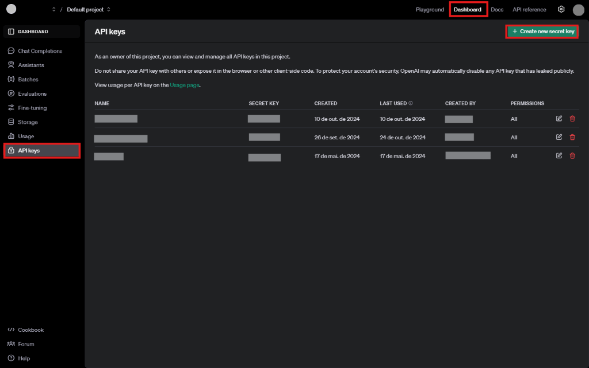

# 1. Criar um assistente

Neste primeiro passo vamos criar juntos um agente IA e configurar as primeiras etapas da integração com o assistente no N8N.

Antes de tudo vamos criar nosso assistente IA, configurar o modelo e criar uma chave de API.

## Como criar uma conta na OpenAI

1. **Acesse o site da OpenAI** ([https://platform.openai.com](https://platform.openai.com)) no seu navegador.
2. **Inicie o cadastro**: clique no botão "Sign Up" ou "Registrar-se" no canto superior direito da página.
3. **Preencha suas informações**: insira seu endereço de e-mail ou, se preferir, faça login diretamente com uma conta Google ou Microsoft. Em seguida crie uma senha.
4. **Verificação de e-mail**: após fornecer suas informações e criar uma conta, você receberá um e-mail de verificação. Acesse sua caixa de entrada e clique no link de verificação enviado pela OpenAI.
5. **Preencha seus dados pessoais**: pode ser solicitado o fornecimento de informações como seu nome e telefone para verificação.
6. **Escolha um plano**: a OpenAI oferece tanto uma versão gratuita quanto planos pagos com mais recursos. Escolha o que melhor se adequa às suas necessidades.

## Como criar um projeto dentro da OpenAI

Após criar sua conta na OpenAI, será possível acessar o painel onde você poderá criar o seu assistente.

1. No painel, clique em "**Dashboard**".
2. Depois, clique em "**Assistants**".
3. Clique em "**Create**".

4. Ao clicar em "Create", será aberta a tela acima onde você poderá dar um nome ao seu assistente no campo "**Name**".
5. No campo "**System instruction**", você deverá definir como o assistente deve se comportar. Exemplo:
   > Você deve se comportar como um corretor de imóveis. Pergunte ao cliente sobre o tipo de imóvel, localização desejada, número de quartos, banheiros, vagas de garagem e faixa de preço. Responda perguntas frequentes de forma rápida e objetiva. Transfira para o atendimento humano se a informação disponível não for suficiente.
6. Defina o modelo no campo "**Model**" — recomendamos o `gpt-4o-mini` por ser um modelo completo e mais rápido que outros.
7. Em seguida, é possível definir configurações adicionais como "**File search**" que permite que o assistente tenha conhecimento dos arquivos que você ou seus usuários carregam. Depois que um arquivo é carregado, o assistente decide automaticamente quando recuperar o conteúdo com base nas solicitações do usuário e, também, o "**Code Interpreter**" que permite que o assistente escreva e execute códigos.
8. Configure o "**Response Format**" para "**Text**".
9. Deixe os campos "**Temperature**" e "**Top P**" default, no futuro ajuste para que a resposta seja mais adequada ao tom que você deseja que o assistente responda.

## Como criar uma chave de API

1. No menu lateral, clique em "**API Keys**".
2. Na página de "API Keys", clique no botão "**Create new secret key**", como demonstra a imagem abaixo:

3. Um pop-up aparecerá mostrando sua nova chave de API. **Copie a chave imediatamente**, pois você não poderá visualizá-la novamente.
4. Essa chave será usada para autenticar suas solicitações ao utilizar a API da OpenAI.
5. Se precisar, você pode revogar ou criar novas chaves a partir dessa mesma tela a qualquer momento.

::: warning Atenção
Lembre-se de que a chave de API é privada e você não deve compartilhá-la publicamente, pois ela dá acesso à sua conta e aos seus créditos da OpenAI.
:::
