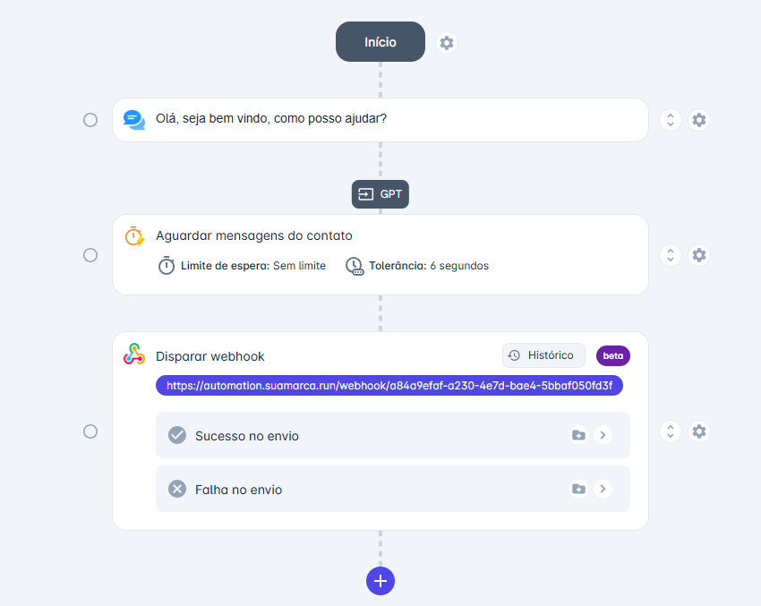
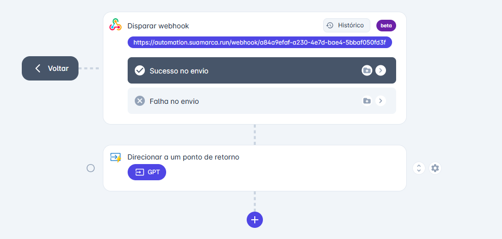
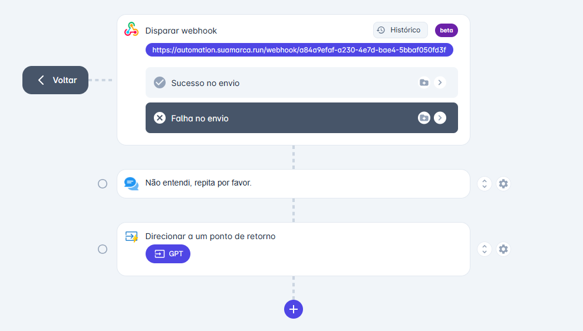

# 2. Criar o loop no chatbot

Entenda como criar o modelo de chatbot e configurar o loop de modo que as mensagens enviadas não se percam e sejam sempre processadas por seu assistente.

## Como criar o modelo do chatbot

Dentro da plataforma faça login com o usuário administrador e siga os passos abaixo para criar o modelo do chatbot que será integrado à IA.

1. No menu de opções clique em **Apps > Chatbot > Novo**.
2. Dê um nome ao seu chatbot e o associe a um tipo de canal (Z-API ou WhatsApp oficial). Defina a equipe padrão desse chatbot.
3. Crie um nó de mensagem receptiva. Exemplo: `Olá, boas-vindas! Como posso ajudar?`
4. Em seguida, configure uma ação que aguarde resposta do contato com as opções: "**Limite de espera: Sem limite**" e "**Tolerância: 5 segundos**".
5. Acima do nó de "Aguardar resposta do contato" é necessário criar um ponto de retorno. **Atenção: sem este ponto de retorno o loop não irá funcionar.**
6. Em seguida, é preciso configurar o disparo webhook que enviará as informações do atendimento.
7. No campo URL copie a URL do webhook que deverá ser criado no N8N e cole no campo "URL". Clique em "Atualizar" para salvar as configurações.

## Como criar os loops

Dentro do subfluxo de "**Sucesso**" crie uma ação que redireciona para o ponto de retorno "**GPT**", como mostra a imagem abaixo.

Assim, o loop estará configurado de modo que sempre que o contato enviar uma mensagem a mesma voltará ao ponto de retorno configurado e será disparada via webhook criando o loop.

No subfluxo de "**Falha no envio**" adicione uma mensagem de modo que o contato seja informado que a mensagem dele falhou ou não foi compreendida, logo após adicione outro ponto de retorno "**GPT**", assim como no fluxo de "Sucesso no envio".

Após seguir os passos acima, salve seu chatbot, publique e o associe ao canal em que os clientes entrarão em contato e serão respondidos por seu assistente.
