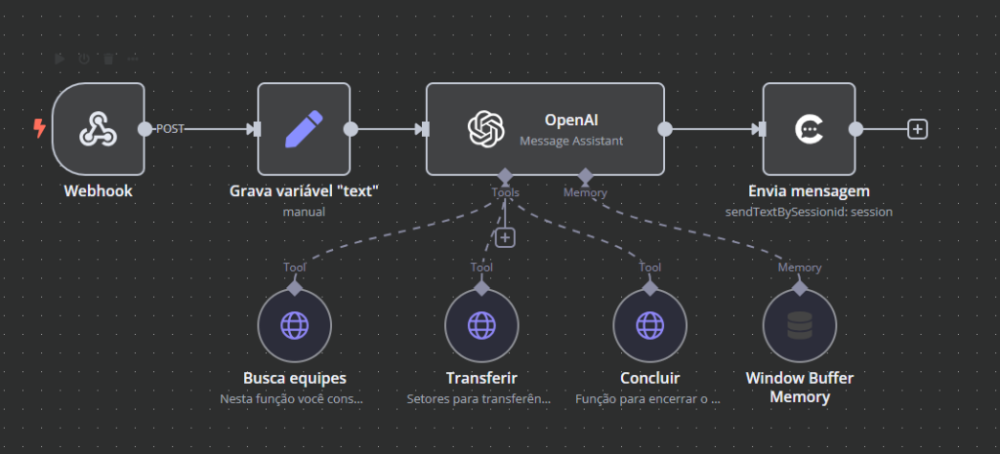
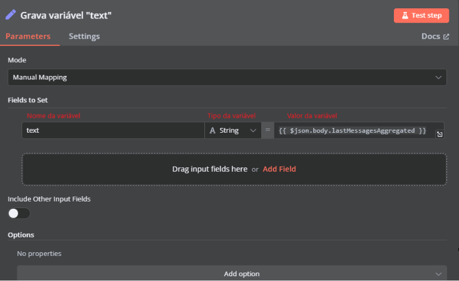
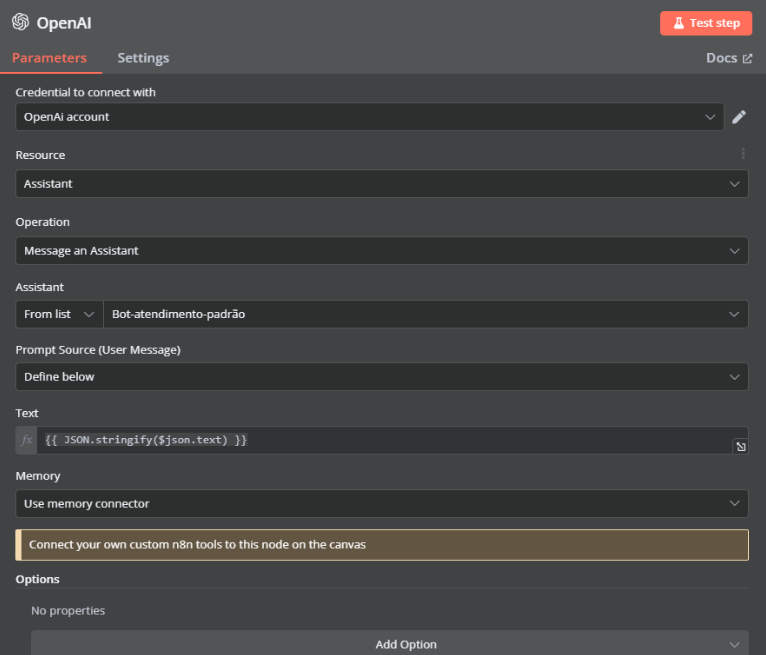
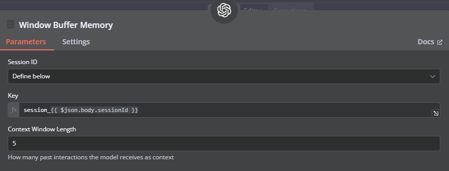
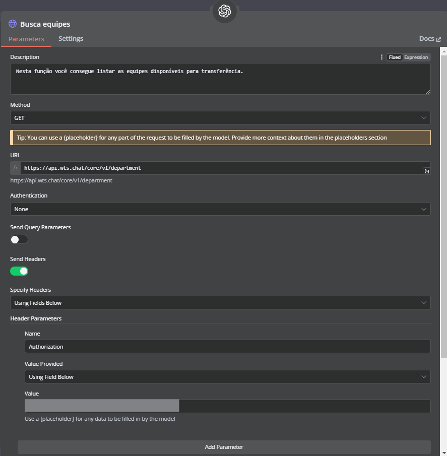
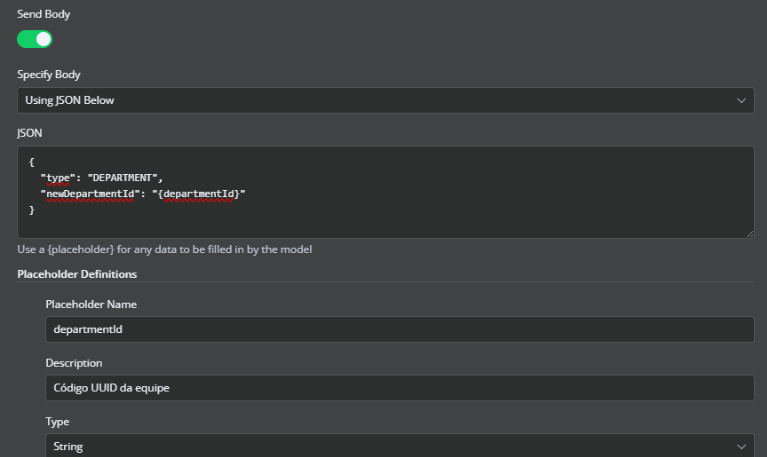
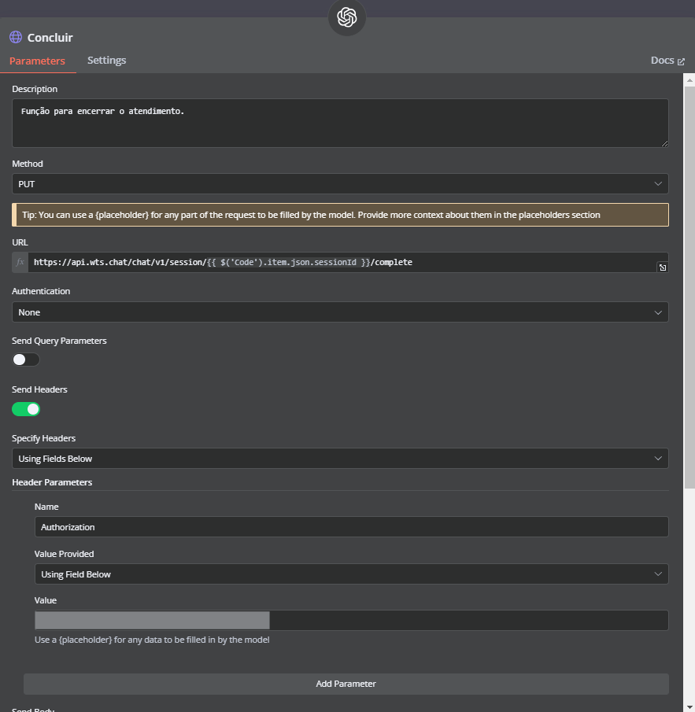
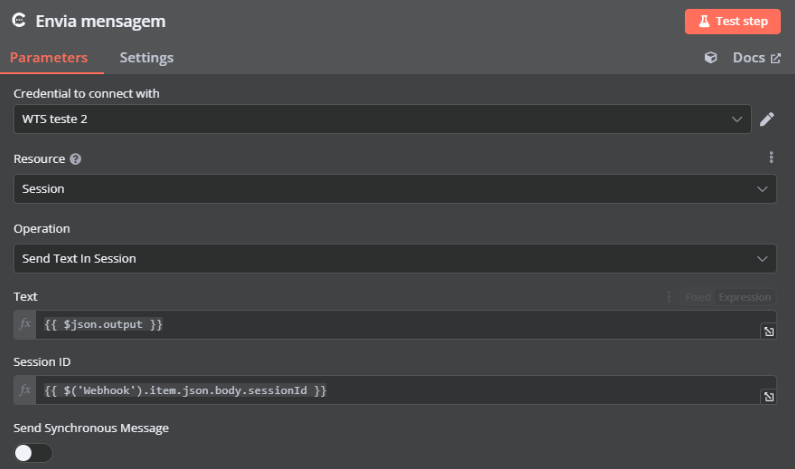

# 3. Como ler e responder textos

Vamos adicionar a capacidade de ler e responder textos usando o ChatGPT.

Confira abaixo como ficará a integração após seguir esse tutorial.



::: tip
Para baixar o fluxo pronto, o JSON com todos os passos está nesse link.

Você poderá criar seu próprio fluxo, para facilitar você pode baixar o nosso fluxo e alterar.
:::

## Como fazer

### Montando o escopo da integração

1. Crie uma conta no N8N.
2. Clique em "**Add workflow**".
3. Em seguida, clique em "**Add first step**".
4. Selecione o node "**On webhook call**".
5. Altere o método "**HTTP**" para "**Post**".

### Armazenando variáveis

1. Crie um node "**Edit Fields**".
2. Crie uma variável chamada `text` e armazene nessa variável o valor `lastMessagesAggregated`. Veja imagem abaixo:



### Configurando o node do assistente

Logo após criar o webhook, é preciso criar o node do assistente IA.

1. Para isso, clique em "**+**" digite "**OpenIA**" e selecione "**Message an assistant**".
2. Adicione a credencial que foi criada dentro da plataforma da OpenIA, essa credencial será a chave da API que você criou no passo 3 da etapa Criando o assistente.
3. Nas opções "**Resource**" e "**Operation**" deixe ambos default.
4. Em "**Assistant**" selecione o assistente que você criou na etapa Criando o assistente.
5. Em "**Prompt**" selecione a opção "**Define below**", no campo "**text**" passe a variável "`text`" que gravamos no node anterior "**Edit Fields**".



6. Em "**Memory**" defina para "**Use memory connector**". Será criado um nó abaixo do nome "**Window Buffer Memory**", nele é preciso passar o ID da sessão (presente no webhook).



::: warning Atenção
Definir a memória é muito importante, ela que fará com que o assistente consiga entender o contexto da conversa.
:::

### Ferramentas do assistente IA

O assistente possui ferramentas (Tools), que permite interações com outros sistemas através de requisições HTTP, isso torna-se útil e abre um leque de opções, você pode fazer requisições para buscar um boleto em um banco de dados e retorna-lo para o contato por exemplo, nesse documento vamos abordar três funcionalidades, mas o céu é o limite tratando-se dessa funcionalidade.

#### Buscar Equipes

Nessa primeira etapa vamos realizar uma requisição na API para buscar as equipes de uma conta, essa lista de equipes dará uma base ao seu agente para transferir o contato de acordo com o contexto da conversa.

1. Clique em tools e crie uma requisição HTTP.
2. Em "**Description**" você deve dar instruções para o agente da função, segue uma sugestão: `"Nesta função você consegue listar as equipes disponíveis para transferência"`.
3. Configure a requisição de acordo com a documentação.
4. Ao configurar o header defina o "**Value Provided**" como "**Using Field Below**". Veja imagem abaixo:



#### Transferir Conversa

Nessa etapa vamos configurar a função de transferência de equipe, também vamos criar uma requisição HTTP, para o endpoint de transferir conversas.

Assim como na etapa anterior vamos dar algumas instruções para nosso assistente IA sobre como usar essa função, segue uma sugestão:

> Setores para transferência.
> Algumas diretrizes:
> - Seja rápido e objetivo ao responder perguntas frequentes, buscando entender detalhadamente o problema do contato.
> - Explique de maneira simples qualquer processo técnico de baixa complexidade.
> - Demonstre paciência ao lidar com questões delicadas ou frustrações dos clientes.
> - Utilize um tom positivo e otimista, mesmo ao comunicar informações difíceis ou negativas.
> - Não solicite dados do contato como (e-mail, Id, números de protocolo, documentos).

Configure a requisição de acordo com a documentação.

Marque a opção "**Send Body**" e cole o JSON abaixo no body da requisição.

```json
{
  "type": "DEPARTMENT",
  "newDepartmentId": "{departmentId}"
}
```

::: info
Você deve usar um placeholder para quaisquer dados a serem preenchidos pelo modelo. Veja imagem abaixo:
:::



#### Concluir Atendimento

Por fim, a função de concluir atendimento, nessa etapa vamos configurar uma outra requisição para finalizar o atendimento quando solicitado pelo contato. Siga os passos abaixo:

1. No campo "**Description**" passe as instruções para seu assistente IA.
2. Configure a requisição de acordo com a documentação.
3. Marque a opção "**Send Body**" e cole o JSON abaixo no body da requisição:

```json
{
  "reactivateOnNewMessage": true
}
```



### Configuração do node de enviar mensagem ao contato

1. O primeiro passo é instalar o módulo do WTS em seu N8N. É possível encontrar essa informação para a instalação em "**Ajustes**" > "**Integrações**" > "**Automações via N8N**".
2. Após instalar o módulo WTS, crie uma chave de API dentro da plataforma em "**Ajustes**" > "**Integrações**" > "**Integrações Via API**" > "**Novo**" > "**Nomeie a chave**" > "**Salve**" > "**Copie**".
3. Clique para adicionar um novo nó e digite "**WTS**", procure por "**Session Actions**" > "**Send Message Text**".
4. Em "**Credential to connection with**", caso você já tenha uma chave de API criada, bastar selecioná-la. Caso não, basta criar uma nova "**Create new credential**" e colar a chave API criada na plataforma.
5. O output em questão é a resposta do seu agente, você deve passá-lo dentro da requisição para disparar essa resposta para o contato.
6. No campo "**Text**" coloque o output retornado por seu agente IA, no campo "**Session ID**" informe o id da sessão (essa informação você encontra no output do webhook, procure por "`sessionId`").



---

Seguindo esse tutorial, será possível ler e responder textos usando o ChatGPT, além disso será possível executar funções de transferência e conclusão de atendimentos. Você também pode adicionar outras funções ao seu assistente, como buscar boletos em uma API externa por exemplo, existem diversas possibilidades que você pode explorar utilizando as ferramentas do seu assistente.
