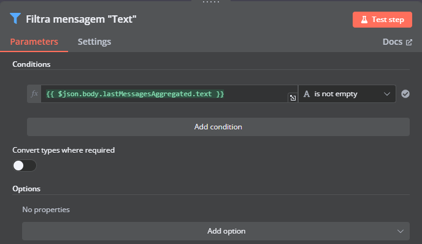
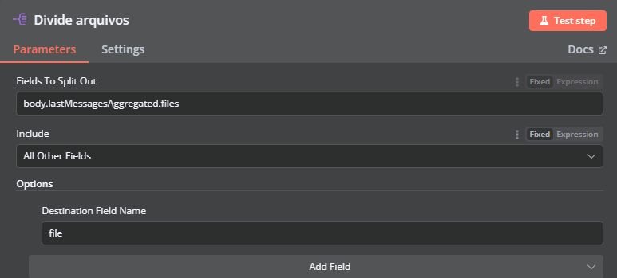
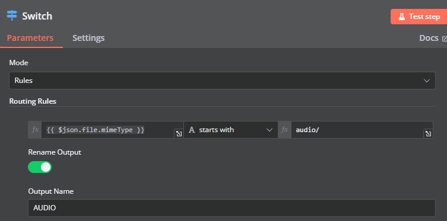
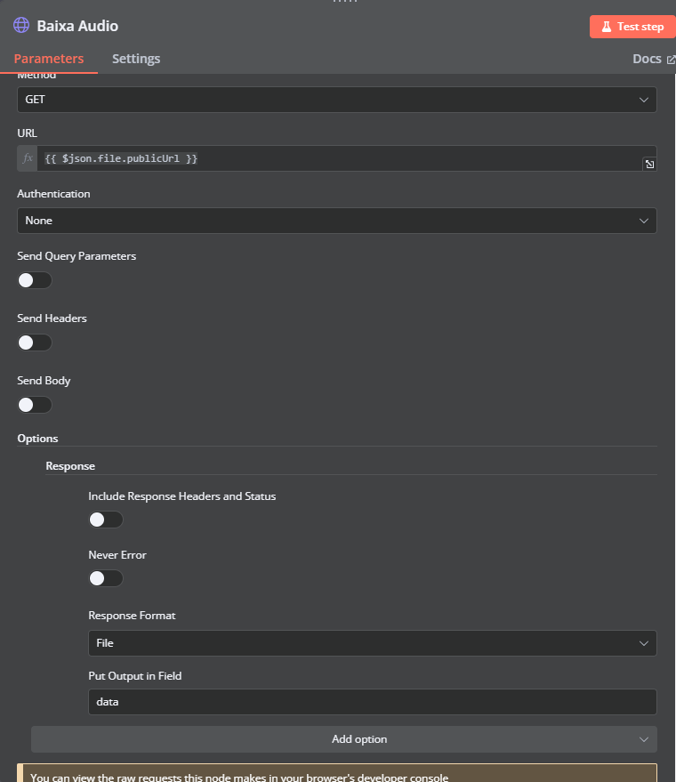
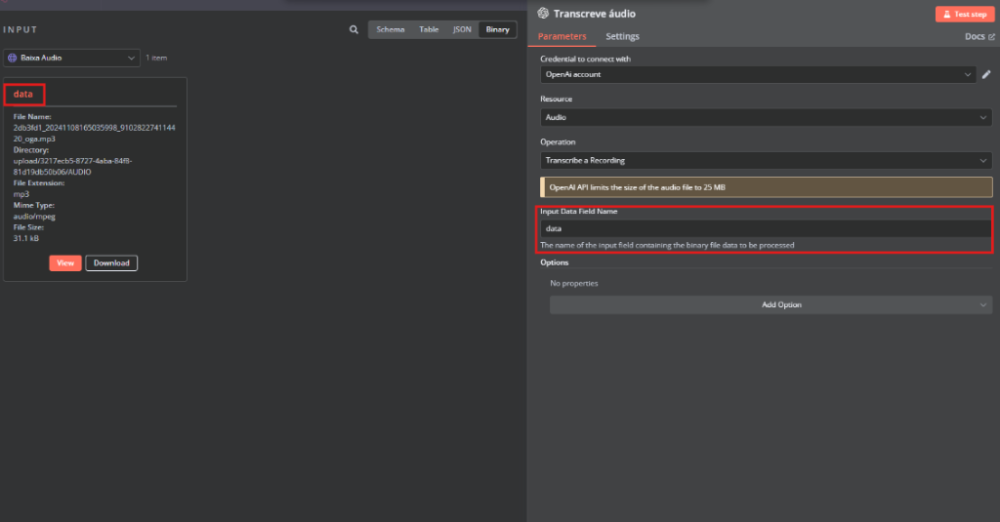
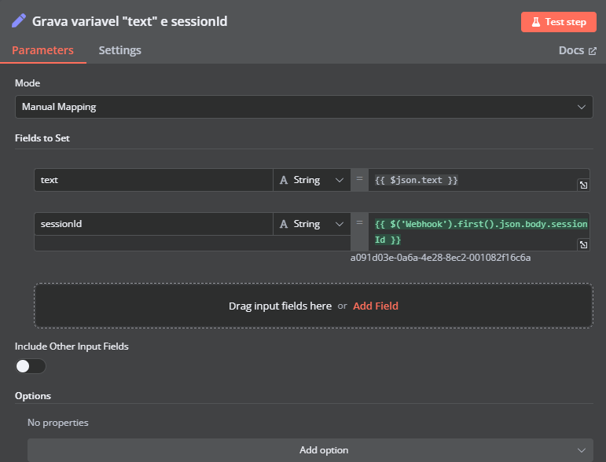

# 4. Como processar áudios

Nessa etapa vamos ensinar como adicionar a capacidade de processar áudios à sua IA.

Confira abaixo como ficará a integração após seguir esse tutorial.


::: tip
Para baixar o fluxo pronto, o JSON com todos os passos está nesse link.

Você poderá criar seu próprio fluxo, para facilitar você pode baixar o nosso fluxo e alterar.
:::

## Separando os tipos de mensagem

Como explicado anteriormente, mensagens agregadas são divididas em mensagens de texto e mensagens que contenham áudio, imagem ou arquivo. Para separarmos as mensagens de texto das mensagens que contenham arquivos, vamos usar o node "**Filter**" validando se o tipo de mensagem "**Text**" é ou não vazio.

Se não for vazio vamos usar um "**Set**" para gravar a várivel `lastMessagesAggregated.text` e, caso seja vazio, serão enviadas apenas mensagens do tipo "**File**", vamos tratar sobre mais a frente.



Já para mensagens "**Files**" devemos dividir os arquivos vindos do webhook em arquivos únicos, usando o node "**Split Out**" e tratar cada tipo de arquivo de uma maneira. Nessa etapa vamos tratar apenas arquivos de áudio, outros tipos de arquivos serão abordados mais a frente.



Após dividirmos os arquivos vamos separá-los por tipo, áudio, imagem e documentos. Para isso usaremos o node "**Switch**" e comparar se o `file.mimeType` (tipo de arquivo) começa com `audio/` (formato) do arquivo.



## Tratando arquivo de áudio

Após separar o arquivo de áudio dos demais, é preciso fazer o seu download. Para isso usaremos uma requisição HTTP, vamos dar um "**GET**" na URL pública que se encontra o áudio.



## Transcrevendo o áudio

Logo após realizar o download do áudio, crie um node OpenIA > "**Transcribe Recording**".

1. No campo "**Input Data Field Name**" é necessário passar o nome do campo de entrada que contém os dados do arquivo binário a serem processados.


2. Grave o output da transcrição em uma variável.
3. Crie um node "**Merge**" para agrupar os inputs.
4. Grave os valores `text` e `sessionId` em um node "**Set**".



Em seguida, é necessário concatenar as mensagens em uma única mensagem para enviarmos para o seu assistente. Para isso será utilizado um node "**Code**", basta copiar o código abaixo:

```javascript
var text = "";
var sessionId = $('Webhook').first().json.body.sessionId;

for (const item of $input.all()) {
  text += item.json.text + " \n";
}

return { "text": text, "sessionId": sessionId };
```

**Resumo do que o código faz:**
* Inicializa uma variável `text` como uma string vazia.
* Recupera o valor do `sessionId` de uma resposta de webhook anterior.
* Itera por todos os itens de entrada disponíveis e concatena o texto de cada item, adicionando uma nova linha entre os textos.
* Retorna um objeto com o texto concatenado e o `sessionId` para ser usado em outro lugar.

Ligue o node "**Code**" ao seu assistente, que por sua vez estará ligado ao node "**Enviar mensagem**".

Após todos esses passos sua integração irá processar áudios enviados, transcrevendo-os em texto para que seu assistente consiga interpretar e responder da forma mais adequada.
