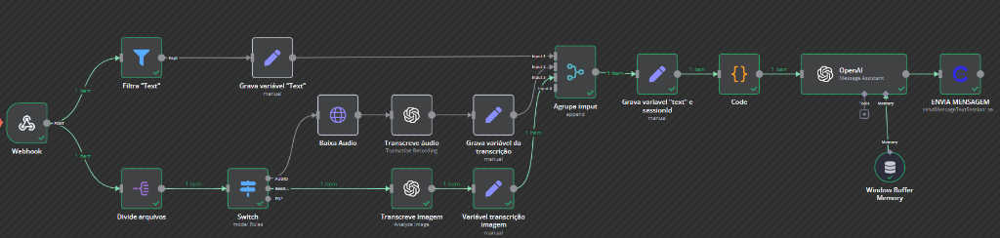
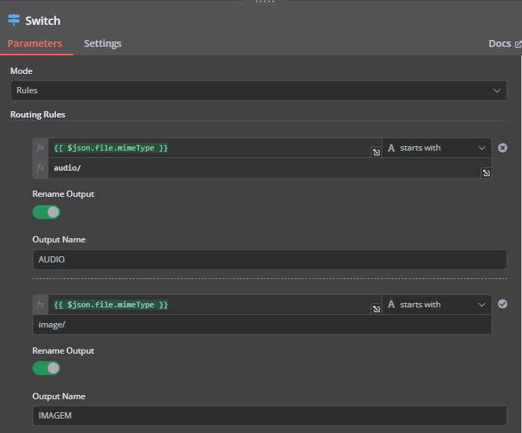
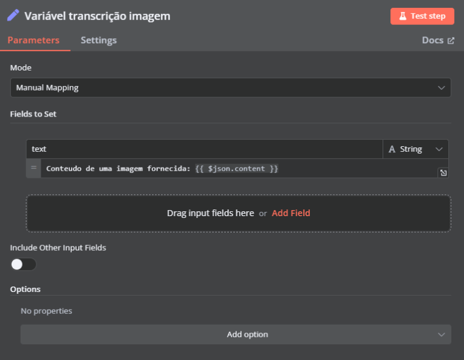

# 5. Como processar imagens

Nessa etapa vamos ensinar como adicionar a capacidade de processar imagens à sua IA.

Confira abaixo como ficará a integração após seguir esse tutorial.

::: tip
Para baixar o fluxo pronto, o JSON com todos os passos está [nesse link](https://github.com/wtschat/files/blob/main/wts_n8n_transcribe_image.json).

Você poderá criar seu próprio fluxo, para facilitar você pode baixar o nosso fluxo e alterar.
:::

## Processando imagens

Na etapa anterior no processamento de áudio foi criado o node "**Switch**" para processar diferentes tipos de arquivo, vamos criar uma rota dentro desse switch para processar as imagens.

Para isso, é necessário comparar se o `file.mimeType` (tipo de arquivo) começa com `image/` + (formato) do arquivo, assim como foi feito para o áudio. Confira a imagem abaixo:

Grave o "**Content**" (resultado da transcrição da imagem) em uma variável.

Após esses passos basta ligar o node "**Set**" (que contém a variável da transcrição da imagem) ao "**Merge**". Como mostra a imagem inicial desse documento.

Salve seu workflow.

Seguindo esse rápido tutorial será possível processar imagens com IA.
