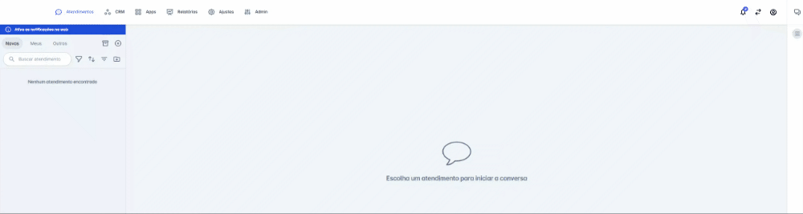

# Criar token para integração

Um token permanente permite que você autentique e autorize seu aplicativo sem ter que implementar fluxos de autenticação. Basta criar um novo token e usá-lo para autenticação onde quiser.

Para criar um token de autenticação clique em **Ajustes > Integrações > Integração via API (Configurar)**. Em seguida, clique em **Novo** e adicione um nome para o token.



## Uso do token em uma chamada Http

Para utilizar o token permanente, você deve incluí-lo no cabeçalho (header) da requisição HTTP. Use o formato abaixo para garantir o acesso:

**Header**
```http
Authorization: Bearer {seu_token_aqui}
```

**cURL**
```bash
curl -X GET "https://api.flw.chat/v1/channel" \
     -H "Authorization: Bearer pn_TOKEN_PERMANENTE"
```

## Orientações de segurança

*   **Geração do Token**: Você pode gerar um novo token permanente sempre que precisar, informe o nome da plataforma que irá utilizar o token para que você consiga identificar no futuro. Esse token é uma chave única que permite acesso direto aos nossos serviços, sem necessidade de login contínuo.
*   **Uso do Token**: O token permanente pode ser utilizado em integrações externas e ferramentas que precisem acessar sua conta. Lembre-se de mantê-lo seguro, pois ele dá acesso direto à sua conta.
*   **Revogação do Token**: Você tem o controle total do token permanente. Caso não precise mais dele ou queira reforçar a segurança, você pode excluí-lo a qualquer momento. Uma vez excluído, todas as integrações que utilizavam esse token deixarão de funcionar.

::: danger Segurança
Recomendamos não compartilhar seu token com terceiros e, se suspeitar de algum uso indevido, exclua-o imediatamente e gere um novo.
:::
