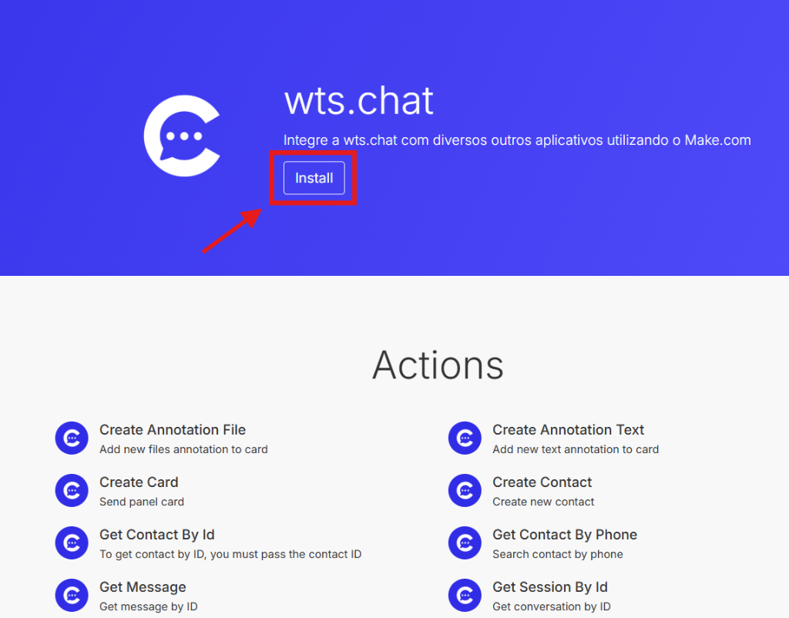
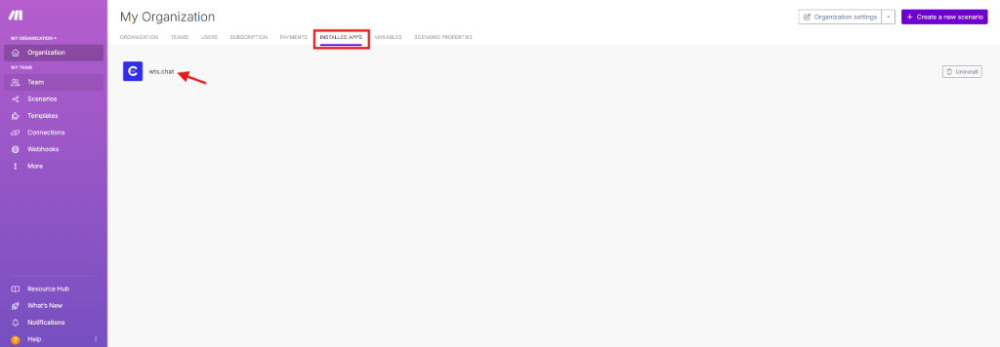
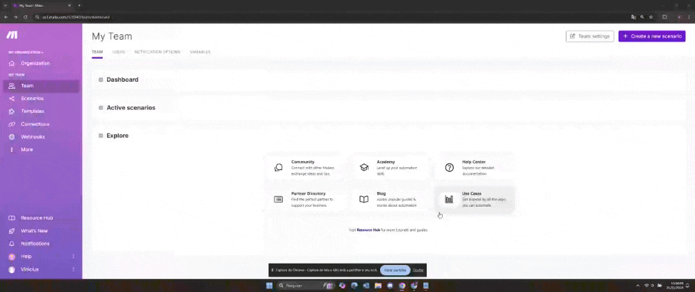

# Make

O Make.com é uma plataforma de automação que permite criar fluxos de trabalho personalizados para integrar diferentes aplicativos e serviços, eliminando tarefas manuais e repetitivas. Com uma interface visual intuitiva, os usuários podem conectar ferramentas e configurar gatilhos e ações para automatizar processos.

## Como funciona a contagem

### Operação
Cada vez que um módulo em um cenário é executado, ele conta como uma operação. Por exemplo:
*   Buscar dados em uma planilha: 1 operação.
*   Enviar uma mensagem via e-mail ou Slack: 1 operação.
*   Processar dados de várias linhas: cada linha pode contar como uma operação separada.

### Cobrança
*   **Plano contratado**: Cada plano (Gratuito, Core, Pro, etc.) tem um limite de operações mensais.
    *   Exemplo: Um plano Core pode oferecer 10.000 operações por mês.
*   **Excedente**: Se o limite for atingido, os cenários param de executar até que:
    *   O limite seja renovado no próximo ciclo.
    *   Você faça um upgrade para um plano superior.

## Autenticação - Make.com

Um token permanente permite que você autentique e autorize seu aplicativo sem ter que implementar fluxos de autenticação OAuth 2.0. Basta criar um novo token e usá-lo para autenticação onde quiser.

## Tutorial de instalação do aplicativo wtschat no Make.com

### Passos para instalação

#### 1. Acesse o Link do Aplicativo Make
Abra o navegador e acesse o [link específico do aplicativo Make](https://www.make.com/en/hq/app-invitation/0e94c36cbd3949661d56ad6aa33a80df). Clique no botão “**Instalar**” para iniciar o processo.

#### 2. Complete a Instalação do Aplicativo
Você será redirecionado para uma página onde deverá selecionar a organização na qual deseja instalar o aplicativo. Selecione a organização desejada e clique no botão “**Instalar**” localizado no canto inferior direito da tela.

::: info Observação
A instalação só pode ser feita em uma organização na qual você possui a função de “administrador” ou “desenvolvedor de aplicativos”.
:::

#### 3. Confirmação de Instalação
Uma notificação aparecerá na tela indicando que a instalação foi concluída com sucesso. Clique em "**Finish Wizard**".

#### 4. Acesse o Make
Abra o Make e acesse a organização onde você instalou o aplicativo. Navegue até “**Aplicativos Instalados**” para visualizar o ícone e o nome do aplicativo "**wts.chat**".

#### 5. Crie um Novo Cenário
Vá para a seção “**Cenários**”. Clique no botão “**Crie um novo cenário**” no canto superior direito da tela.

#### 6. Adicione o módulo wtsChat ao Cenário
Após criar o cenário, um pop-up será exibido permitindo que você pesquise os aplicativos. Digite "**wts chat**" na barra de pesquisa. Você poderá ver todos os módulos do wts chat, organizados em grupos como “Contatos”, “Mensagens”, “Painéis”, etc.

