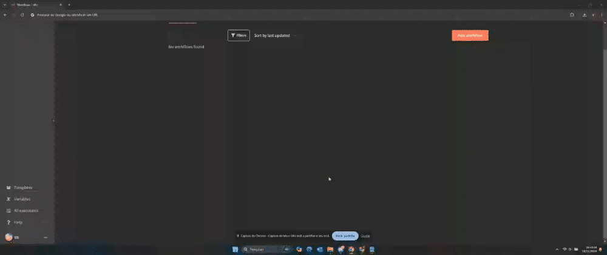
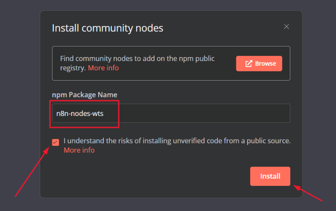
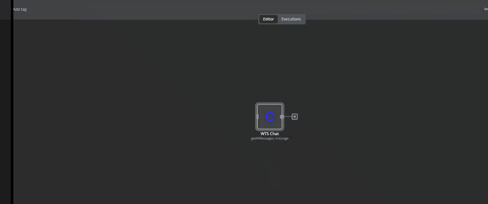

# N8N

O n8n é uma plataforma LowCode que permite criar automações de maneira intuitiva, sem a necessidade de conhecimento profundo em programação. Com o n8n, é possível integrar nossa plataforma com diversos serviços externos, aumentando significativamente as possibilidades ao utilizar nossa API.

## Modalidades de uso

### n8n.cloud
Você pode optar por contratar o n8n como serviço na nuvem, pagando por execução dos fluxos. Existem diferentes pacotes com limites de execuções mensais, atendendo às necessidades da maioria dos usuários. Este modelo é ideal para aqueles que buscam simplicidade e não querem se preocupar com manutenção de infraestrutura.
[Veja mais aqui](https://n8n.io/pricing).

### Auto-hospedado (Self-hosted)
Para cenários em que há grande volume de integrações e automações, o custo do n8n na nuvem pode ser um fator limitante. Nesse caso, é possível instalar o n8n em um servidor próprio, permitindo execuções ilimitadas e reduzindo os custos relacionados.

Com a opção de auto-hospedagem, você paga apenas pelo servidor, o que é vantajoso para quem deseja flexibilidade e escalabilidade sem restrição de execuções.
[Veja mais aqui](https://docs.n8n.io/hosting/).

## Módulo nativo para uso Self-hosted

Desenvolvemos um módulo nativo para facilitar a integração.

::: info Atenção - Community Nodes
Para construção do módulo utilizamos a funcionalidade **Community Nodes** do N8N, esta funcionalidade está disponível apenas para contas auto-hospedadas (self-hosted).

Os usuários com n8n.cloud ainda não têm acesso a essa funcionalidade.
:::

### Passos para instalação

1.  Acesse as configurações na página inicial do n8n. Para isso, clique no menu de configurações no canto inferior esquerdo, em seguida clique em “**Settings**”/ “**Configurações**”.

2.  Em seguida, no menu de opções clique em “**Community nodes**”/ “**Nós da comunidade**”.

3.  Clique em “**Install community nodes**”. Adicione o nome do pacote npm e aceite os termos de instalação e clique em **install**.

*   Nome do pacote: `n8n-nodes-wts`

🎉 Pronto, agora é só usar...

### Uso do módulo

Clique no painel de nós, no canto superior direito e busque por “**wts chat**” para listar as ações disponíveis.

::: tip Token
Para utilizar o módulo, é necessário ter um token permanente, [saiba mais aqui](./criar-token-para-integracao).
:::

Após adicionar um dos nós, clique em **Credential to connect with** e **Create new credential**. Escolha um nome que identifique a sua conta na plataforma. Para finalizar, clique em salvar.

Preencha as outras opções do nó e execute.

🎉 Pronto você deu o primeiro passo para realizar as integrações.
