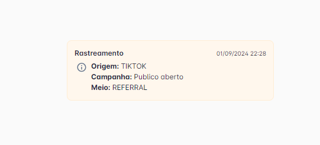

# Rastreio de campanha UTM

Entenda como rastrear sua campanha utilizando padrões UTM.

Os padrões UTM são parâmetros adicionados às URLs para ajudar a rastrear a eficácia das campanhas, esses padrões permitem que você identifique de onde os visitantes estão vindo e quais campanhas são mais eficazes.

## Exemplo de URL

Um exemplo de uma URL com parâmetro UTM:

```http
https://api.flw.chat/chat/v1/channel/wa/[TELEFONE]?text=[MENSAGEM]&utm_source=[SOURCE]&utm_medium=[MEDIUM]&utm_campaign=[CAMPAIGN]
```

## Parâmetros

* `[TELEFONE]`: Inserir telefone da sua empresa no formato "5511980009999";
* `[MENSAGEM]`: Inserir a mensagem que será enviada pelo cliente no WhatsApp. Ex.: Quero saber mais;
* `[MEDIUM]`: Meio onde vai ser difundida a campanha independentemente da fonte. Ex.: Stories;
* `[SOURCE]`: Plataforma de origem do lead. Ex.: tiktok;
* `[CAMPAIGN]`: identifica a campanha. Ex.: PublicoAberto;

## Visualização

Assim que a conversa for iniciada, você verá a mensagem abaixo podendo ver a origem do lead.



Além deste ponto você conseguirá ver na origem do contato e no relatório de indicadores e de atendimentos.
