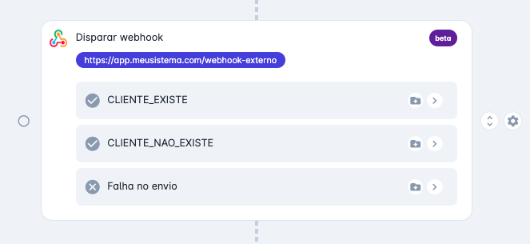

# Webhook no Chatbot

Durante o atendimento pelo Chatbot, o sistema poderá disparar webhooks para buscar mais informações, dados e criar fluxos alternativos para uma melhor experiência dos clientes.



O webhook no chatbot tem uma mensagens de input e output padrões, você define a URL e recebe a mensagem via método POST.

## Mensagem de disparo

Esta mensagem será enviada pelo chatbot para seu sistema com todos os dados capturados até o momento, os dados do canal de atendimento, dados do contato e as opções de respostas possíveis:

```json
{
    "responseKeys": [
        "CLIENTE_EXISTE",
        "CLIENTE_NAO_EXISTE"
    ],
    "sessionId": "567ca9b8-eaa9-4a33-8cf9-d2c67060af74",
    "session": {
      "id": "567ca9b8-eaa9-4a33-8cf9-d2c67060af74",
      "createdAt": "2024-06-02T12:00:10.38771Z",
      "departmentId": "07deebd3-dede-42d1-9169-75e00efdf088",
      "userId": null,
      "number": "2024062700164",
      "utm": {
        "clid": "asldkjasLKJASLKDJLKJASLDKJASGFui3HT7c7KUdBaB7lOHHxp5CxufCY0GjlvZcDRpsTaRbZMQ",
        "term": null,
        "medium": "REFERRAL",
        "source": "INSTAGRAM",
        "content": "Campanha de Natal Minas Gerais!",
        "campaign": "776107696326",
        "headline": "Converse conosco",
        "referralUrl": "https://www.instagram.com/p/x466u6s5ykjs/"
      }
    },
    "channel": {
        "id": "0a4ca3cd-b9fd-4523-a032-5a343bf7b209",
        "key": "551140037752",
        "platform": "WhatsApp",
        "displayName": "(11) 3000-0000"
    },
    "contact": {
        "id": "f8f43b22-2f20-42f3-be13-65bf90282143",
        "name": "David",
        "phonenumber": "+55|1199999999",
        "display-phonenumber": "(11) 99999-9999",
        "email": "email@gmail.com",
        "instagram": null,
        "tags": [
            "Lead"
        ],
        "cnpj": "00.000.000/0000-00",
        "metadata": { "cod-ext": "abcd" }
    },
    "questions": {
        "cb-ec36e3fe-qst-c0b0875a": {
            "text": "Qual seu CNPJ?",
            "answer": "00.000.000/0000-00"
        }
    },
    "menus": {
        "cb-ec36e3fe-mn-943b055a": {
            "text": "Qual opção você deseja?",
            "answer": "Comprar"
        }
    },
    "lastMessage": {
      "id": "152d4d13-0b13-49bb-bafc-3923434f204b",
      "createdAt": "2024-06-27T19:09:22.592061Z",
      "type": "IMAGE",
      "text": null,
      "fileId": "aa546fa6-ca68-4a8b-a57d-c031460fae69",
      "file": {
        "publicUrl": "https://cdn.flw.chat/upload/88fb5de-0cc2-4209-b456-47b454ee6e14/IMAGE/c40e85e_20240627190923197_436019626068697.jpg?AWSAccessKeyId=XXXX",
        "extension": ".jpg",
        "mimeType": "image/jpeg",
        "name": "436019626068697.jpg",
        "size": 233541
      }
    }
}
```

## Mensagem de retorno (Simples)

Seu webhook deverá responder com um código HTTP 200 para seguir no fluxo principal de sucesso, mas você poderá criar fluxos alternativos, assim deverá responder com o código HTTP 200 e uma mensagem conforme abaixo:

```json
{
    "response": "CLIENTE_EXISTE"
}
```

## Mensagem de retorno (Com dados do contato)

Você poderá atualizar os dados do contato no retorno do webhook, bem como metadados para serem usados em outro momento de integração, como no exemplo abaixo o código do cliente no seu sistema.

```json
{
    "response": "CLIENTE_EXISTE",
    "metadata": {
        "cliente-existe": true
    },
    "contact": {
        "cnpj": "00.000.000/0000-00",
        "metadata": {
            "cod-ext": "abcd"
        }
    }
}
```

## Mensagem de retorno (Com disparo de mensagens)

Também é possível enviar mensagens ao usuário ao retornar do webhook, você deverá indicar uma lista de mensagens que serão disparadas na ordem enviada;

```json
{
    "response": "CLIENTE_EXISTE",
    "messages": [
        {
            "text": "Segue seu boleto abaixo para pagamento. Vencimento dia 10/01"
        },
        {
            "fileUrl": "https://xyz.com/boleto.pdf"
        },
        {
            "template": {
                "id": "ab78cd_oferta",
                "parameters": {
                    "valor": "R$ 9,99"
                }
            }
        }
    ]
}
```

As mensagens podem incluir texto e/ou arquivo. Além disso, é possível utilizar um modelo de mensagem (template) previamente criado.

As opções de respostas foram separadas para efeitos didáticos, mas podem ser combinadas em uma única mensagem.
