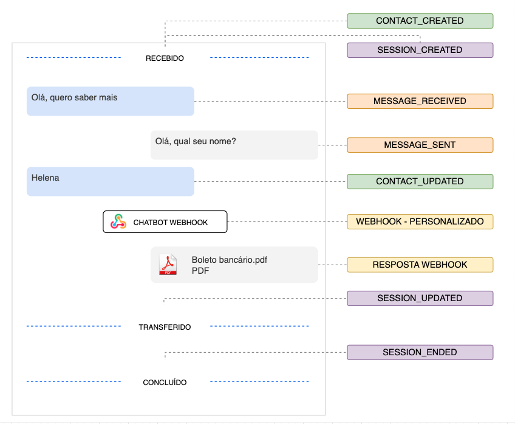

# Webhooks

Entenda como receber eventos em outro sistema.

O envio de eventos por webhook é um mecanismo para notificar o seu sistema quando uma variedade de interações ou eventos acontecem, incluindo quando uma pessoa envia uma mensagem ou um contato é alterado.

## Configuração

É possível realizar a configuração através da plataforma (acessando **Ajustes > Integrações > Webhooks**).

Ao criar uma nova assinatura, você deverá selecionar os eventos/tópicos que deseja assinar e informar uma URL válida. A plataforma enviará requisições HTTP utilizando o método POST para a URL informada, que deverá estar preparada e disponível publicamente para receber os eventos.

É possível pausar temporariamente o recebimento de webhooks, modificando os status da assinatura para inativo.

## Ciclo de vida de uma conversa



## Estrutura

As mensagens de webhook enviadas possuirão o corpo no formato `application/json` e a seguinte estrutura:

```json
{
    "eventType": "NOME_DO_EVENTO",
    "date": "DATA_DE_ENVIO",
    "content": { ... }
}
```

Sendo:

* `eventType`: o nome do evento/tópico, sendo os valores possíveis listados abaixo;
* `date`: data e hora de geração do evento, seguindo o formato `YYYY-MM-DDTHH:mm:ss`;
* `content`: conteúdo do evento.

Veja abaixo um exemplo de webhook de alteração de contato:

```json
{
    "eventType": "CONTACT_UPDATE",
    "date": "2023-08-23T16:42:35.4359934Z",
    "content": {
        "id": "ed2b52f8-cf13-449b-b3d5-ae27051f4663",
        "createdAt": "2022-10-28T21:24:26.158391Z",
        "updatedAt": "2023-08-23T16:15:35.3814324Z",
        "companyId": "626fb5de-0cc2-4209-b456-47b454ee6e14",
        "name": "John Raymond Legrasse",
        "phonenumber": "+55|00000000000",
        "phonenumberFormatted": "(00) 00000-0000",
        "email": "exemplo@email.com",
        "instagram": null,
        "annotation": "",
        "tagsId": [],
        "tags": [],
        "status": "ACTIVE",
        "origin": "CREATED_FROM_HUB",
        "utm": null,
        "customFieldValues": {},
        "metadata": null
    }
}
```
