# Portabilidade de número

Se sua empresa já utiliza um número conectado à API Oficial do WhatsApp com outro provedor e deseja migrar para a **plataforma**, é possível realizar a portabilidade do número sem perder o histórico de qualidade e mantendo a infraestrutura oficial da Meta.

Veja abaixo o passo a passo para garantir uma transição segura e dentro das diretrizes da Meta.

## O que é a portabilidade entre provedores da API Oficial?

Portabilidade, neste caso, significa migrar seu número da API Oficial de um provedor atual para a infraestrutura de API usada pela **plataforma**. É um processo técnico homologado pela Meta que permite que sua empresa mantenha o mesmo número, preservando o histórico de mensagens, qualidade e reputação da conta.

::: tip Pré-requisitos
* O número já está conectado à API Oficial da Meta com outro provedor;
* O número está vinculado a uma conta do **portfólio empresarial verificado;**
* Você tem acesso de administrador ao Gerenciador de Negócios da Meta;
* A **autenticação em dois fatores** da **WABA** está desativada.
* O número que será migrado deve estar ativo e habilitado para receber chamadas telefônicas, pois o código de verificação da Meta será enviado por ligação durante o processo de portabilidade.
:::

::: danger Atenção
Antes de iniciar o processo de portabilidade, recomendamos verificar se o número exibe corretamente o **display name** (nome de exibição). Para isso, envie uma mensagem a partir de um número que nunca tenha interagido com ele.
:::

## Passo 1: Conferir se o Portfólio empresarial é verificado

Acesse o [Gerenciador de Negócios da Meta](https://business.facebook.com/). Na lateral esquerda, role para baixo e clique em **'Informações da empresa'**.

Verifique o **Status de verificação da empresa**. Mais informações sobre como acessar o portfólio empresarial [clique aqui](/atalhos/faq/portfolio-empresarial/informacoes-do-portfolio).

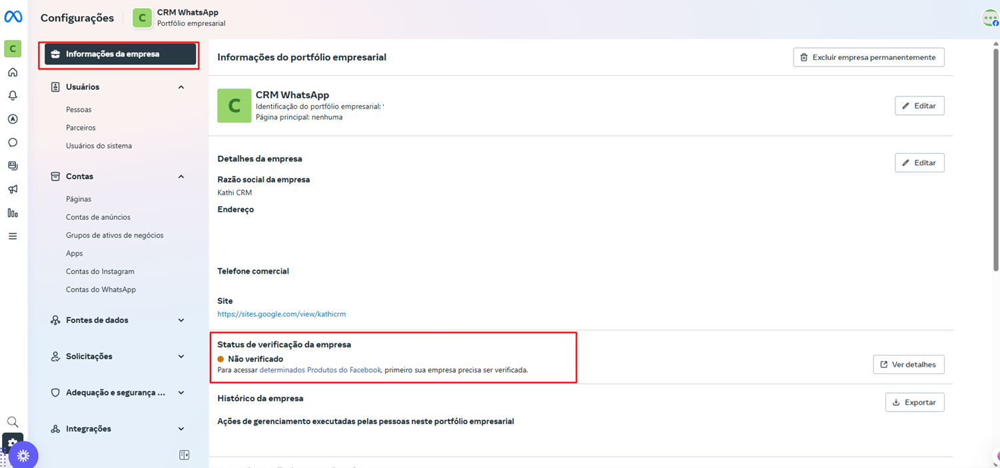

::: info Verificação do Portfólio
Veja aqui como fazer a [**verificação do portfólio empresarial**](/atalhos/faq/portfolio-empresarial/verificar-portfolio-empresarial)
:::

## Passo 2: Desative a autenticação em dois fatores

Siga os passos descritos neste manual para [Desativar a autenticação em dois fatores](/atalhos/faq/portfolio-empresarial/desativar-autenticacao-em-dois-fatores).

## Passo 3: Inicie a conexão de um número por portabilidade

Acesse a plataforma, clique em **"Ajustes"**, depois em **"Conta"** e, na aba **"Canais de Atendimento"**, selecione o **botão "+"** para iniciar uma nova conexão com o WhatsApp via Cloud API.

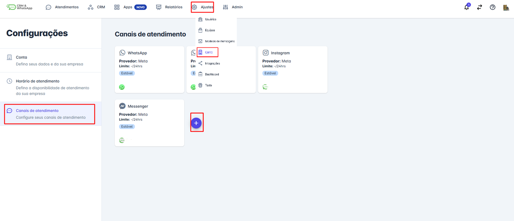

## Passo 4: Selecione migrar número

Na tela seguinte selecione a opção de **migrar número** e em seguida clique em **iniciar**.

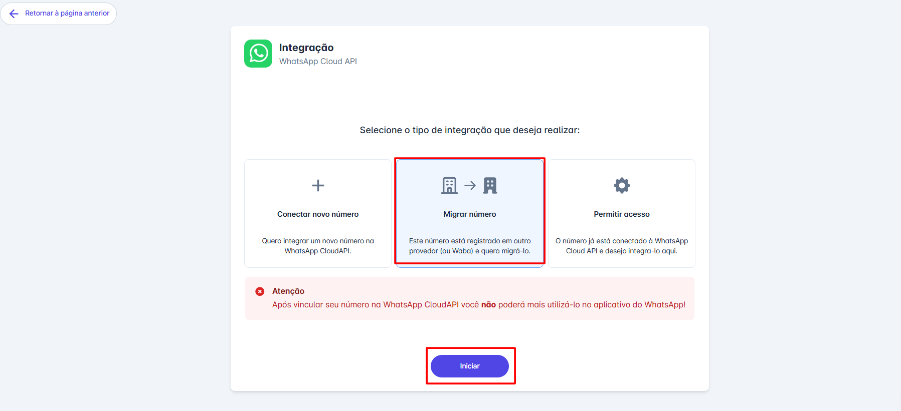

## Passo 5: Revisar instruções

Na tela seguinte, revise atentamente as instruções para realizar a portabilidade. Se estiver tudo correto, clique em **"Continuar"** para prosseguir com o processo.

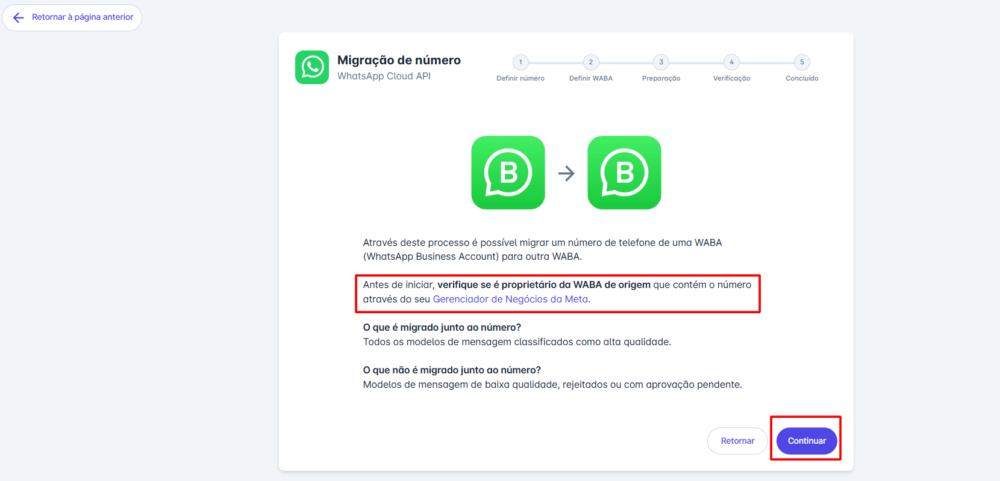

## Passo 6: Digite o número

Digite o número a ser migrado e clique em continuar.

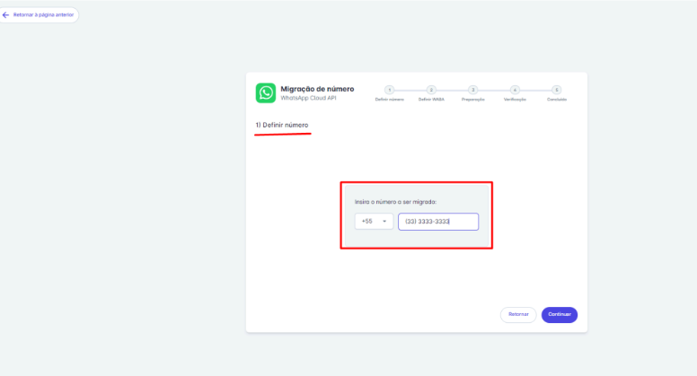

## Passo 7: Login no Facebook

Na tela seguinte faça login no **Facebook**.

## Passo 8: Confirme a conta

Confirme a conta que deseja utilizar para o login.

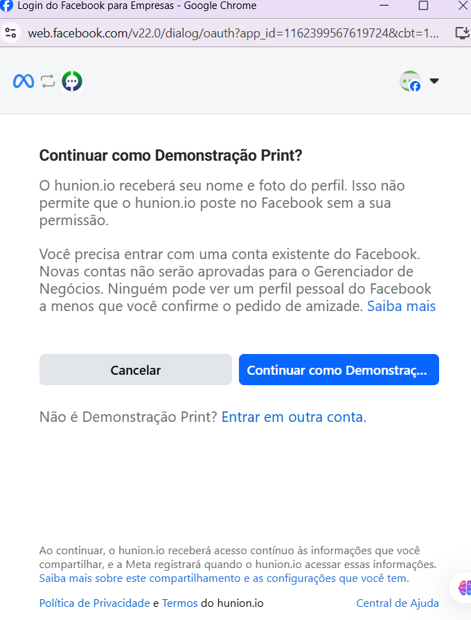

## Passo 9: Começar processo

Após aceitar os termos de conexão com a plataforma, clique em **"Começar"** para prosseguir.

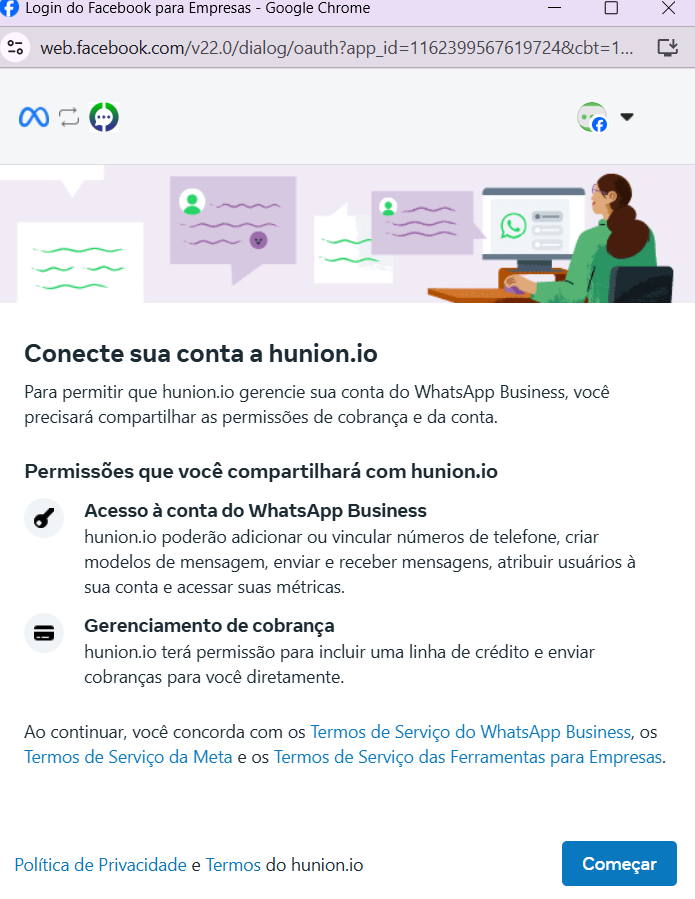

## Passo 10: Conferir dados da empresa

Confira os dados da empresa e em seguida clique em **avançar**.

## Passo 11: Selecionar WABA

Selecione ou crie a **WABA** onde o número será transferido, em seguida clique em **avançar**.

## Passo 12: Aceitar termos

Após aceitar os termos de acesso que a plataforma terá, clique em **"Continuar"** para prosseguir.

## Passo 13: Processo concluído

Um novo pop-up será exibido informando que o processo foi concluído. Clique em **"Concluir"** para finalizar.

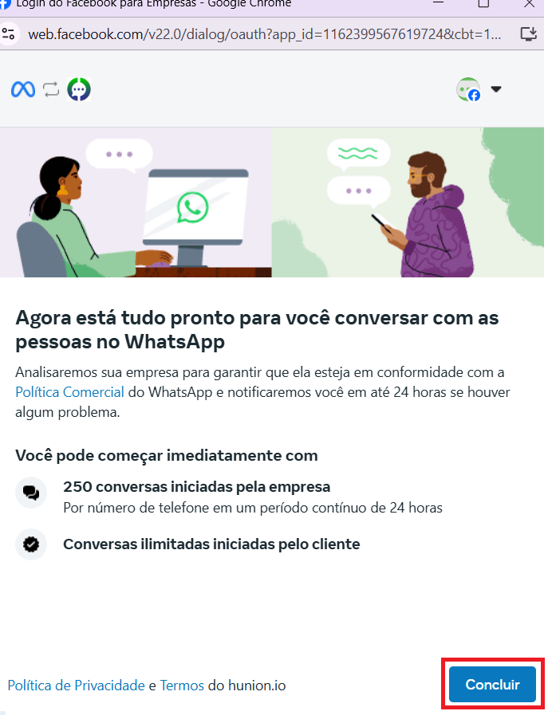

## Passo 14: Configuração de pagamento

Retornando à plataforma, clique em **"Confirmação de configuração de pagamento"** ou acesse o Gerenciador de Negócios para definir a forma de pagamento. Após concluir essa etapa, clique em **"Continuar"**.

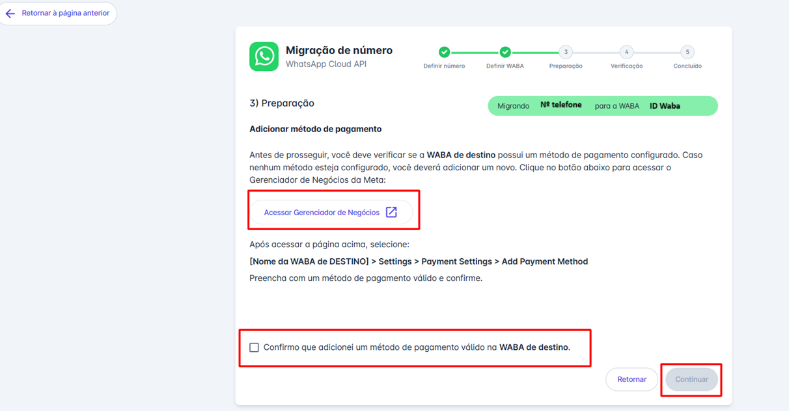

## Passo 15: Desativar autenticação

Uma nova aba se abrirá clique em **"Confirmação de desativação da autenticação de dois fatores"** ou acesse o **Gerenciador de Negócios** para desativar a autenticação. Após concluir essa etapa, clique em **"Continuar"**.

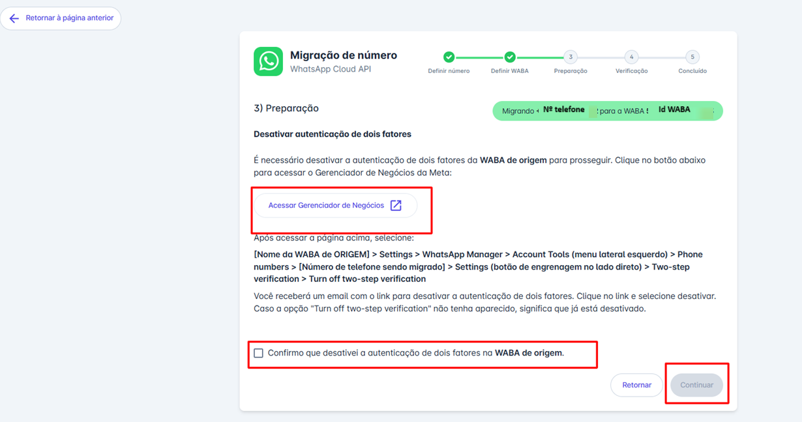

## Passo 16: Selecionar meio de verificação

Em seguida, selecione o meio pelo qual deseja receber o código de verificação e clique em **"Continuar"**.

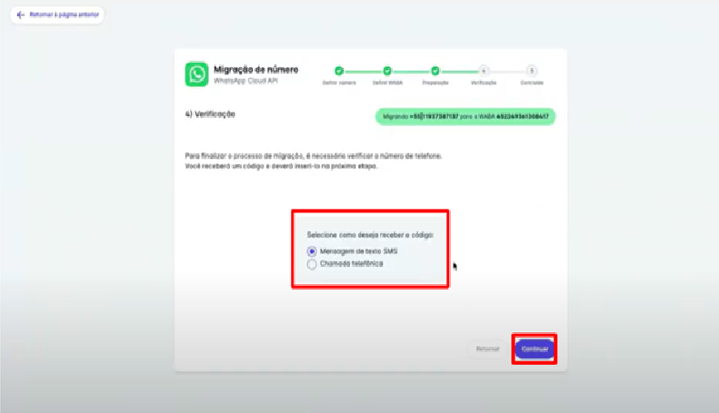

## Passo 17: Informar código de verificação

Informe o código de verificação recebido e clique em **"Continuar"** para prosseguir com o processo.

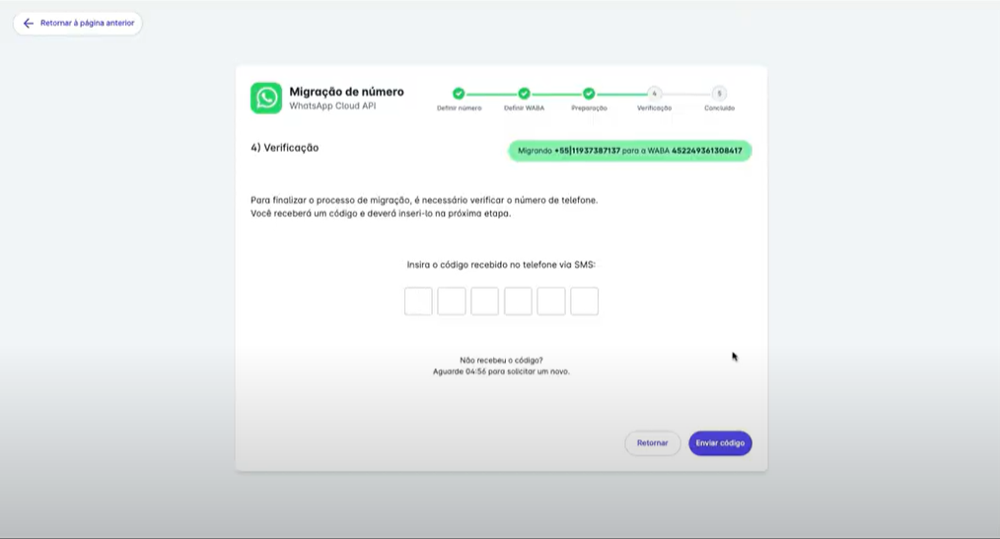

## Passo 18: Finalizar

Clique em **"Finalizar"** para concluir a configuração.

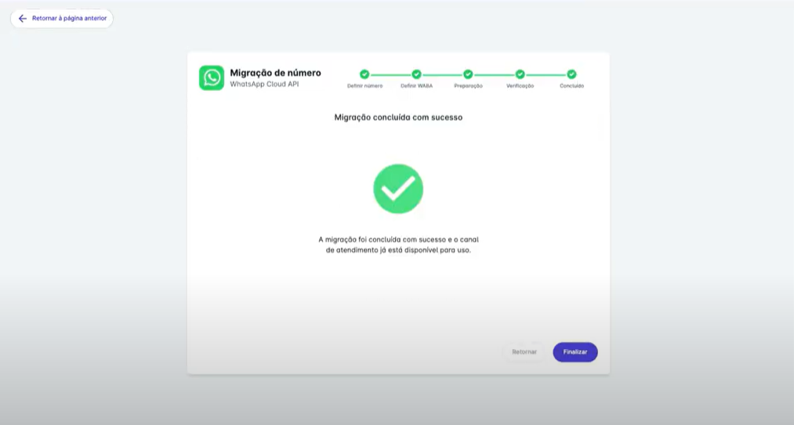

## Considerações finais

::: warning Observações Importantes

**Sobre a migração:**
* É possível, e recomendado, migrar o número de **WABA** (conta do WhatsApp Business) porém **NÃO é possível** migrar o número de Portfólio Empresarial. Após a migração, o número continuará associado ao mesmo Gerenciador de Negócios em que já estava.
* Na Meta não tem como fazer migração / portabilidade de conta empresarial. Se sua intenção for mudar o número para outra BM, será necessário [desconectar o número da API Oficial](/atalhos/faq/conexao-whatsapp/remover-numero-do-portfolio) e então fazer uma nova integração como se fosse um número novo.
* Se o número a ser implantado estiver conectado à URA (Unidade de Resposta Audível) será necessário desativar a URA para receber o código de verificação.
:::

::: danger O que é preservado na portabilidade?

Ao fazer a portabilidade corretamente, são mantidas:
* A reputação da conta (qualidade);
* Os números verificados no Gerenciador de Negócios;
* Os templates (mensagens padrão) previamente aprovados;
* O histórico de relacionamento com a Meta.
:::
