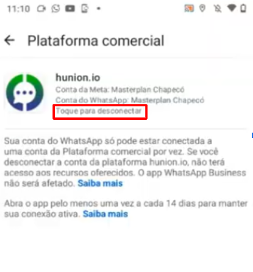
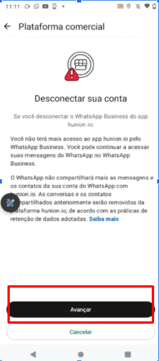
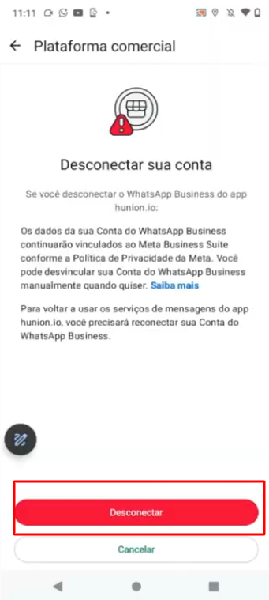

# Remover conexão QR Code

Em determinadas situações, pode ser necessário **remover um número de telefone da conta WhatsApp Business** dentro do **APP Whatsapp Business** — seja para substituição, reorganização de estrutura ou reonboarding. A remoção do número libera o uso dele em uma nova conexão com a API oficial, mas deve ser feita com atenção para evitar perda de dados.

::: tip Pré-requisitos
* Ter **acesso de administrador** ao **Portfólio empresarial** onde o número está configurado.
* Ter o aparelho acesso ao aparelho onde o número está conectado via **QR Code.**
* Tenha ciência de que, ao remover o número, **todas as mensagens, sessões e templates relacionados a ele serão perdidos**.
:::

## Passo 1: Acessar Configurações

Acesse o aplicativo **WhatsApp Business** no celular. Na tela inicial Toque nos três pontinhos no canto superior direito.

## Passo 2: Abrir Configurações

Clique na opção **Configurações**.

## Passo 3: Acessar Conta

Clique na opção **Conta**.

## Passo 4: Plataforma Comercial

Clique na opção **Plataforma Comercial**.

## Passo 5: Iniciar desconexão

O parceiro será exibido na tela. Clique na opção "**Toque para desconectar**".

## Passo 6: Avançar

Aparecerá uma nova tela com a opção **desconectar**, clique em **avançar**.

## Passo 7: Confirmar desconexão

Aparecerá uma nova tela com a confirmação da desconexão. Clique em **Desconectar**.

## Passo 8: Confirmação final

Por fim, a tela de **nova conexão será exibida**, confirmando que a **conexão anterior foi encerrada** e permitindo que um novo dispositivo seja conectado.

## Considerações Finais

::: warning Observações Importantes
* Após a remoção, o número **poderá ser reconectado** por QR Code oficial ou outro método suportado, respeitando as diretrizes da Meta.
* É recomendável fazer **backup de informações importantes antes da exclusão**, se necessário.
* Essa ação encerra o acesso via QR Code (como o WhatsApp Web ou outras ferramentas que usam esse método).
* Se a intenção é **migrar o número para outra conta da Meta ou provedor**, confirme que ele esteja totalmente desvinculado e tenha superado o tempo de retenção da Meta (em alguns casos, até 30 dias).
:::
