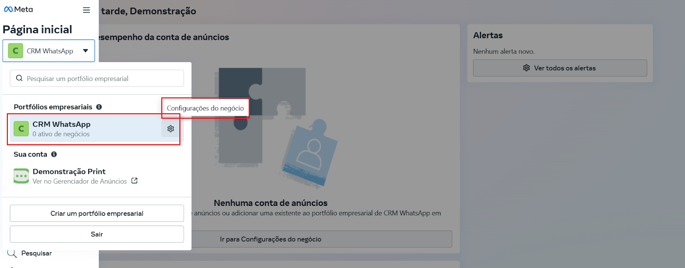
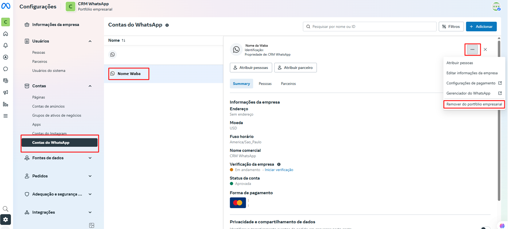
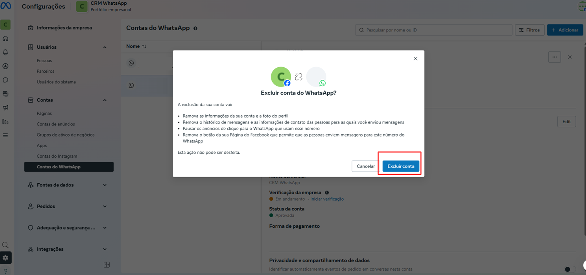

# Remover número do portfólio

Em determinadas situações, pode ser necessário **remover um número de telefone da conta do WhatsApp Business (WABA)** dentro do **Business Manager da Meta** — seja para substituição, reorganização de estrutura ou reonboarding. A remoção do número libera o uso dele em uma nova conexão com a API oficial, mas deve ser feita com atenção para evitar perda de dados.

::: tip Pré-requisitos
* Ter **acesso de administrador** ao **portfólio empresarial** onde o número está configurado.
* O número deve estar vinculado a uma **conta de WhatsApp Business (WABA)** ativa.
* Verifique se não há **cobranças** ou **pendências financeiras** atreladas ao número antes de prosseguir com a remoção.
* Tenha ciência de que, ao remover o número, **todas as mensagens, sessões e templates relacionados a ele serão perdidos**.
:::

## Passo 1: Acessar o Gerenciador de Negócios

Acesse o [Gerenciador de Negócios da Meta](https://business.facebook.com/). No painel principal do **portfólio empresarial**, selecione a empresa correta e clique no ícone de **engrenagem**.

## Passo 2: Acessar Contas do WhatsApp

No menu lateral esquerdo, localize e clique em "**Contas do WhatsApp**". Em seguida, role o cursor da lateral direita até o fim e clique em "**Gerenciador de WhatasApp**".

## Passo 3: Gerenciador do WhatsApp

Uma nova aba será exibida. Clique no ícone de **lixeira** localizado ao lado do número de telefone.

## Passo 4: Confirmar exclusão do número

Uma janela pop-up será exibida para confirmar a exclusão do número. Clique em **"Avançar"** para prosseguir com a remoção.

::: danger Atenção
Esse processo é irreversível.
:::

## Passo 5: Excluir a WABA (WhatsApp Business Account)

Após remover o número da conta, acesse novamente o [Gerenciador de Negócios da Meta](https://business.facebook.com/). No painel principal do **portfólio empresarial**, selecione a empresa correta e clique no ícone de **engrenagem**.

No menu lateral, clique em "**Contas do WhatsApp**" e selecione a **WABA** que deseja excluir. Em seguida, clique no ícone de três pontinhos no canto superior direito da tela. Será exibido um menu de opções — selecione "**Remover do Portfólio Empresarial**" para iniciar o processo de exclusão.

## Passo 6: Confirmar exclusão da conta

Uma janela pop-up será exibida para confirmar a exclusão da conta. Clique em **"Excluir conta"** para prosseguir com a remoção.

## Considerações Finais

::: warning Observações Importantes
* Após a remoção, o número **poderá ser reconectado** por QR Code oficial ou outro método suportado, respeitando as diretrizes da Meta.
* É recomendável fazer **backup de informações importantes antes da exclusão**, se necessário.
* A remoção não cancela automaticamente cobranças associadas ao uso da API, por isso é importante verificar a **fatura ativa** no Gerenciador de Pagamentos da empresa.
* Se a intenção é **migrar o número para outra conta da Meta ou provedor**, confirme que ele esteja totalmente desvinculado e tenha superado o tempo de retenção da Meta (em alguns casos, até 30 dias).
:::
