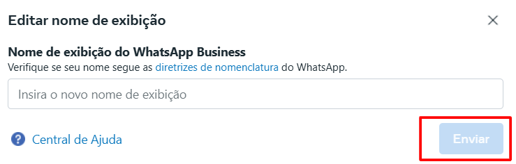

# Alterar display name

O nome de exibição (Display Name) é a identificação pública do seu número de WhatsApp na API oficial. Ele aparece para os seus clientes e, por isso, deve estar alinhado à identidade da empresa. Se você precisa ajustar o nome exibido, a alteração pode ser feita diretamente no Gerenciador de Negócios (Business Manager) da Meta, seguindo os passos abaixo.

::: tip Pré-requisitos
* Ter acesso de administrador à conta do **portfólio empresarial** onde o número está cadastrado.
* Ter acesso ao **Gerenciador do WhatsApp Business** dentro da **portfólio empresarial**.
* O número já deve estar conectado à API oficial da Meta.
* A alteração do nome de exibição passará por uma nova análise da Meta, podendo levar até **48h úteis**.
:::

## Passo 1: Acessar Configurações de Negócio

Acesse o [Gerenciador de Negócios da Meta](https://business.facebook.com/). No painel principal da **portfólio empresarial**, clique em **"Configurações de Negócio"**.

## Passo 2: Acessar Contas do WhatsApp

No menu lateral esquerdo, localize e clique em "**Contas do WhatsApp**". Em seguida, role o cursor da lateral direita até o fim e clique em "**Gerenciador de WhatasApp**".

## Passo 3: Gerenciador do WhatsApp

Uma nova aba será exibida. Clique em **"Número de telefone"** e, em seguida, selecione o ícone de **engrenagem** localizado ao lado do número de telefone.

## Passo 4: Editar Nome de Exibição

Uma nova tela será exibida. Selecione a opção **"Perfil"**, logo abaixo aparecerá a opção **"Nome de Exibição"**, clique em **"Editar"**.

## Passo 5: Enviar novo nome

Digite o nome que deseja utilizar, não se esqueça de verificar se o nome segue as [diretrizes de nomenclatura do WhatsApp](https://web.facebook.com/business/help/338047025165344?_rdc=1&_rdr). Em seguida clique em **"Enviar"**. A alteração será analisada pela **Meta**.

## Considerações finais

::: warning Diretrizes e Observações
* O novo nome de exibição [**deve seguir as diretrizes da Meta**](https://web.facebook.com/business/help/338047025165344?_rdc=1&_rdr), que incluem estar relacionado ao nome da empresa e não conter termos genéricos ou que possam induzir o usuário ao erro.
* Durante a análise, o número continuará funcionando normalmente.
* Caso o nome de exibição seja reprovado, será necessário realizar uma nova solicitação com ajustes.
* Essa alteração **não afeta o número de telefone, histórico de mensagens ou as conexões da API**.
:::
