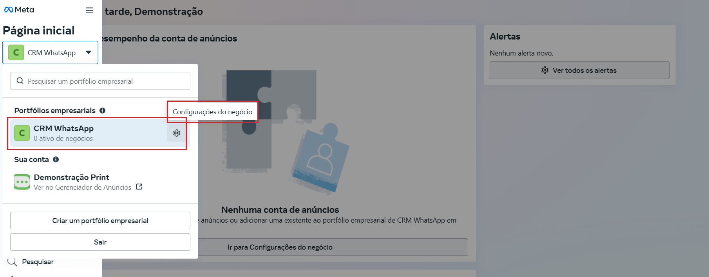
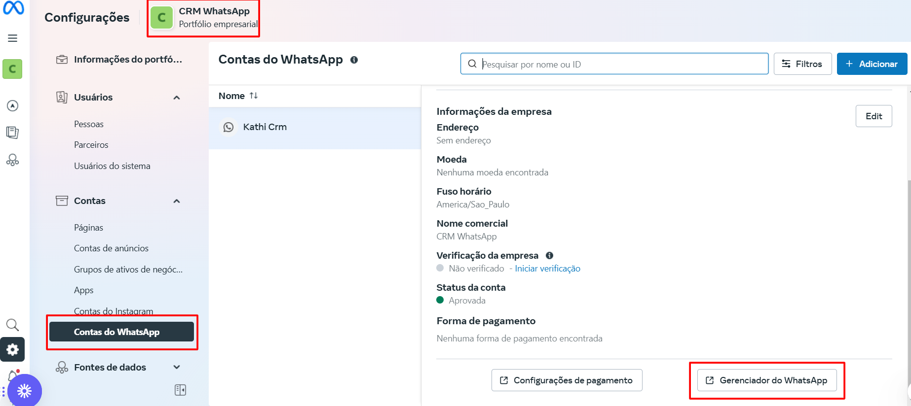
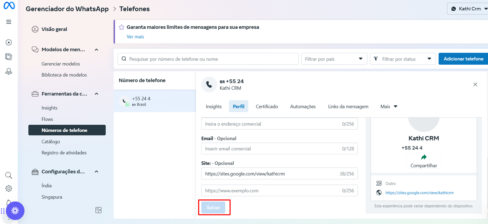

# Alterar perfil do WhatsApp

Alterar o perfil do WhatsApp no **portfólio empresarial** é essencial para manter as informações da sua empresa atualizadas, garantindo uma comunicação eficaz e profissional com seus clientes. O perfil do WhatsApp inclui dados como nome, descrição, endereço e site, e pode ser modificado diretamente pela plataforma.

::: tip Pré-requisitos
* Ter acesso com controle total do **portfólio empresarial.**
:::

## O que é o perfil do WhatsApp?

O perfil do WhatsApp é a informação visível para os clientes ao interagirem com sua empresa pelo aplicativo. Ele inclui:

* **Nome de exibição:** O nome da sua empresa.
* **Descrição:** Uma breve descrição dos serviços ou produtos oferecidos.
* **Endereço:** Localização da empresa.
* **Site:** URL do site oficial.

## Passo a Passo para Alterar o Perfil do WhatsApp

### Passo 1: Faça login na sua conta da Business Manager

Acesse: [**https://business.facebook.com/**](https://business.facebook.com/)

Certifique-se de estar utilizando a conta vinculada ao WhatsApp que deseja editar.

No painel principal do **portfólio empresarial**, clique em **"Configurações de Negócio"**.

### Passo 2: Acesse a Configuração do WhatsApp

No menu lateral esquerdo, localize e clique em "**Contas do WhatsApp**".

Em seguida, role o cursor da lateral direita até o fim e clique em "**Gerenciador de WhatasApp**".

### Passo 3: Gerenciador do WhatsApp

Uma nova aba será exibida. Clique em **"Número de telefone"** e, em seguida, selecione o ícone de **engrenagem** localizado ao lado do número de telefone.

### Passo 4: Edite o Perfil do WhatsApp

Dentro das configurações do número selecionado, localize a seção **"Perfil"**.

Atualize os campos necessários, como:

* **Inserir foto de perfil:** escolha um arquivo com a imagem desejada.
* **Nome de Exibição:** Insira o nome que será exibido para os clientes.
* **Descrição:** Informe ou atualize a descrição da empresa.
* **Categoria:** Informe ou atualize a área de atuação da empresa.
* **Endereço e Localização:** Altere o endereço comercial, se necessário.
* **Site:** Insira ou atualize a URL oficial da empresa.

### Passo 5: Salvar alterações

Após realizar as edições desejadas, clique em **salvar**.

## Pontos de Atenção

::: danger Importante
* **Análise de Nome de Exibição:** A Meta pode levar até 24 horas para aprovar alterações no nome de exibição, garantindo que ele siga as diretrizes da plataforma.
* **Consistência:** Certifique-se de que as informações editadas estão consistentes com os dados da sua empresa, como CNPJ, endereço e site.
* **Revisões Periódicas:** Atualize o perfil sempre que houver mudanças no nome, endereço ou descrição da empresa, para manter a comunicação alinhada com sua marca.
:::

## Considerações Finais

Alterar o perfil do WhatsApp no **Portfólio empresarial** é um processo simples, mas que exige atenção aos detalhes para garantir que as informações transmitam profissionalismo e estejam em conformidade com as políticas da **Meta**.
