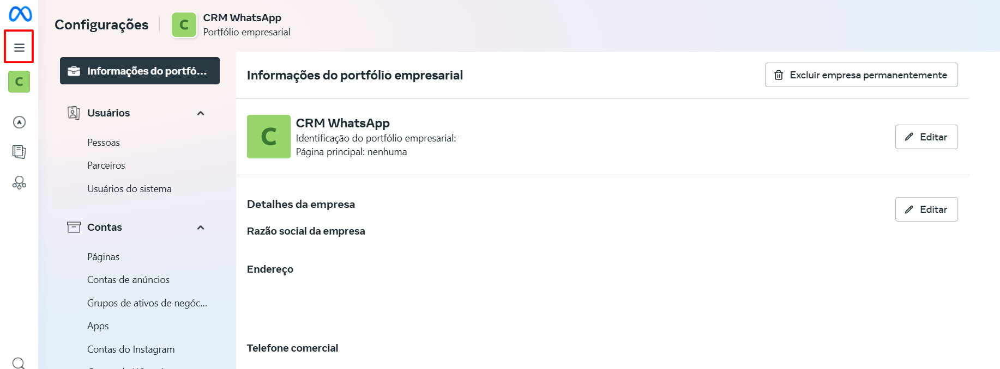
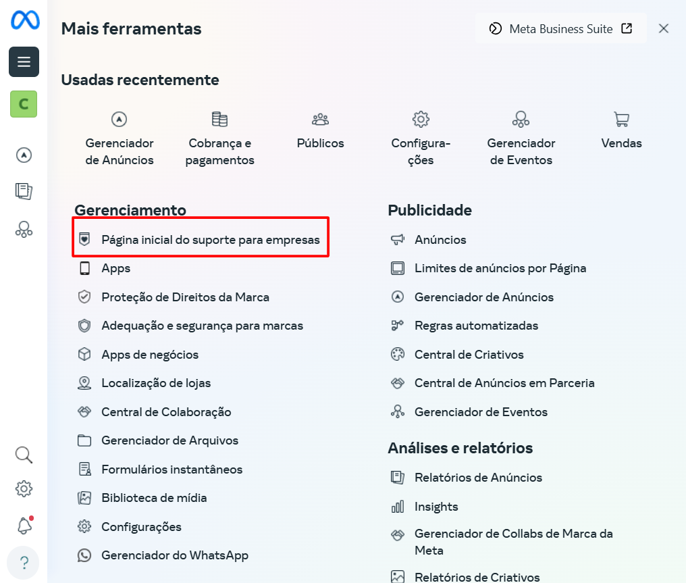

# Acessar página de suporte

O Meta Business Manager é uma plataforma gratuita que permite gerenciar e acompanhar as atividades comerciais nas suas contas do Facebook e Instagram de maneira integrada. Através dela, é possível acessar ferramentas de marketing, analisar insights e interagir com seu público de forma eficiente. Para obter suporte ou esclarecer dúvidas sobre o uso do Meta Business Manager, você pode acessar a página inicial de suporte dedicada.

::: tip Pré-requisitos
* Ter acesso ao **portfólio empresarial**
:::

## Passo 1: Acesse o ícone de ajuda

Faça login na sua conta da Business Manager: [**https://business.facebook.com/**](https://business.facebook.com/)

No painel principal da lateral esquerda da **Meta Business Manager**, clique no ícone 

## Passo 2: Página Inicial do Suporte

Uma tela com várias opções será exibida. Acesse o menu "Gerenciamento" e clique em **"Página Inicial do Suporte para Empresas"**.

## Passo 3: Verificar restrições

Nesta página, será possível verificar se há alguma restrição no **portfólio empresarial**, na **página de anúncios** ou na **conta do WhatsApp**.

## Considerações Finais

A página inicial de suporte da Meta dentro da Business Manager é um recurso vital para manter suas operações funcionando sem problemas. Lembre-se sempre de ter suas credenciais à mão e certificar-se de ter as permissões necessárias para acessar o **portfólio empresarial**.
