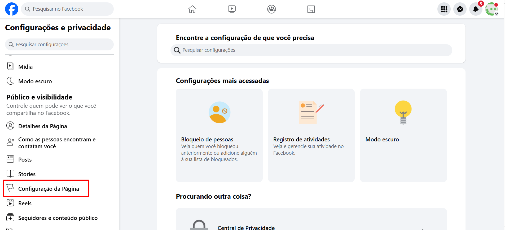
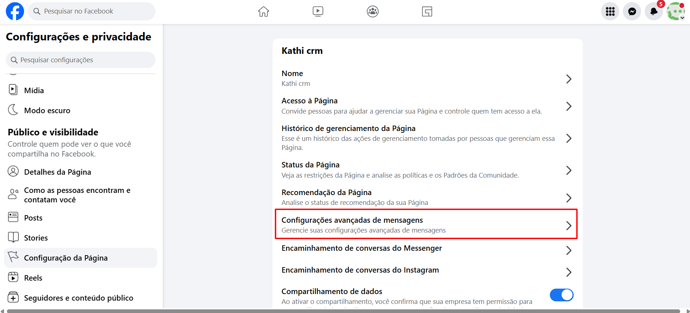
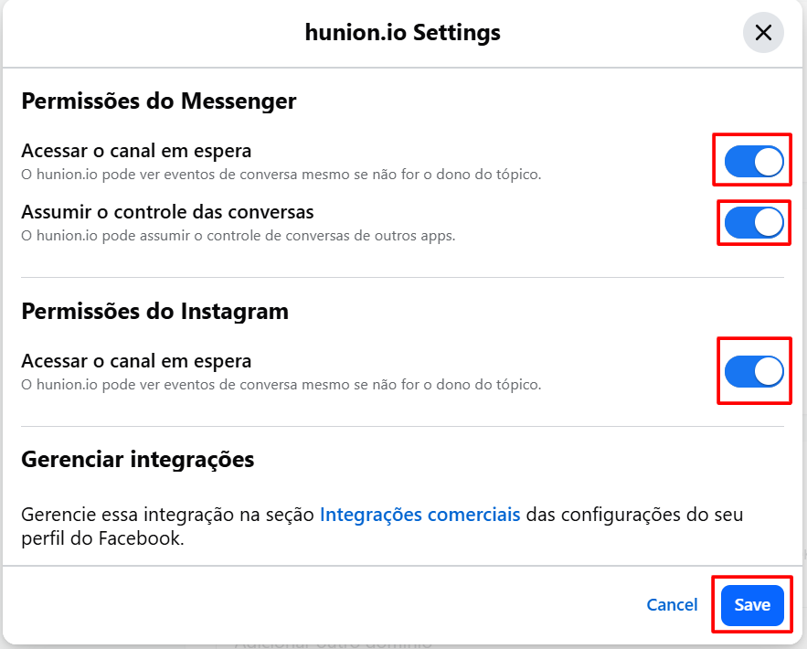
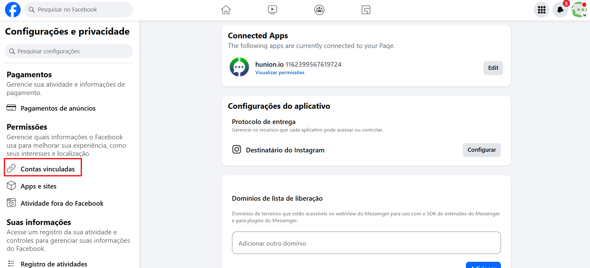
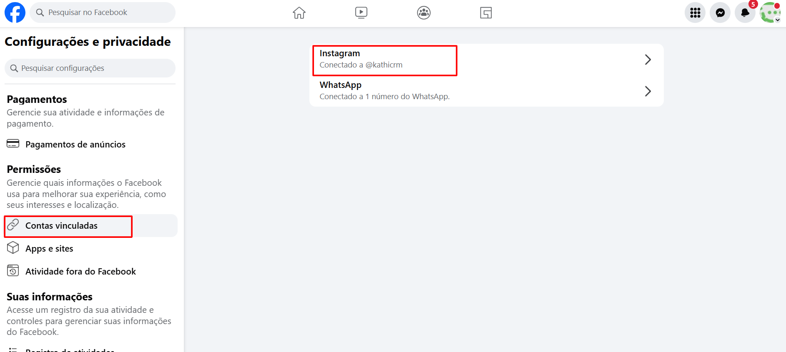
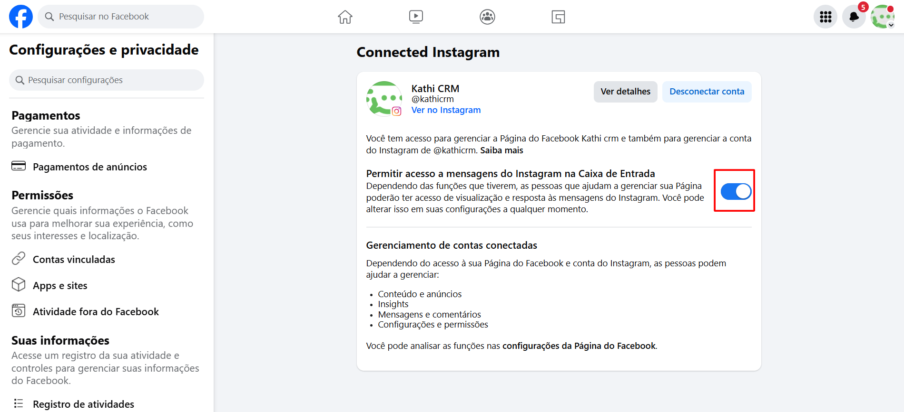
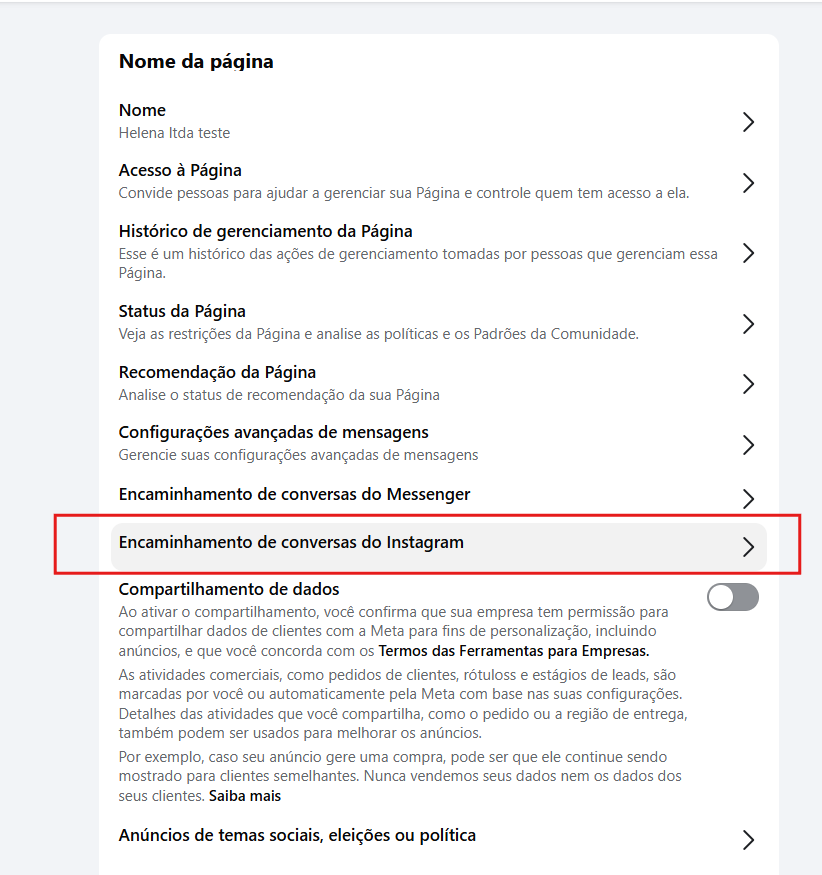
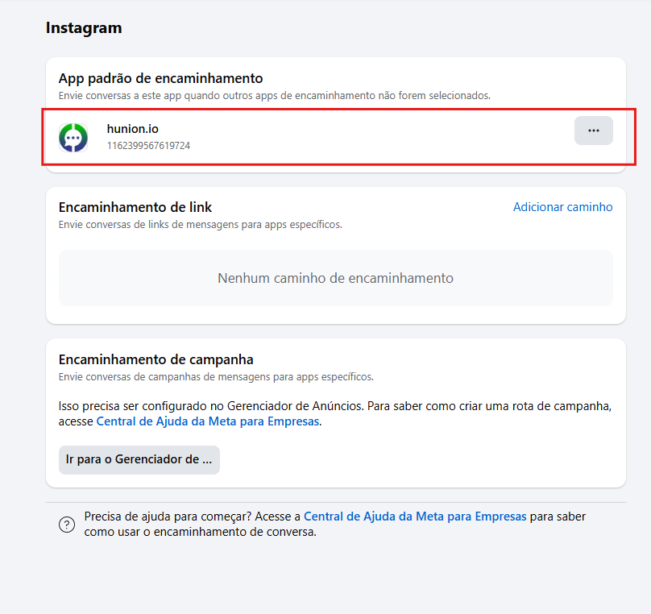

# Mensagens do Instagram não chegam

Este artigo explica os passos para garantir que as mensagens do Instagram sejam recebidas corretamente na **plataforma**. Caso as mensagens não estejam chegando, siga os passos abaixo.

::: tip Pré-requisitos
* Acesso à conta do **Facebook** associada ao Instagram
* Permissões para acessar as **Configurações da Página** no Facebook
:::

## Passo 1: Acesse as Configurações do Facebook

Acesse a conta do **Facebook** vinculada ao seu Instagram.

Clique em **Configurações** no menu superior direito.

## Passo 2: Configurações da Página

Na lateral direita da tela, clique em **Configurações da Página**.

## Passo 3: Configurações avançadas de mensagens

Clique em **"Configurações avançadas de mensagens"** para acessar as configurações de mensagens da página.

## Passo 4: Verifique a conexão da plataforma

Certifique-se de que a plataforma **hunion.io** está conectada à sua página do Facebook.

Se não estiver conectada, remova o canal da plataforma e faça a reconexão.

Caso esteja conectada, clique em **Edit**.

## Passo 5: Ative todas as chaves

Um **popup** será exibido. Verifique se todas as **chaves** estão **ligadas**. Caso alguma chave esteja desligada, ative-a e clique em **Salvar**.

## Passo 6: Contas Vinculadas

No menu lateral esquerdo, role para baixo e clique em "**Contas Vinculadas**".

## Passo 7: Selecione o Instagram

Na tela exibida, você verá as contas vinculadas à página do Facebook, como Instagram e WhatsApp. Clique na opção **Instagram**.

## Passo 8: Permitir acesso a mensagens

Na tela de configurações do **Instagram**, localize a chave **Permitir acesso a mensagens do Instagram na Caixa de Entrada**.

Certifique-se de que a chave esteja ligada para garantir que as mensagens do Instagram sejam recebidas na plataforma.

## Passo 9: Encaminhamento de conversas

Volte nas configurações da página e entre em **Encaminhamento de conversas**.

## Passo 10: Verificar app padrão

Verifique se o app **hunion.io** está selecionado como app padrão. Se não estiver, altere o app atual.

## Dicas Adicionais

::: info Verifique as permissões
Caso o problema persista, certifique-se de que as permissões de **acesso às mensagens do Instagram** estejam configuradas corretamente tanto no **Instagram** quanto no **Facebook**.
:::

## Considerações Finais

Esse processo deve resolver a maioria dos problemas relacionados ao recebimento das mensagens do Instagram. Manter a integração devidamente configurada entre Instagram, Facebook e a **plataforma** é essencial para garantir uma comunicação sem interrupções.
