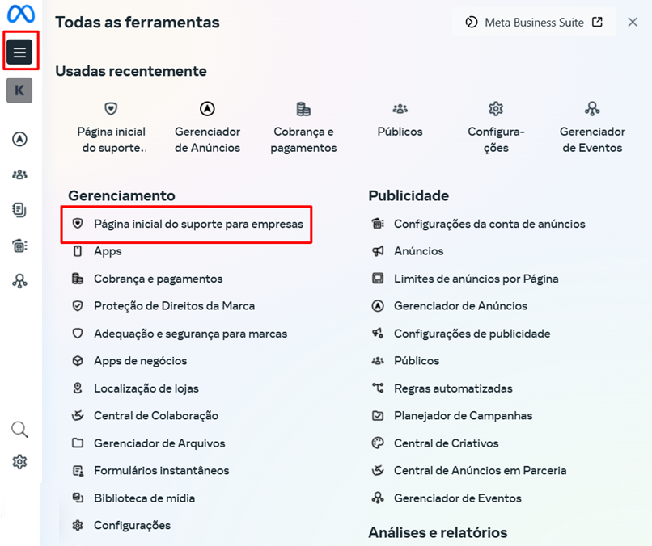
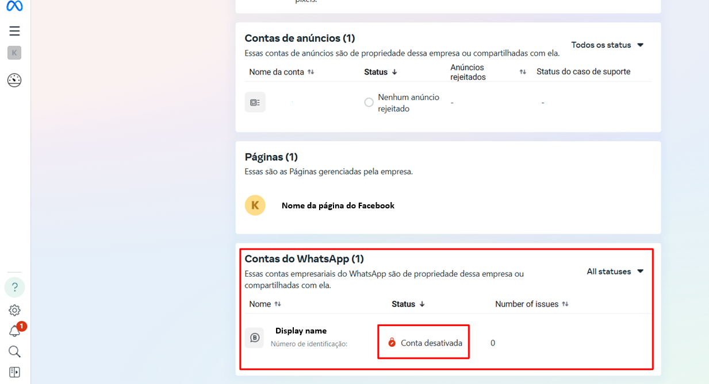

# Solicitar revisão de banimento

## O que significa um banimento ou bloqueio?

Quando uma conta de WhatsApp conectada via **API oficial da Meta** é banida ou bloqueada, ela perde a capacidade de **enviar e/ou receber mensagens** através da **plataforma**. Isso pode ocorrer por diversas razões, como:

* Quebra das **Políticas de Comércio** ou [**Diretrizes da Comunidade da Meta**](https://developers.facebook.com/docs/whatsapp/overview/policy-enforcement?locale=pt_BR)
* **Volume elevado de bloqueios** por parte de contatos
* Uso de linguagem ou conteúdo considerado ofensivo ou sensível
* Campanhas em massa sem opt-in dos contatos

::: danger Como identificar o bloqueio?
Você pode perceber o bloqueio por meio de:

* Mensagens com erro de envio e alertas no painel da **plataforma**
* Aviso de status "bloqueado" ou "banido" na seção **Apps > WhatsApp API**
* Notificações ao tentar reconectar o canal
* Mensagens retornadas com erros como: **"Esta conta foi banida"** ou **"Violation of WhatsApp Business Policy"**
:::

::: tip Pré-requisitos
* Ter uma conta na **Meta Business** configurada e vinculada ao seu número do WhatsApp
* Ser um **administrador** ou possuir permissões adequadas para acessar as informações de faturamento
* Ter um método de pagamento cadastrado e ativo na **Meta Business**
:::

## Passo a passo para solicitar revisão do bloqueio

Se sua conta foi bloqueada indevidamente, siga este processo para solicitar uma **revisão diretamente na Meta**:

### Passo 1: Acesse o Gerenciador de Negócios da Meta

* Vá até o link: [https://business.facebook.com/](https://business.facebook.com/)
* Faça login com o usuário administrador da conta
* Clique em **Conta do WhatsApp**

### Passo 2: Abra o Gerenciador do WhatsApp

* Selecione a conta afetada
* Role o cursor até encontrar a opção **Status da Conta**
* Nesse campo, será exibido o **status atual da conta**, permitindo que você verifique se está ativa ou se há alguma pendência

### Passo 3: Verifique o status da conta

Você verá o status como:

### Passo 4: Acesse a página inicial de suporte

Se a conta estiver **bloqueada ou desabilitada**, acesse a [**página inicial de suporte**](/atalhos/faq/erros-e-problemas/acessar-pagina-de-suporte) para solicitar a revisão e desbloqueio.

* Clique nas **três barras** no canto superior esquerdo
* Em seguida, abrirá um menu — selecione **"Página inicial de suporte"** para acessar as informações do bloqueio

### Passo 5: Localize as informações da conta

Na **página inicial do suporte**, role o cursor até a seção onde constam as informações das contas de **WhatsApp**.

* Em seguida, clique sobre o **status da conta** que deseja verificar

### Passo 6: Visualize os detalhes do bloqueio

Ao clicar no status da conta dentro do **Meta Business Manager**, você será redirecionado para uma página dedicada a exibir os detalhes do bloqueio ou desabilitação da conta. Nela, é possível conferir:

* O motivo do bloqueio, conforme informado pelo sistema
* A data em que a restrição foi aplicada
* As ações disponíveis no momento, como a opção "Request Review" (Pedir Análise) para contestar a decisão

### Passo 7: Solicite a revisão

Para solicitar a revisão, clique no botão **"Pedir Análise"** e siga as instruções na tela para submeter seu pedido. Ao concluir, aguarde o posicionamento da equipe da Meta, que analisará sua solicitação e retornará com um parecer.

Explique que a conta está sendo usada para fins legítimos (atendimento ao cliente, vendas, suporte etc.).

## Após o envio

* A Meta geralmente conclui a análise e retorna com uma decisão em até **48 horas úteis**, embora possa levar mais tempo dependendo da complexidade do caso ou da demanda do suporte
* A resposta será enviada para o **e-mail cadastrado** no Gerenciador de Negócios
* Caso a revisão seja **aprovada**, a conta será reativada automaticamente

::: danger Dicas importantes
* **Nunca utilize listas de transmissão ou mensagens em massa sem consentimento (opt-in)**
* Mantenha uma linguagem neutra e profissional nas interações com os clientes
* Evite envio repetitivo de mensagens automáticas com conteúdo promocional
* Se o bloqueio for frequente, revise suas práticas de envio e estratégias de abordagem
:::

## Considerações Finais

* Nem sempre o bloqueio implica a suspensão total: às vezes, apenas funções específicas são limitadas, mas você ainda pode solicitar uma revisão
* Se o botão de solicitação não estiver disponível, verifique se sua conta possui **autenticação de dois fatores ativada**, pois isso é exigido em alguns casos para liberar o pedido de revisão
* Mantenha-se atento aos prazos informados — geralmente há um período limite para enviar o pedido de revisão
