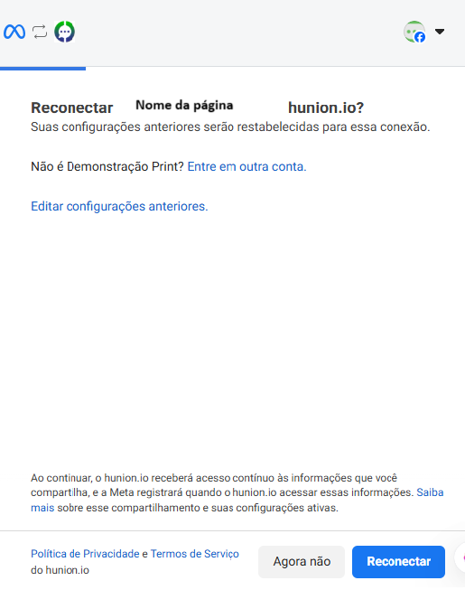
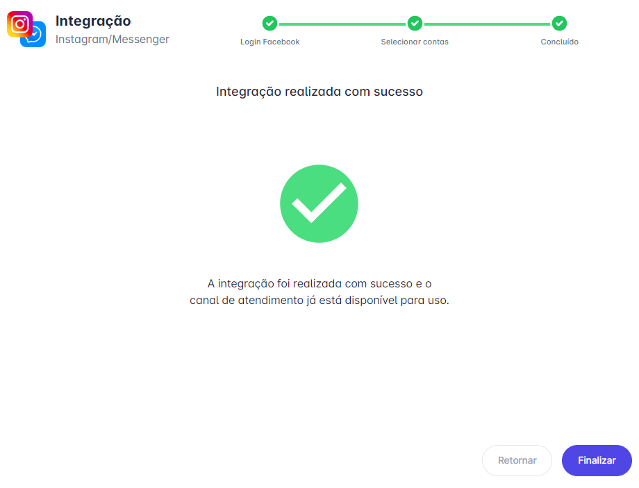

# Renovar token do Instagram e Messenger

Na integração com o **Instagram** e o **Facebook Messenger** na **plataforma**, é necessário **renovar o token de permissão a cada 60 dias**. Esse token é fornecido pela Meta e tem um prazo de validade. Quando expira, as mensagens param de ser recebidas até que a renovação seja feita.

Neste artigo, mostramos o passo a passo para você renovar esse token de forma rápida e segura.

::: tip Pré-requisitos
* Acesso à conta na **plataforma**
* Somente os usuários com perfil de Administrador podem fazer a conexão do Instagram e/ou Messenger
* Ter uma conta comercial no **Instagram** vinculada a uma página do **Facebook**
* Ser **administrador** da conta no **Meta Business Manager**
* O Messenger da página do Facebook deve estar **ativado**
* O Instagram deve estar integrado à página do Facebook
:::

Quando chegar o momento de **renovar o token**, a **plataforma** exibirá uma mensagem de alerta assim que você fizer login na conta.

## Passo 1: Alterar permissões

Clique na opção **Alterar permissões**.

## Passo 2: Iniciar renovação

A tela de integração será exibida. Basta clicar em **"Iniciar"** para prosseguir com a renovação do token.

## Passo 3: Entrar com o Facebook

Clique em **"Entrar com o Facebook"** para prosseguir com a autenticação.

## Passo 4: Reconectar

Um pop-up será exibido. Clique em **"Reconectar"** para restabelecer a integração com a conta.

## Passo 5: Selecionar contas

Selecione as contas que deseja manter associadas à plataforma e, em seguida, clique em **"Continuar"**.

## Passo 6: Finalizar

Por fim clique em **"Finalizar"** para concluir o processo.

## Considerações finais

::: warning Observações Importantes
* Manter o token de permissão atualizado é essencial para garantir o bom funcionamento das integrações com **Instagram e Facebook Messenger** na **plataforma**
* A plataforma facilita esse processo com avisos automáticos e um passo a passo intuitivo, mas é importante que o responsável pela conta tenha as permissões corretas no **Gerenciador de Negócios da Meta**
* Recomendamos revisar periodicamente as conexões e garantir que os tokens estejam ativos para evitar interrupções no atendimento
* A cada **60 dias** o token de conexão das redes sociais expira e será necessário renová-lo
* Importante manter as opções de: **Receber mensagem quando esta conta for mencionada em um story e Receber respostas e reações aos seus stories** selecionadas dentro da plataforma
:::
