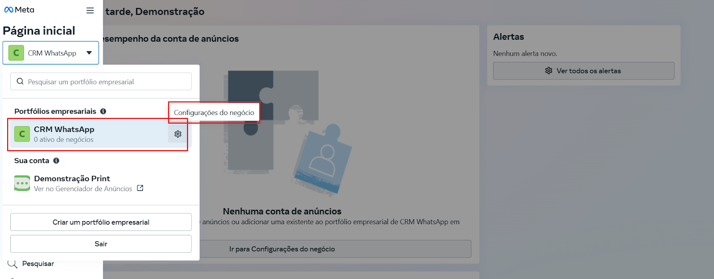
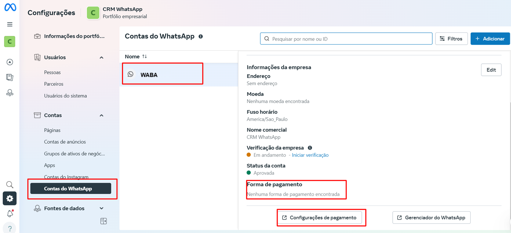
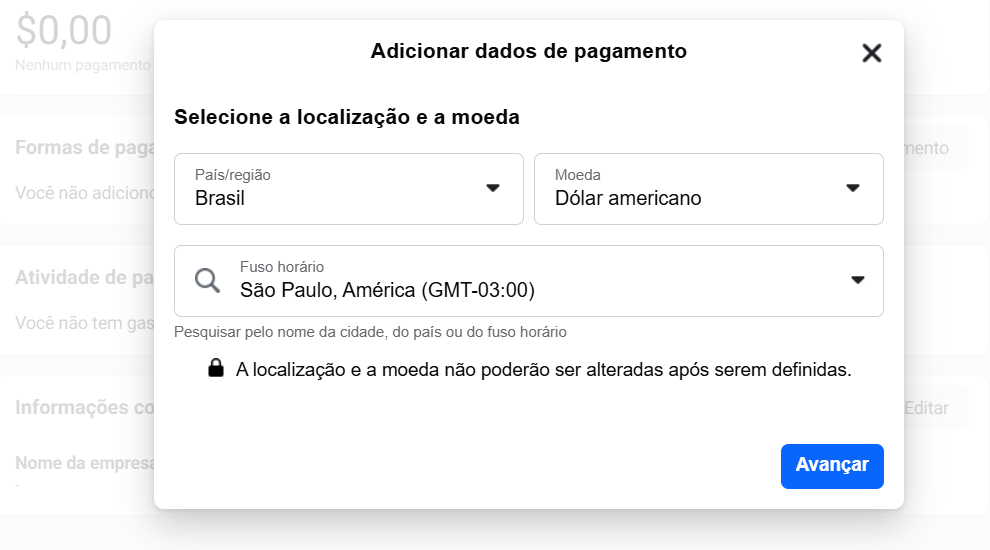

# Configurar pagamento

Para utilizar a API Oficial do WhatsApp Business, é necessário cadastrar uma forma de pagamento válida na sua conta do **Meta Business Manager**. Este processo é essencial para que você possa enviar mensagens e utilizar os recursos oferecidos pela API. A seguir, apresentamos um guia passo a passo para ajudá-lo a adicionar um cartão de crédito à sua conta.

::: tip Pré-requisitos
* Ter uma conta na **Meta Business** configurada e vinculada ao seu número do WhatsApp.
* Ser um **administrador** ou possuir permissões adequadas para acessar as informações de faturamento.
:::

## Passo 1: Acessar Configurações do Negócio

Faça login na sua conta pelo site [Meta Business Manager](https://business.facebook.com/).

No menu lateral, clique em **Configurações do Negócio**.

## Passo 2: Acessar Configurações de Pagamento

Na BM, selecione '**Conta do WhatsApp**'. Em seguida, no canto inferior direito, acesse '**Configurações de Pagamento**'.

## Passo 3: Adicionar forma de pagamento

Clique no botão **Adicionar forma de pagamento**, cadastre o número do cartão (ou selecione o cartão padrão da empresa, caso já tenha preenchido algum) preencha os dados da empresa antes de salvar.

## Passo 4: Preencher Informações do Negócio

Uma janela será aberta solicitando informações adicionais:

* **País/Região**: Selecione "Brasil" no menu suspenso.
* **Moeda**: Escolha "Dólares dos EUA". Embora você esteja no Brasil, a Meta realiza a conversão automática de dólar para real na cobrança.
* **Fuso Horário**: Selecione o fuso horário correspondente à sua localização no Brasil.

Após preencher todas as informações, clique em "Avançar".

## Passo 5: Inserir os Dados do Cartão de Crédito

Agora, você precisará fornecer os detalhes do seu cartão de crédito ou débito:

* **Número do Cartão**: Digite os 16 dígitos que aparecem na frente do seu cartão.
* **Data de Validade**: Insira o mês e o ano de validade do cartão, geralmente encontrados na frente do cartão.
* **Código de Segurança (CVV)**: Este é um número de três dígitos localizado no verso do cartão.
* **Nome do Titular**: Digite o nome exatamente como aparece no cartão.

Após inserir todas as informações corretamente, clique em **"Salvar"** para concluir o processo.

## Considerações Finais

::: warning Observações Importantes
* **Cartão Internacional**: Certifique-se de que o seu cartão de crédito ou débito está habilitado para transações internacionais, pois as cobranças da API Oficial do WhatsApp são feitas em dólares americanos.
* **Cobranças**: A Meta converterá automaticamente o valor das cobranças de dólares para reais na sua fatura.
:::

**Saiba mais:**
Saiba como adicionar um cartão de crédito neste link: <https://www.facebook.com/business/help/488291839463771>
