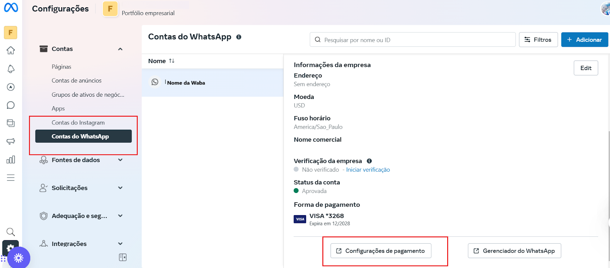

# Consultar extrato de pagamento

A Meta Business permite acompanhar os custos das conversas realizadas através da API oficial do WhatsApp. Consultar o extrato de pagamento é essencial para monitorar os gastos e garantir um melhor controle financeiro dentro da plataforma. Neste guia, você aprenderá como acessar e visualizar os detalhes do extrato de pagamento de conversas na Meta Business.

::: tip Pré-requisitos
* Ter uma conta na **Meta Business** configurada e vinculada ao seu número do WhatsApp.
* Ser um **administrador** ou possuir permissões adequadas para acessar as informações de faturamento.
* Ter um método de pagamento cadastrado e ativo na **Meta Business**.
:::

## Passo 1: Acessar Configurações do Negócio

Faça login na sua conta pelo site [Meta Business Manager](https://business.facebook.com/).

No menu lateral, clique em **Configurações do Negócio**.

## Passo 2: Acessar Configurações de Pagamento

Na BM, selecione '**Conta do WhatsApp**'. Em seguida, no canto inferior direito, acesse '**Configurações de Pagamento**'.

## Passo 3: Visualizar Atividade de Pagamento

Uma nova aba se abrirá, clique na opção **atividade de pagamento**.

### Visualize o Extrato de Pagamento

* Dentro da aba de **Faturamento**, localize a opção **Extrato de Conversas**.
* Escolha o **período** que deseja consultar.
* O extrato detalhará a quantidade de conversas pagas, o valor cobrado e a categoria da conversa (como conversas de atendimento ou marketing).

### Baixe ou Exporte os Dados

* Caso precise manter um registro, clique na opção **Baixar extrato**.
* O arquivo será gerado em formato PDF ou CSV para análise detalhada.

## Considerações Finais

::: info Dica
Consultar o extrato de pagamento regularmente permite um melhor planejamento financeiro e evita surpresas com cobranças inesperadas.
:::
