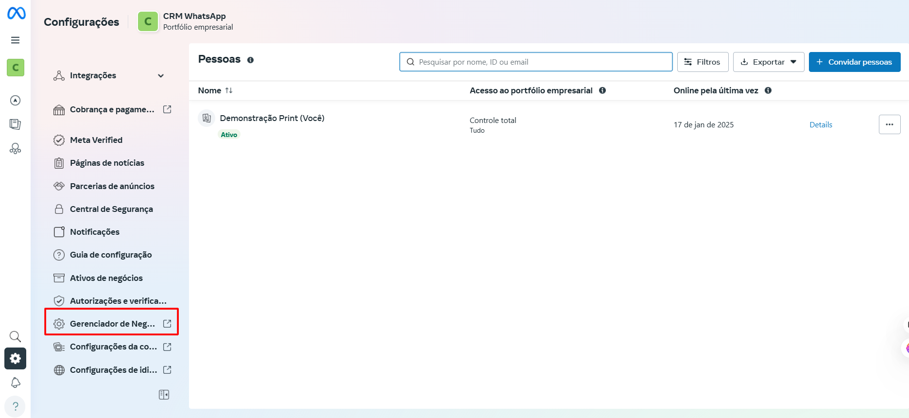

# Informações do portfólio

**O que é o Portfólio Empresarial no Meta Business Manager?**

O **portfólio empresarial** no **Meta Business Manager** é uma seção onde você pode organizar todos os ativos e recursos digitais da sua empresa, como **páginas do Facebook**, **contas de anúncios**, **contas do Instagram, contas de WhatsApp**, **catálogos de produtos**, entre outros. Ele serve como um painel centralizado para facilitar a gestão e o controle dos diversos elementos que você utiliza para a sua presença digital.

::: tip Pré-requisitos
* Ter uma **conta pessoal no Facebook**
* Ter acesso ao **Meta Business Manager.**
:::

## Passo 1: Acessar o Gerenciador de Negócios

Acesse o site oficial: [https://business.facebook.com/](https://business.facebook.com/).

No menu lateral esquerdo, clique em **"Gerenciador de Negócios"**.

## Passo 2: Acessar Informações da Empresa

Uma nova aba será aberta. Na lateral esquerda, role para baixo e clique em **'Informações da empresa'**.

## Passo 3: Editar Informações

A tela para edição das informações da empresa será exibida. Clique no ícone para editar as informações da sua empresa.

::: warning Importante
Preencha todos os campos corretamente, pois para integrar um número, é imprescindível que esses dados estejam completos e que o **site da empresa** esteja ativo e com **certificado de segurança**.
:::

## Passo 4: Salvar alterações

Após o preenchimento clique em **salvar**.

## Considerações Finais

* O **portfólio empresarial** dentro do **Meta Business Manager** é uma ferramenta poderosa para organizar e gerenciar os ativos digitais da sua empresa. Ao centralizar as páginas, contas de anúncios, catálogos e outros recursos, você consegue otimizar o gerenciamento da sua presença digital e facilitar a colaboração entre os membros da equipe.
* Mantenha as informações da empresa sempre atualizadas.
