# Cadastrar Instagram / Facebook Messenger

A integração do Instagram e Messenger à **plataforma** permite que sua equipe centralize os atendimentos e melhore a eficiência no suporte ao cliente. Com essa conexão, todas as mensagens recebidas nesses canais ficarão disponíveis na **plataforma**, facilitando o gerenciamento das interações e agilizando as respostas.

::: tip Pré-requisitos
* Acesso à conta na **plataforma**.
* Somente os usuários com perfil de Administrador podem fazer a conexão do Instagram e/ou Messenger
* Ter uma conta comercial no **Instagram** vinculada a uma página do **Facebook**.
* Ser **administrador** da conta no **Meta Business Manager**.
* O Messenger da página do Facebook deve estar **ativado**.
:::

### Passo 1: Acessar Ajustes de Conta

No menu principal clique em **“Ajustes”** e em seguida **"Conta”**.

### Passo 2: Canais de Atendimento

No menu de opções, clique em **”Canais de atendimento”** e em seguida clique o ícone correspondente.

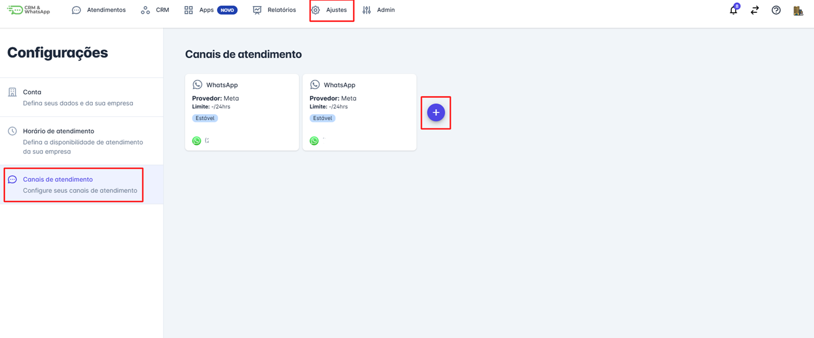

### Passo 3: Selecionar Rede Social

Selecione qual **rede social** deseja integrar na plataforma.

### Passo 4: Iniciar Integração

Uma tela de integração se abrirá. Clique em **Iniciar**.

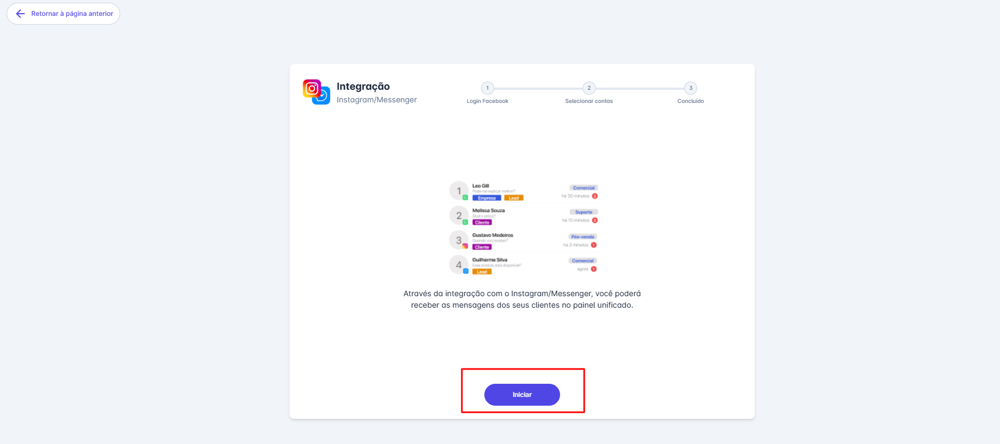

### Passo 5: Login com Facebook

Uma tela será aberta, direcionando para o login com o Facebook. Clique em **"Entrar com Facebook"**.

### Passo 6: Selecionar Conta

Faça login na conta em que o Messenger e/ou Instagram estão conectados à **Business Manager (BM)**.

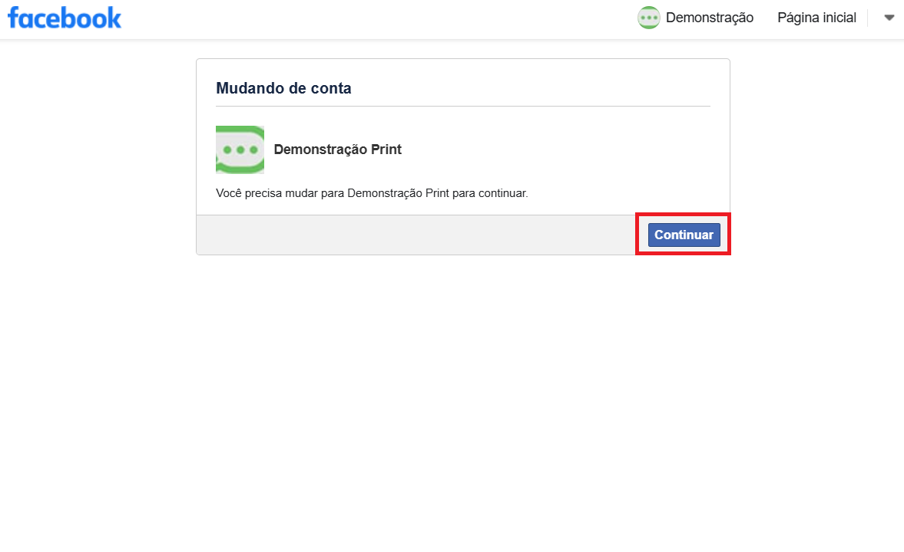

### Passo 7: Continuar como

Clique em “**Continuar como [Nome da conta do Facebook]”.**

### Passo 8: Selecionar Páginas

Nesta etapa, selecione as **“páginas”** que deseja integrar à plataforma. Escolha a opção desejada e, em seguida, clique em **"Continuar".**

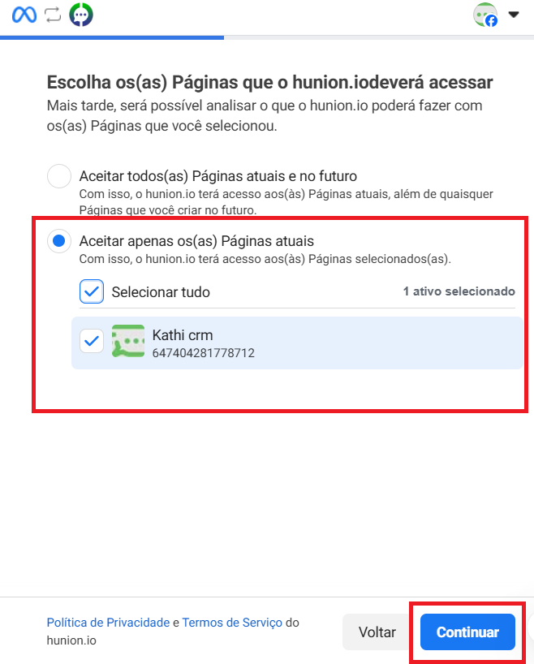

### Passo 9: Selecionar Empresas

Nesta etapa, selecione as **“Empresas”** que deseja integrar à plataforma. Escolha a opção desejada e, em seguida, clique em **"Continuar”.**

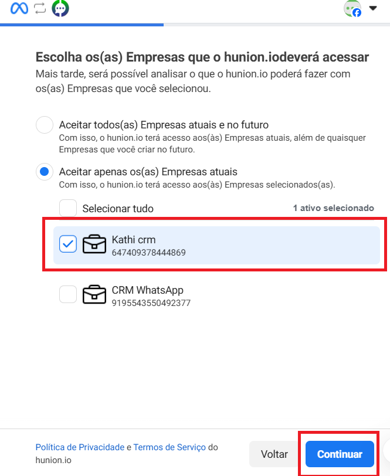

### Passo 10: Selecionar Contas

Selecione as contas do Instagram e/ou Messenger que deseja conectar na plataforma. Em seguida clique em **“Continuar”.**

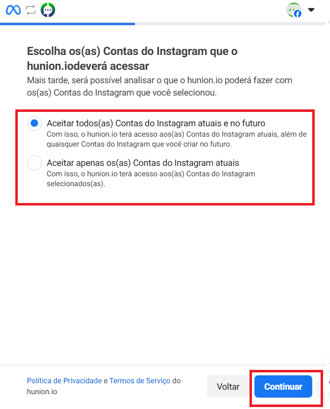

### Passo 11: Salvar

Na próxima tela revise as informações e clique em **“Salvar”.**

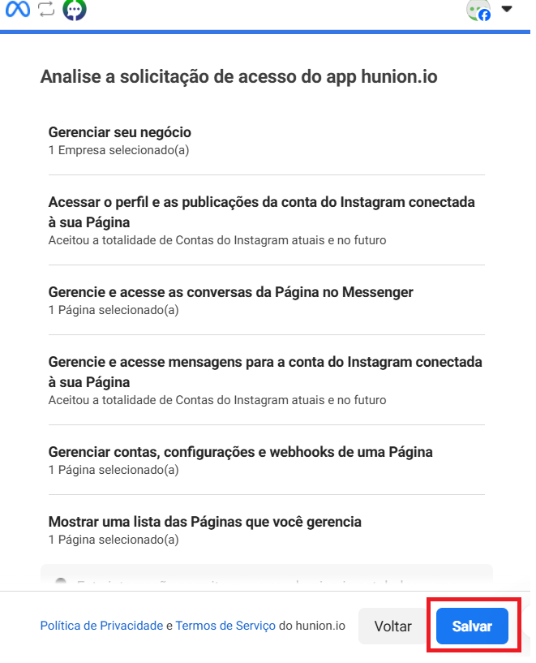

### Passo 12: Finalizar no Facebook

A conexão com a hunion foi feita. Clique em **“Entendi”** para finalizar o processo.

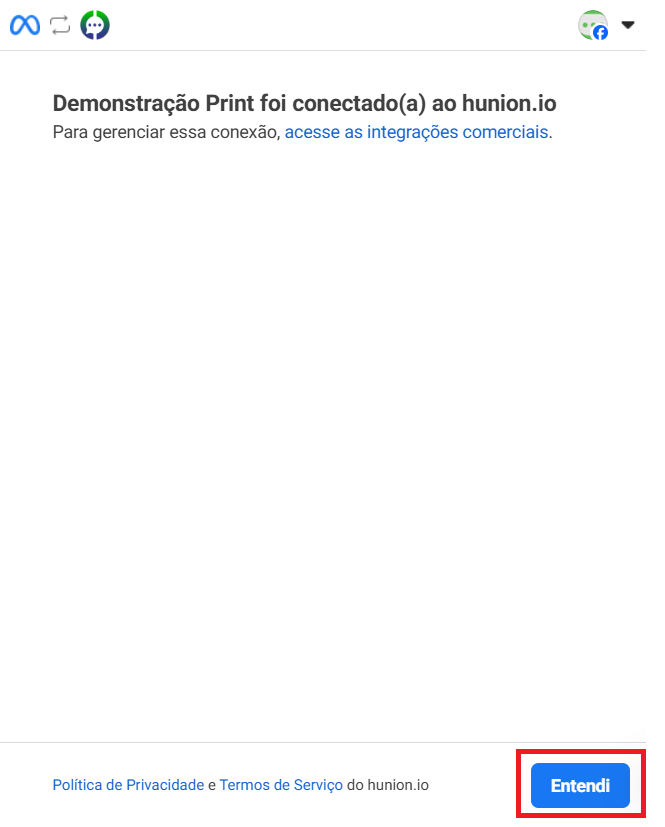

### Passo 13: Conclusão na Plataforma

Você será direcionado para plataforma novamente para a **conclusão** do processo. As redes sociais irão aparecer na tela, clique em **“continuar”.**

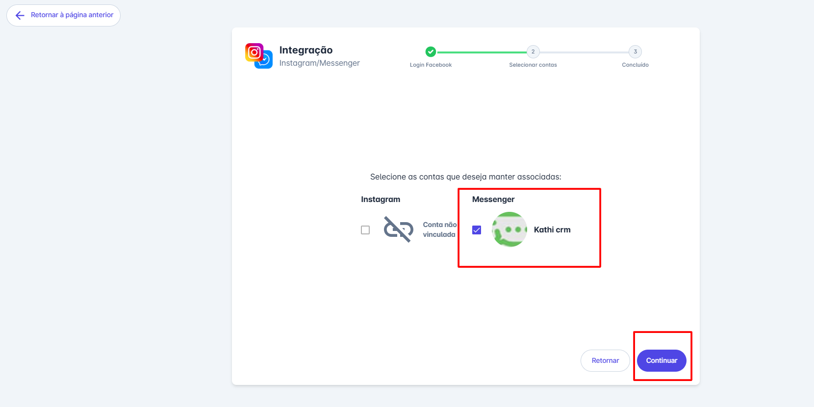

### Passo 14: Finalizar

Por fim clique em **“finalizar”** para concluir a integração.

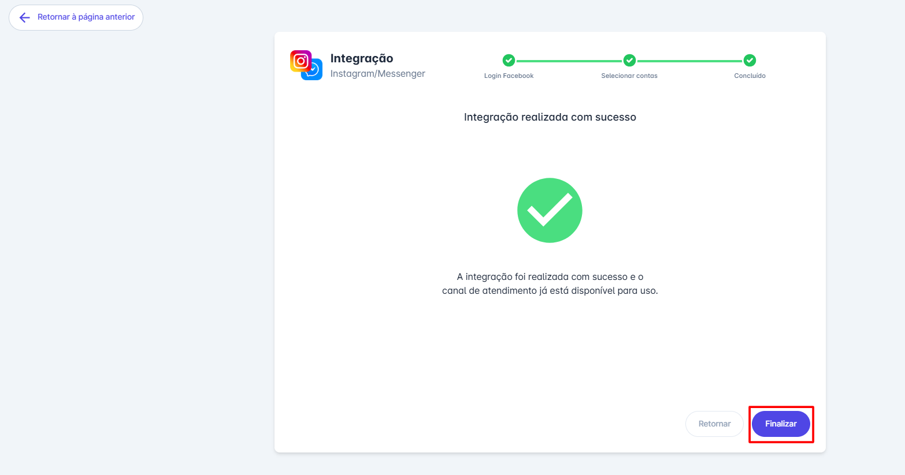

### Passo 15: Visualização Final

A tela de **canais de atendimento** ficará como a imagem abaixo.

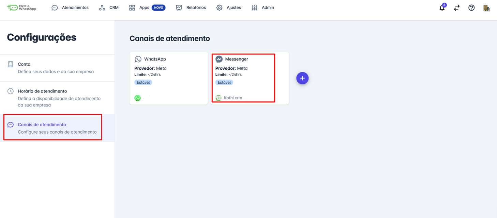

## Considerações finais

* A integração do **Instagram** e **Messenger** à **plataforma** permite uma gestão mais eficiente das interações com seus clientes, centralizando as mensagens em um único ambiente.
* Ao seguir os passos apresentados neste artigo, você garante que suas contas estejam corretamente conectadas, evitando falhas na comunicação e otimizando o atendimento.
* A cada **60 dias** o token de conexão das redes sociais expira e será necessário renová-lo.
* A **janela de conversa** das redes sociais ficam abertas por 7 dias, para reiniciar a conversa com o contato será necessário utilizar o aplicativo.
* **Não é possível iniciar conversa** com contato de Intagram e Messenger, apenas responder.
* As interações com os contatos vindos das redes sociais **não são cobradas.**
