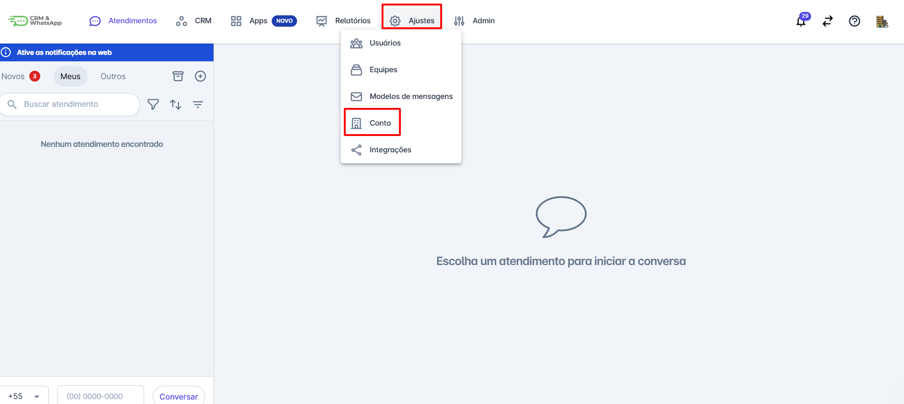
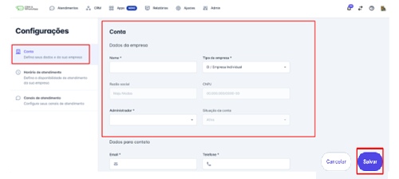

# Dados da conta

Os dados da conta na **plataforma** são informações essenciais sobre a empresa. Esses dados incluem informações como nome da empresa, tipo de empresa, razão social, CNPJ, Administrador da conta, entre outras informações relevantes.

::: tip Pré-requisitos
* Acesso à conta na **plataforma**.
* Somente os usuários com **perfil de Administrador** podem acessar e editar os dados da conta.
:::

### Passo 1: Acessar Dados da Conta

No menu principal clique em **“Ajustes”** e em seguida **"Conta”**.

### Passo 2: Salvar Alterações

Após realizar o cadastro ou ajustes necessários clique em **salvar**.

## Considerações finais

* Mantenha os dados da sua conta sempre atualizados.
