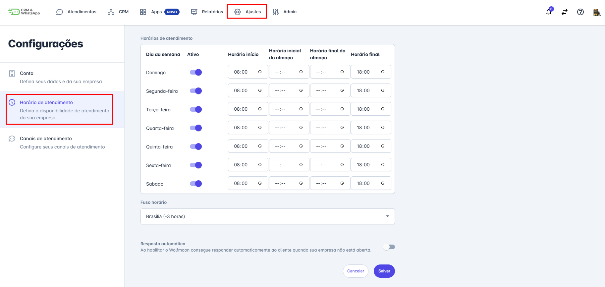
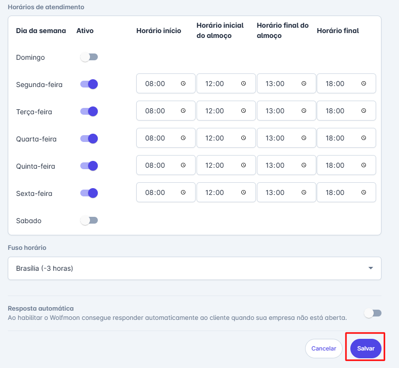
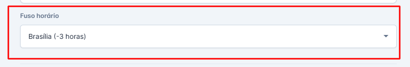
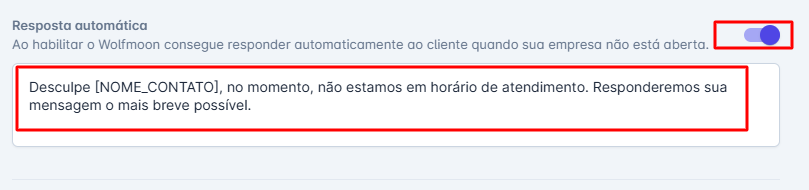
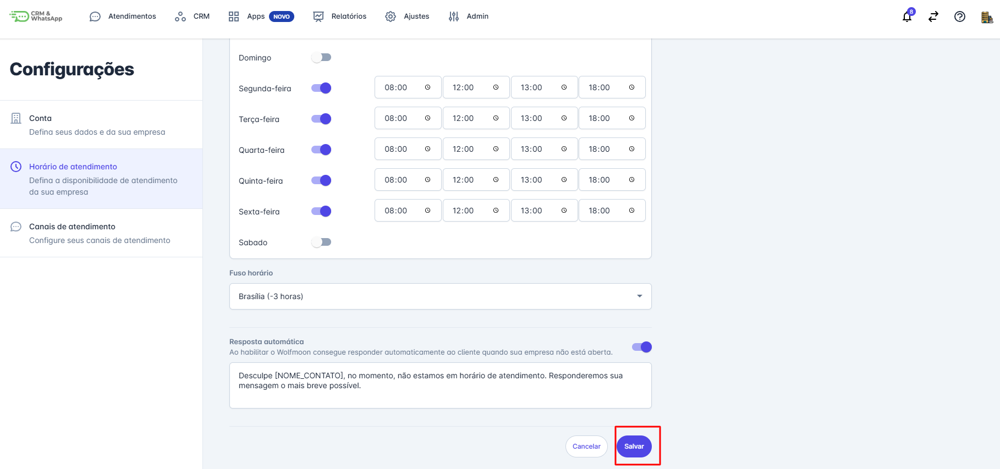

# Horário de atendimento

A funcionalidade "**Horário de Atendimento"** da **plataforma** permite que as empresas definam e gerenciem os horários de operação de suas atividades. Essa ferramenta é essencial para assegurar que os clientes e a equipe estejam sempre cientes dos horários de atendimento, facilitando a gestão de tempo e melhorando a satisfação do cliente. Com o "Horário de Atendimento", sua empresa pode configurar horários de funcionamento específicos para diferentes dias da semana, feriados e eventos especiais.

::: tip Pré-requisitos
* Acesso à conta na **plataforma**.
* Somente os usuários com perfil de Administrador podem acessar e editar o Horário de Atendimento.
:::

### Passo 1: Acessar Ajustes de Conta

No menu principal clique em **“Ajustes”** em seguida **"Conta”**.

### Passo 2: Acessar Horário de Atendimento

No menu de opções, clique em **"Horário de Atendimento"**.

A tela de configuração de horários será exibida.

### Passo 3: Preenchimento dos Horários

Insira os horários de abertura e fechamento para cada dia da semana conforme a necessidade da sua empresa. Adicione intervalos de pausa, se aplicável (por exemplo, horário de almoço).

### Passo 4: Selecionar Fuso Horário

Selecione o fuso horário correspondente à localidade da sua empresa para garantir que os horários de atendimento estejam corretos.

### Passo 5: Ativar Resposta Automática

É possível optar pela resposta automática fora do horário de atendimento, para isso ligue a chave de resposta automática para ativar esta funcionalidade.

Configure a mensagem que será enviada aos clientes fora do horário de atendimento, informando-os que a empresa está fechada e quando estará disponível novamente.

### Passo 6: Salvar

Após preencher todos os horários, definir o fuso horário e configurar a resposta automática, revise as informações.

Clique em **"Salvar"** para aplicar e publicar os horários de atendimento.

## Considerações finais

* Mantenha os dados de seu horário de atendimento sempre atualizados.
