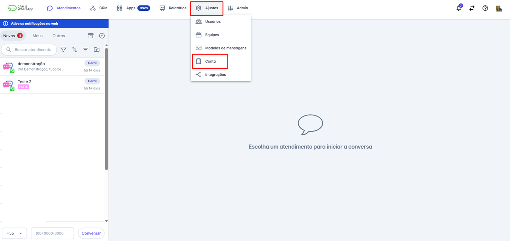
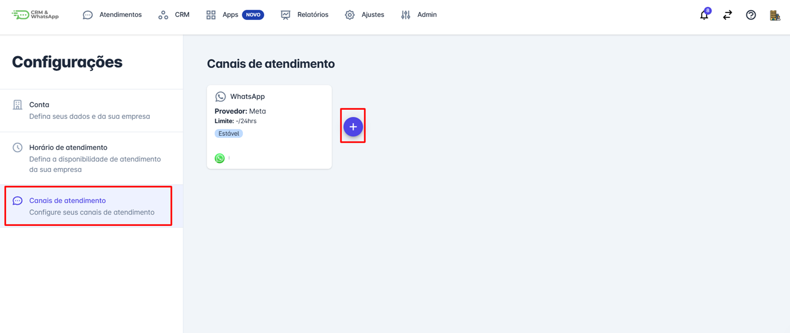
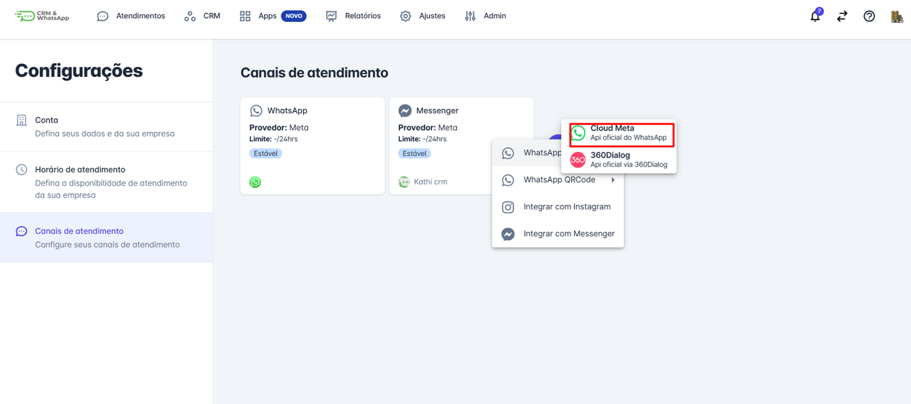
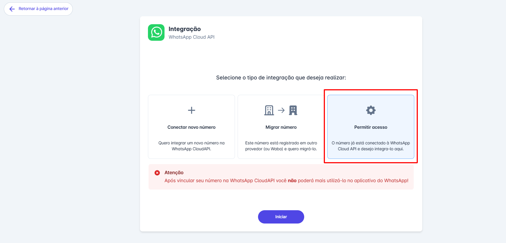
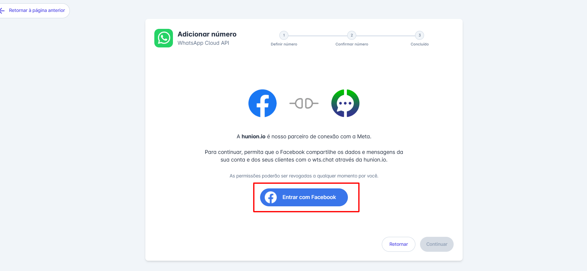
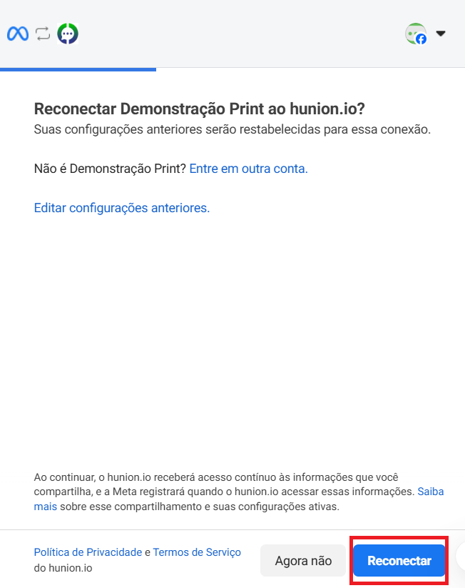
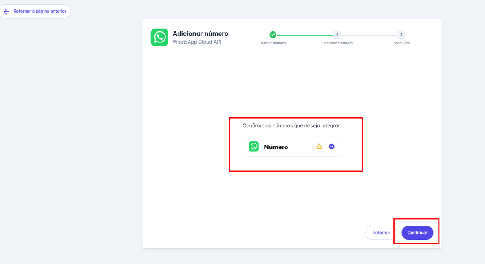

# Processo de dar permissão para reconectar o número

Na **plataforma**, a funcionalidade de reconectar o número permite que empresas mantenham a continuidade da comunicação via WhatsApp, mesmo em situações em que haja necessidade de restabelecer a conexão do número. Essa ferramenta é essencial para assegurar que o atendimento não seja interrompido, proporcionando agilidade e segurança na gestão dos canais de comunicação.

**Por Que a Reconexão é Importante?**

* **Continuidade do Atendimento:** Permite que a empresa retome rapidamente as interações com os clientes, mesmo após eventuais desconexões.
* **Segurança e Confiabilidade:** Garante que o número permanece ativo e integrado à plataforma, mantendo o histórico de atendimentos e a integridade dos dados.
* **Flexibilidade Operacional:** Facilita a gestão de mudanças ou atualizações sem comprometer o fluxo de atendimento.

::: tip Pré-Requisitos
* **Acesso à conta** na **plataforma**.
* Ter perfil de **administrador** na plataforma.
* O número que será reconectado deve estar previamente configurado e validado na plataforma.
:::

## Como Dar Permissão para Reconectar o Número

### Passo 1: Acessar Ajustes de Conta

Acessar as Configurações de Atendimento. No menu principal da **plataforma**, clique em **"Ajustes"** e em seguida clique em **"Conta"**.

### Passo 2: Canais de Atendimento

No menu de opções, clique em "**Canais de Atendimento**”, em seguida clique no **ícone “+”**.

### Passo 3: Selecionar WhatsApp Cloud API

Clique em **WhatsApp Cloud Api**. Como mostra a imagem abaixo.

### Passo 4: Permitir Acesso

Selecione a opção de **“Permitir acesso”** e clique em iniciar, como mostra a imagem abaixo.

### Passo 5: Login com Facebook

Clique em **"Entrar com Facebook" e** faça login com sua conta empresarial.

* Se você não for administrador da conta **Business Manager (BM),** clique em **"Entrar em outra conta"** e faça login com um usuário que tenha acesso administrativo.

### Passo 6: Reconectar

Um popup será exibido na tela. Clique em **"Reconectar"** para iniciar o processo de reconexão do número.

### Passo 7: Selecionar Número

Você será redirecionado para a **janela de integração** da plataforma. Selecione o número que deseja **reconectar** e, em seguida, clique em **"Continuar".**

### Passo 8: Finalizar

Para concluir o processo, clique em **finalizar**.

## Considerações Finais

* A funcionalidade de dar **permissão para reconectar** o número na **plataforma** é um recurso fundamental para manter a continuidade e a eficiência do atendimento ao cliente.
* Essa ferramenta não só melhora a experiência do cliente, mas também otimiza os processos internos, permitindo que a equipe de atendimento se concentre na resolução de problemas e na melhoria do serviço prestado.
* Essa funcionalidade tem como objetivo solucionar problemas como não envio e recebimento de mensagens.
