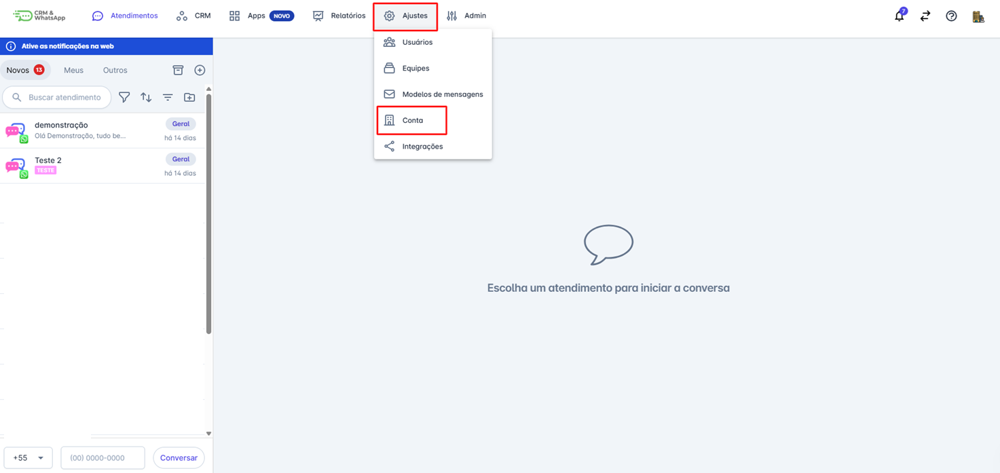
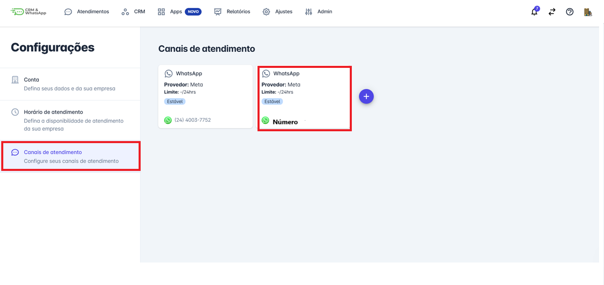
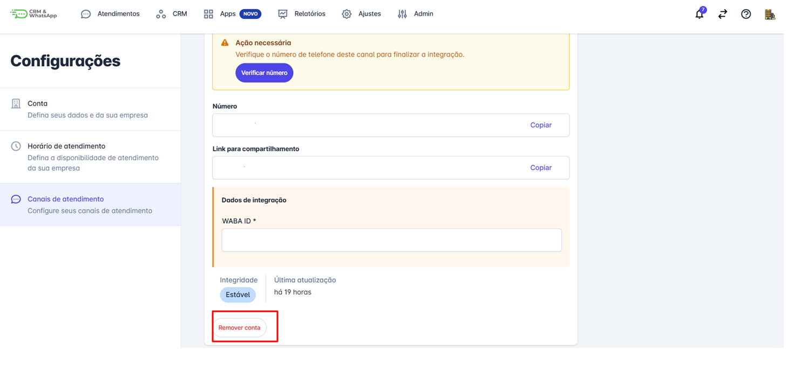
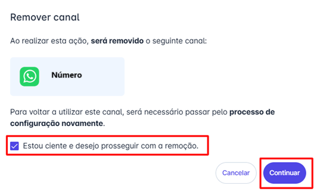
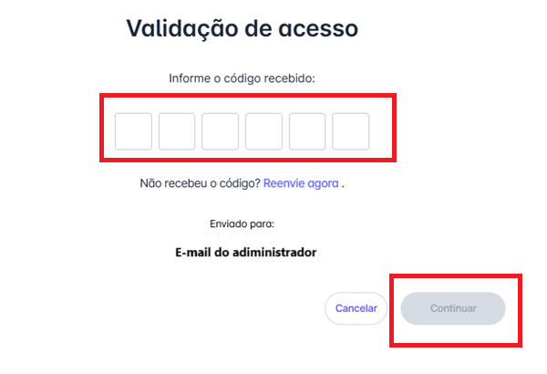
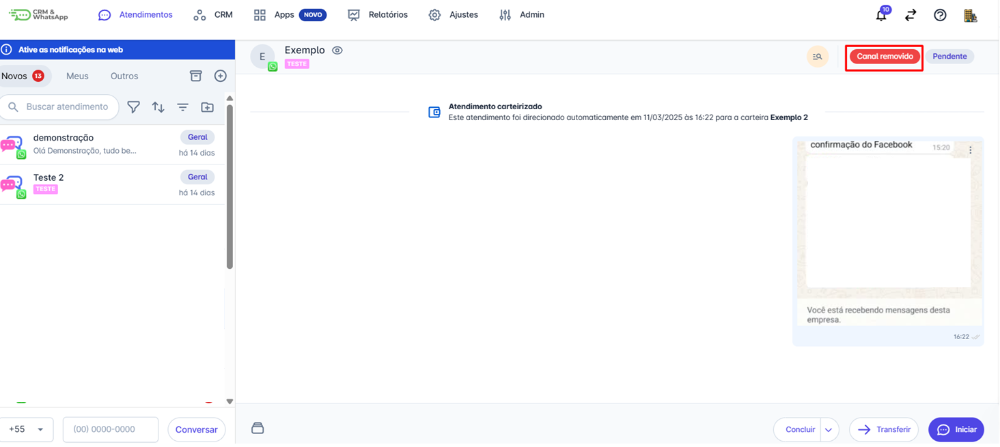
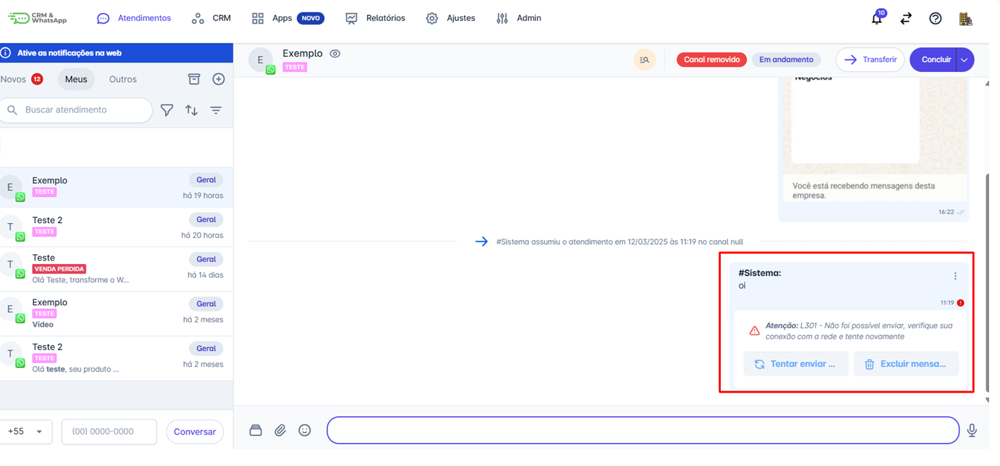

# Remover Canal de Atendimento

Na **plataforma**, os **canais de atendimento** são essenciais para a comunicação com os clientes, porém, em alguns casos, pode ser necessário remover um canal que não está mais em uso. Esse processo deve ser realizado com atenção para evitar impactos no atendimento e na gestão da equipe.

::: tip Pré-requisitos
* Ter perfil de **administrador** na plataforma.
* Certificar-se de que **não há atendimentos ativos** no canal que será removido, caso haja, conclua ou transfira os atendimentos.
* Caso o canal seja uma **integração oficial (API do WhatsApp, Messenger, etc.)**, confirmar se a remoção não impactará outras configurações.
:::

### Passo 1: Acessar Ajustes de Conta

Acessar as Configurações de Atendimento. No menu principal da **plataforma**, clique em **"Ajustes"** em seguida clique em **"Conta"**.

### Passo 2: Selecionar Canal

Selecione a opção **"Canais de Atendimento"** e localize o canal que deseja excluir na lista de **canais cadastrados**.

### Passo 3: Remover Conta

Clique sobre o canal para acessar suas configurações. Em seguida clique em **Remover conta**.

### Passo 4: Confirmar Remoção

Um alerta será exibido informando sobre a remoção. Confirme a ação clicando em **"Estou ciente e desejo prosseguir com a remoção".** Em seguida clique em **"Continuar”.**

### Passo 5: Validação

Uma tela de validação surgirá, insira o código enviado para o email do **Administrador** da conta e em seguida clique em “**Continuar”**. O Canal será removido.

### Passo 6: Visualização Pós-Remoção

Após a remoção, as conversas atreladas ao canal removido aparecerão dessa maneira na plataforma.

Ao tentar enviar mensagem para o contato será enviada a mensagem: **“ Não foi possível enviar, verifique sua conexão com a rede e tente novamente”.**

## Considerações Finais

* A remoção de um canal é **irreversível**. Caso precise utilizá-lo novamente, será necessário configurá-lo novamente.
* Se precisar continuar a conversa com um contato vinculado ao canal removido, conclua os atendimentos pendentes e inicie um novo atendimento por meio de **outro canal disponível na plataforma**.
* Ao remover um canal, as conversas vinculadas a ele **não retornam** para a aba **'Novos'.**
