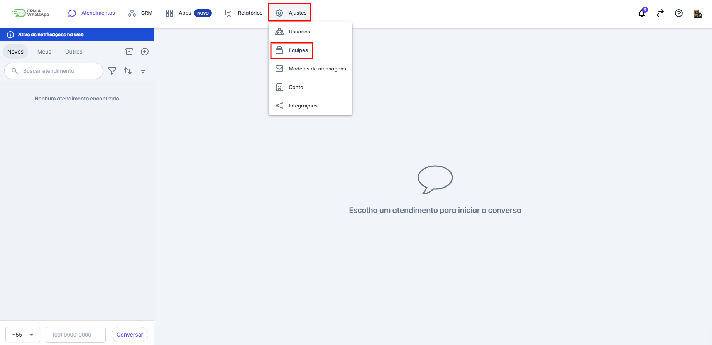
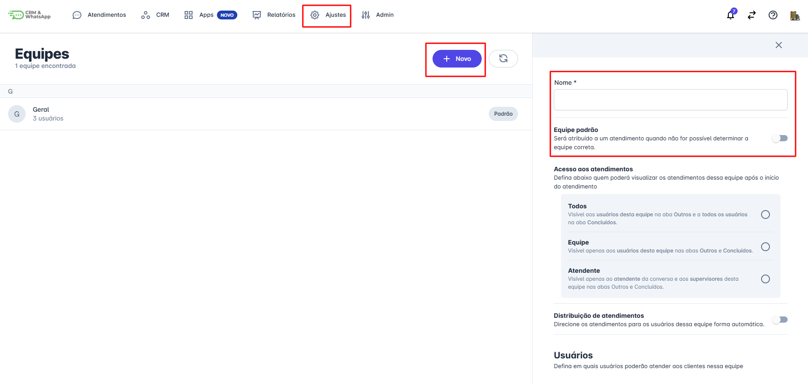
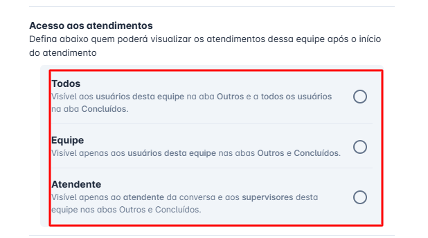
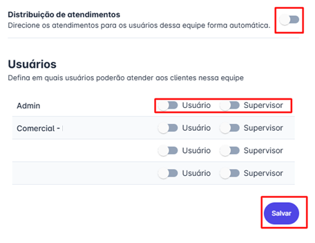

# Cadastrar equipe

O cadastro de equipes na **plataforma** é fundamental para organizar e gerenciar colaboradores de forma eficiente. Com essa funcionalidade, é possível delegar tarefas, acompanhar o desempenho da equipe e otimizar a comunicação interna, garantindo um fluxo de trabalho mais estruturado.

::: tip Pré-requisitos
* Apenas usuários com perfil de **administrador** podem cadastrar novas equipes.
* É necessário ter pelo menos uma equipe cadastrada na plataforma.
:::

## Passo a Passo

### Passo 1: Acessar Menu Equipes

**Acesse** o menu **"Ajustes"** e clique em **"Equipes"**, em seguida, selecione **"+ Novo"**.

### Passo 2: Definir Nome e Padrão

**Defina o nome da equipe** e escolha se ela será a equipe **padrão** da plataforma (a equipe padrão recebe atendimentos quando não há uma equipe específica atribuída).

### Passo 3: Configurar Acesso

**Configure o acesso aos atendimentos** da equipe, escolhendo uma das opções:

* **Todos:** para conversas pendentes ou em andamento, qualquer atendente da equipe poderá visualizar em todas as abas (Novos, Meus e Outros). Quando a conversa é concluída ela fica visível para todos os usuários na aba **Concluídos.**
* **Equipe:** para conversas pendentes ou em andamento, qualquer atendente da equipe poderá visualizar em todas as abas (Novos, Meus e Outros). Quando a conversa é concluída ela fica visível apenas para os usuários associados à equipe (na aba **Concluídos).**
* **Atendente:** somente o atendente responsável pelo atendimento pode visualizar, esteja ela em andamento ou concluída.

::: info Importante
Um usuário com perfil de **Administrador** (no Cadastro de Usuário), ou um usuário associado à equipe como Supervisor (na associação do usuário à equipe), poderá visualizar a conversa independentemente da configuração escolhida acima.
:::

### Passo 4: Distribuição e Associação

Defina se a equipe terá a funcionalidade de distribuição de atendimento. Veja mais sobre distribuição de atendimento no [próximo artigo](./distribuicao-e-transbordo-de-atendimento).

Associe os usuários à equipe, selecionando se serão **usuários**, **supervisores** ou ambos.

No quadro abaixo entenda as diferenças entre associar como usuário ou supervisor.

| Usuário | Supervisor |
| :--- | :--- |
| Enviam mensagens apenas em conversas que ele assume. | Enviam mensagens em suas conversas, ou em conversas de outros usuários. |
| Transferem apenas conversas que assumem. | Podem transferir suas próprias conversas ou de outros usuários. |
| Recebem notificação sonora quando novas conversas chegam | Não recebem notificação sonora quando novas conversas chegam |
| Entram na distribuição automática quando o recurso estiver ativado na equipe. | Não participam da distribuição automática |

### Passo 5: Salvar

Clique em **Salvar** para concluir o cadastro da equipe.

## Considerações Adicionais

* Toda conversa dentro da plataforma precisa estar dentro de uma equipe.
* Crie equipes para que possa direcionar conversas através do chatbot. É possível criar quantas equipes forem necessárias.
* Um usuário pode fazer parte de **mais de uma equipe**, tanto como **usuário** quanto como **supervisor**.
* Ao excluir uma equipe o sistema verifica se há atendimentos abertos associados a ela. Neste momento o sistema pergunta se deverá concluir ou movê-las para outra equipe.
