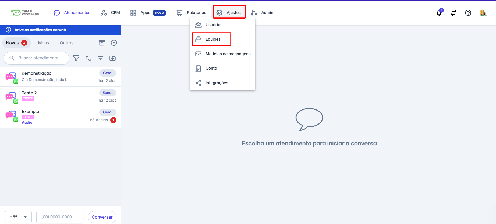
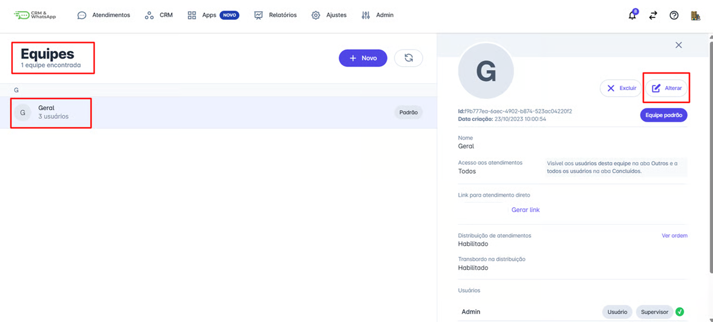
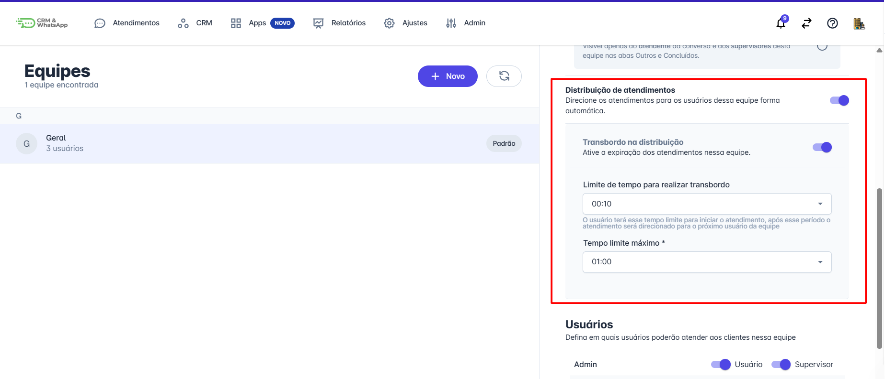
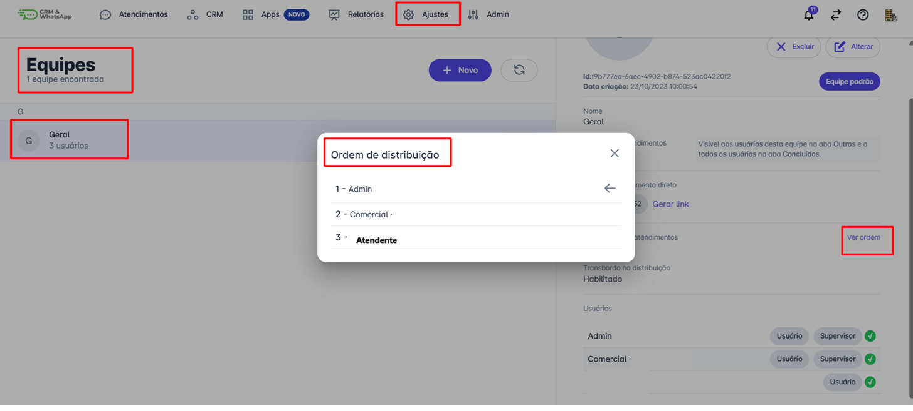
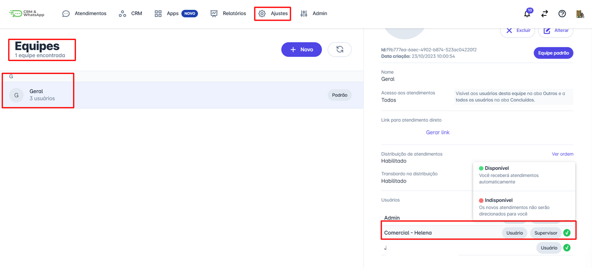

# Distribuição e transbordo de atendimento

A funcionalidade de **Distribuição de Atendimento e Transbordo** permite encaminhar conversas para os atendentes de uma equipe de forma **circular**, garantindo que cada interação seja direcionada a um atendente por vez, seguindo uma ordem predefinida. Isso assegura uma **distribuição uniforme dos atendimentos**, otimizando o fluxo de trabalho e evitando sobrecarga para um único atendente.

Além disso, o **transbordo** entra em ação quando um atendente não responde dentro de um tempo determinado, transferindo automaticamente a conversa para o próximo atendente disponível. Dessa forma, a equipe mantém um atendimento ágil e eficiente, garantindo que nenhum cliente fique sem resposta.

::: tip Pré-requisitos
* Ter acesso à **plataforma** com perfil de **administrador**.
* Ter a funcionalidade de **distribuição de atendimento** habilitada.
* Ter pelo menos **uma equipe cadastrada** com usuários adicionados.
:::

### Passo 1: Acesse as configurações de equipe

No **menu principal**, clique em **"Ajustes"**, em seguida, selecione **"Equipes"**.

### Passo 2: Escolha a equipe para configurar

Selecione a equipe desejada e clique em **"Alterar"** para ajustar as configurações.

### Passo 3: Configuração da Distribuição e Transbordo

Na janela de ajustes da equipe, ative ou desative a funcionalidade de **distribuição de atendimentos**. Uma vez ativada o sistema passará a associar um usuário para cada novo atendimento.

É possível ativar a função de **transbordo na distribuição**, e então definir um tempo máximo para o sistema aguardar até que o atendente selecionado inicie o atendimento. Passado o tempo configurado, é feita uma transferência automática para o próximo atendente da fila.

O tempo de expiração do transbordo pode ser configurado entre **2 minutos e 2 horas**.

Clique em **Salvar** para atualizar as configurações da equipe.

### Observação 1: Visualizar a ordem de distribuição

Em **"Ajustes" → "Equipes"**, é possível visualizar a **ordem dos atendentes** que receberão os atendimentos.

O próximo atendente a receber uma conversa será indicado por uma **seta ao lado do nome**.

### Observação 2: Gerenciar a disponibilidade dos atendentes

Um usuário com perfil de **administrador** pode definir quando um atendente **não está disponível**, evitando que ele receba atendimentos durante licenças, férias ou folgas.

Para isso, acesse **"Equipes"**, selecione a equipe do usuário, clique no ícone "✅" ao lado do nome do atendente e marque a opção **"Indisponível"**.

## Considerações finais

* O transbordo encaminha o atendimento de um atendente para outro até que alguém o aceite, Caso ninguém inicie o atendimento, o transbordo continuará o fluxo até atingir o tempo limite configurado. Se o tempo limite for atingido, o atendimento será enviado para todos os atendentes da equipe.
* O **tempo máximo** de distribuição pode ser configurado entre **2 minutos e 2 horas**.
* Se o atendimento for iniciado **fora do horário de atendimento**, o comportamento dependerá da configuração de resposta automática:
  * **Ativada** → O cliente receberá uma mensagem automática personalizada.
  * **Desativada** → O atendimento aguardará um atendente iniciar a conversa, sem acionar transbordo.
* A **ordem de distribuição** segue a ordem de criação dos usuários e não pode ser alterada.
* Se todos os usuários estiverem indisponíveis, o sistema ignora a distribuição e encaminha o atendimento para toda a equipe.
