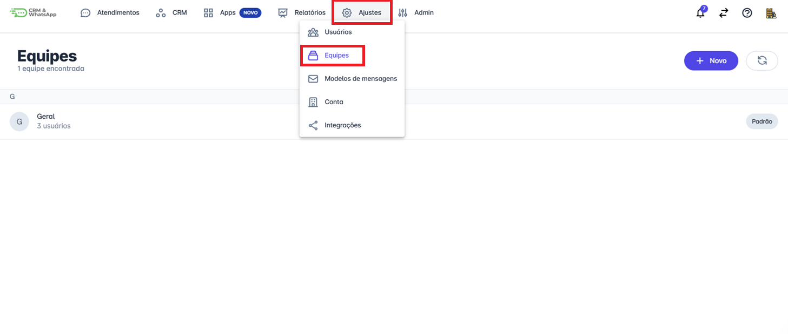
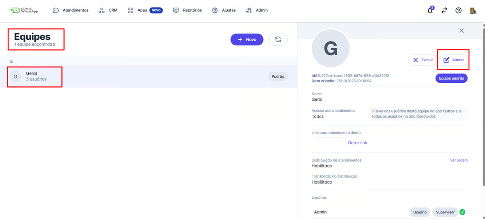
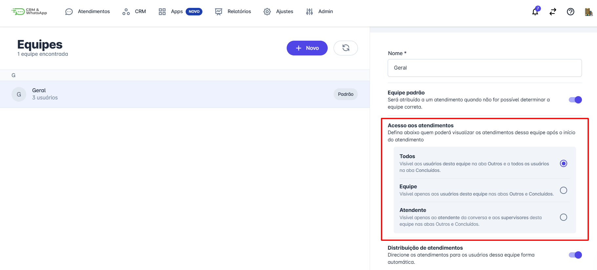

# Relação de acessos x conversas

Na **plataforma**, a gestão de atendimentos é flexível e permite definir quem pode visualizar as conversas de acordo com a estrutura e necessidade de cada equipe. Essa configuração garante mais controle e organização, permitindo que somente os usuários necessários tenham acesso aos atendimentos.

Neste artigo, vamos explicar a relação entre **acessos e conversas** na plataforma e como a configuração de **"Acesso aos Atendimentos"** influencia a visualização das interações.

::: tip Pré-requisitos
* Ter acesso à **plataforma** com perfil de administrador.
* Ter pelo menos uma **equipe cadastrada** na plataforma com usuários inseridos.
:::

## Definição de Acesso aos Atendimentos

Ao configurar a equipe de atendimento, é possível definir quem poderá visualizar os atendimentos após o início da conversa. Essa configuração afeta onde os atendimentos aparecerão nas abas **"Outros"** e **"Concluídos"** dentro da plataforma.

### Opções de Acesso Disponíveis:

✅ **Todos**

* Os atendimentos ficam visíveis para todos os usuários **da equipe** em que ele se encontra, ou seja, aparecerá na aba **"Outros"** para os membros da equipe que não assumirem os mesmos.
* Após a finalização, o atendimento será visível para todos os usuários na aba **"Concluídos"**.
* Ideal para empresas que desejam transparência total no acompanhamento dos atendimentos.

✅ **Equipe**

* O atendimento ficará visível apenas para os usuários da equipe responsável.
* Na aba **"Outros"**, somente os membros da equipe poderão visualizar o atendimento.
* Na aba **"Concluídos"**, apenas os usuários da equipe poderão acessar o histórico da conversa.
* Indicado para **departamentos específicos** onde as conversas não precisam ser acessadas por toda a empresa.

✅ **Atendente**

* Apenas o atendente que iniciou a conversa e os **supervisores da equipe** poderão visualizar o atendimento.
* O atendimento não será acessível para outros membros da equipe ou usuários da plataforma.
* Melhor opção para **casos mais sensíveis**, como suporte VIP ou atendimento exclusivo.

## Passo a Passo

### Passo 1: Acessar Ajustes de Equipes

Para acessar essa configuração na plataforma, no menu principal clique em **Ajustes** em seguida **Equipes**.

### Passo 2: Alterar Equipe

Em seguida, clique na equipe que deseja configurar. Uma janela será aberta, então clique em **"Alterar".**

### Passo 3: Selecionar Acesso

Selecione a opção de acesso desejada para a equipe, em seguida, role até o final da página e clique em **"Salvar".**

## Qual a Melhor Configuração para Minha Empresa?

A escolha da configuração ideal depende da **estratégia de atendimento** da sua empresa:

📌 **Se você precisa que toda a equipe tenha acesso às conversas** → Escolha a opção **"Todos"**.
📌 **Se deseja restringir o acesso apenas à equipe responsável** → Use a configuração **"Equipe"**.
📌 **Se quer um atendimento mais restrito, acessível apenas pelo atendente e supervisores** → Opte por **"Atendente"**.

## Considerações finais

Manter uma boa gestão de acessos melhora a **organização** e evita consultas desnecessárias a conversas que não fazem parte da rotina de determinados usuários.
