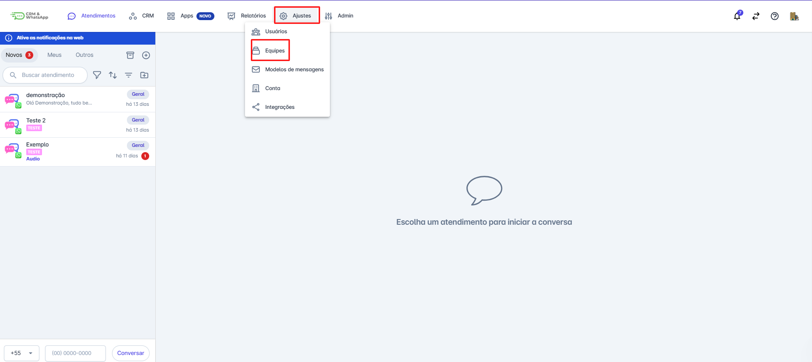
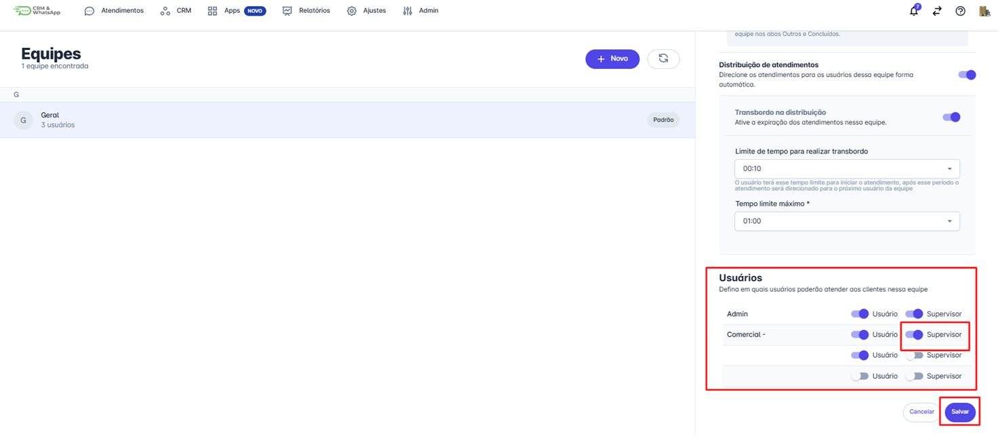

# Tipo de associação usuário x supervisor

Na **plataforma**, a associação entre **usuários e supervisores** é uma funcionalidade essencial para uma gestão eficiente das equipes. Com essa associação, os **supervisores** podem acompanhar o desempenho dos membros da equipe, oferecer suporte, garantir a organização das tarefas e assegurar que os objetivos sejam atingidos de forma eficaz.

::: tip Pré-requisitos
* Apenas usuários com **perfil de administrador** podem definir o perfil de cada usuário.
:::

## Função supervisor da equipe

O **supervisor da equipe** possui privilégios que o diferenciam dos usuários convencionais. Confira abaixo as características dessa função:

* **Acesso irrestrito** ao módulo de atendimento dentro da equipe em que é supervisor.
* **Visualização completa** dos atendimentos de todos os usuários da equipe.
* **Interação e finalização** de atendimentos iniciados por qualquer membro da equipe.
* **Não participa da distribuição automática de atendimentos**.

## Como Definir um Supervisor

### Passo 1: Acesse as configurações da equipe

No **menu principal**, clique em **"Ajustes"** e, em seguida, selecione **"Equipes"**.

### Passo 2: Escolha a equipe

Selecione a equipe na qual o usuário será supervisor e clique em **"Alterar"**.

### Passo 3: Defina o usuário como supervisor

Role a tela até a seção **"Usuários"**. Localize o usuário desejado e marque a opção **"Supervisor"**. Clique em **"Salvar"** para confirmar a alteração.

## Considerações finais

* Um usuário pode ser **supervisor e atendente** ao mesmo tempo na mesma equipe.
* O **sinal sonoro para novos atendimentos** é emitido apenas para usuários com perfil de **atendente**. Supervisores **não recebem alerta sonoro** ao receberem um atendimento.
