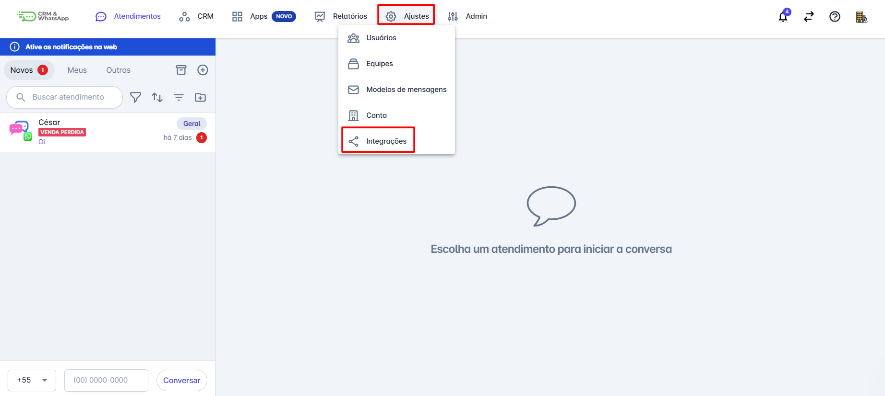
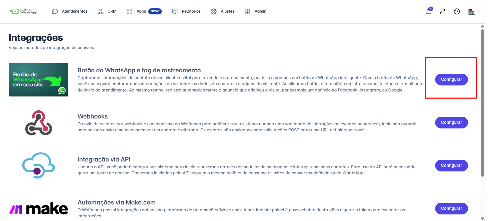
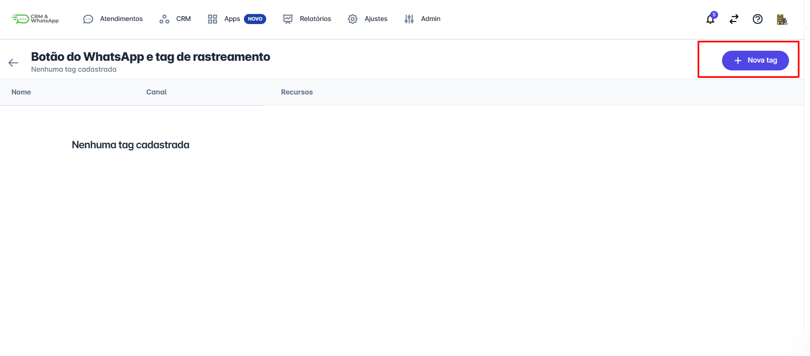
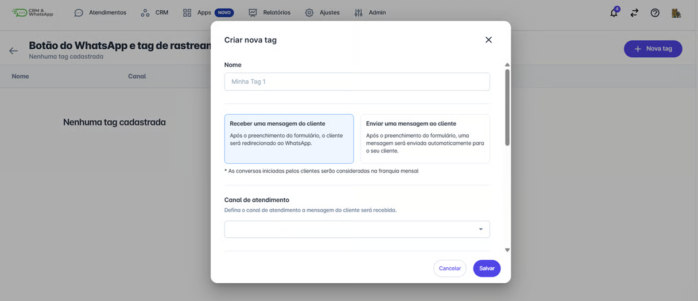
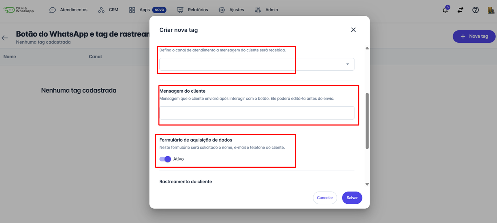
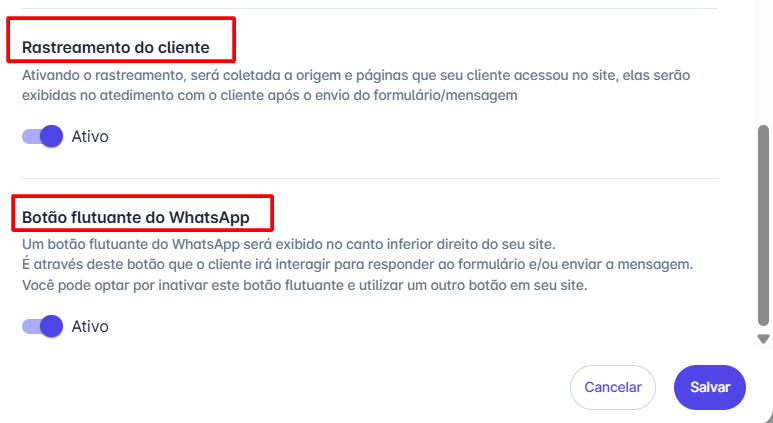
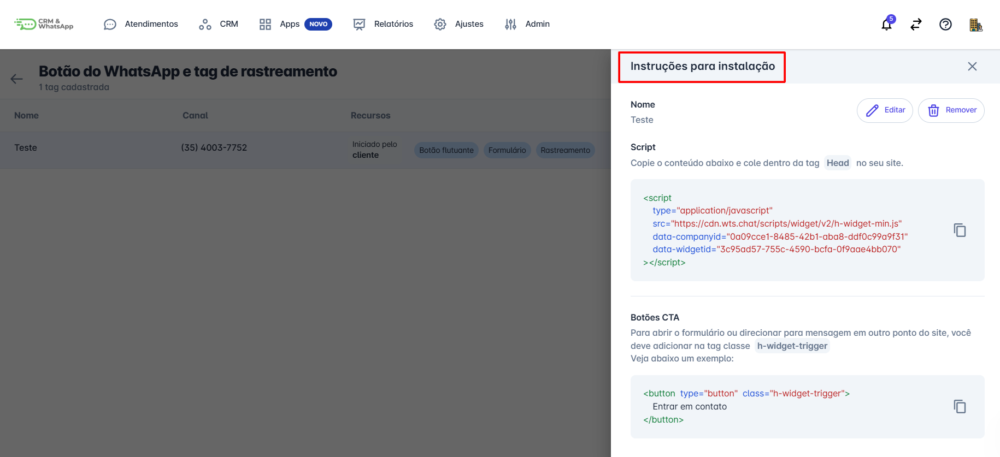
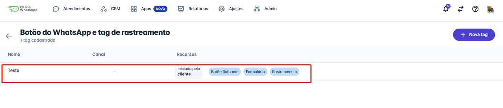

# Botão do WhatsApp e tag de rastreamento

A **plataforma** permite a personalização e otimização do atendimento ao cliente por meio da integração de **botões interativos**. Entre as opções disponíveis, destacam-se os botões **Flutuante** e **CTA (Call to Action)**, que oferecem diferentes abordagens para facilitar a interação do usuário com a empresa.

Este artigo explica a diferença entre os dois tipos de botão e como integrá-los corretamente na **plataforma**.

## Diferença entre os Tipos de Botão

Os botões Flutuante e CTA possuem finalidades distintas e podem ser usados em diferentes estratégias de atendimento e marketing.

1. **Botão Flutuante**
   * Fica fixado em uma posição específica da tela, geralmente no canto inferior direito.
   * É ideal para oferecer um canal de contato direto, como um chat de atendimento.
   * Pode ser personalizado com ícones e mensagens curtas, como **"Fale Conosco"** ou **"Precisa de ajuda?"**.
   * Exemplo de uso: Atendimento rápido em lojas virtuais ou suporte técnico imediato.

2. **Botão CTA (Call to Action)**
   * É utilizado dentro de páginas específicas para direcionar o usuário a uma ação, como **agendar uma demonstração**, **baixar um material** ou **iniciar uma conversa com um atendente**.
   * Pode conter textos chamativos como **"Saiba Mais"**, **"Agendar Agora"** ou **"Fale com um Especialista"**.
   * Exemplo de uso: Captação de leads em landing pages e campanhas de marketing.

::: tip Pré-requisitos
* Apenas usuários com perfil de administrador pode realizar integrações no sistema.
* Ter acesso ao código do site
:::

## Como Integrar os Botões na plataforma

### Passo 1: Acessar Integrações

Acesse a **plataforma** e faça login. No menu principal, clique em **"Ajustes"** e em seguida “**Integrações**”.

### Passo 2: Configurar Botão

Na página de integrações, clique em **“Configurar”** na opção do botão do WhatsApp e Tag de rastreamento.

### Passo 3: Nova Tag

Uma nova tela se abrirá, clique em **“+ Nova Tag”.**

### Passo 4: Preencher Informações

Preencha as informações solicitadas, dê um nome para a Tag, escolha entre as duas opção de acionamento do botão:
* **Receber uma mensagem do cliente -** Após o preenchimento do formulário, o cliente será redirecionado ao WhatsApp.
* **Enviar uma mensagem ao cliente -** Após o preenchimento do formulário, uma mensagem será enviada automaticamente para o seu cliente.

### Passo 5: Detalhes da Configuração

Continue o preenchimento das informações:

* Defina o **canal de atendimento**.
* Escreva a mensagem que será enviada pelo cliente após a interação com o botão.
* Defina se **Formulário de aquisição de dados** estará ou não ativo ligando ou não a chave de ativo.
* Role o cursor e continue preenchendo as informações.

### Passo 6: Salvar

Ainda no preenchimento das informações defina se **Rastreamento do cliente** e se o **Botão flutuante do WhastApp** estará ativo ou não. Por fim clique em **“Salvar”.**

### Passo 7: Instalação no Site

Após **salvar** uma nova janela se abrirá com as orientações de como instalar o botão de WhatsApp no seu site.

### Passo 8: Confirmação

Quando finalizar o processo a **tag configurada** aparecerá na listagem de integrações dentro da plataforma, conforme imagem abaixo.

## Considerações Finais

Os **botões Flutuante e CTA** são ferramentas poderosas para melhorar a experiência do usuário e aumentar a conversão de atendimentos na **plataforma**.

* O **botão Flutuante** é ideal para suporte imediato e contato rápido.
* O **botão CTA** é indicado para direcionar o usuário a uma ação específica e potencializar campanhas.
* É possível criar **várias tags**, porém o script adicionado entre as tags `<head>` e `</head>` pode referenciar apenas **uma delas**.
