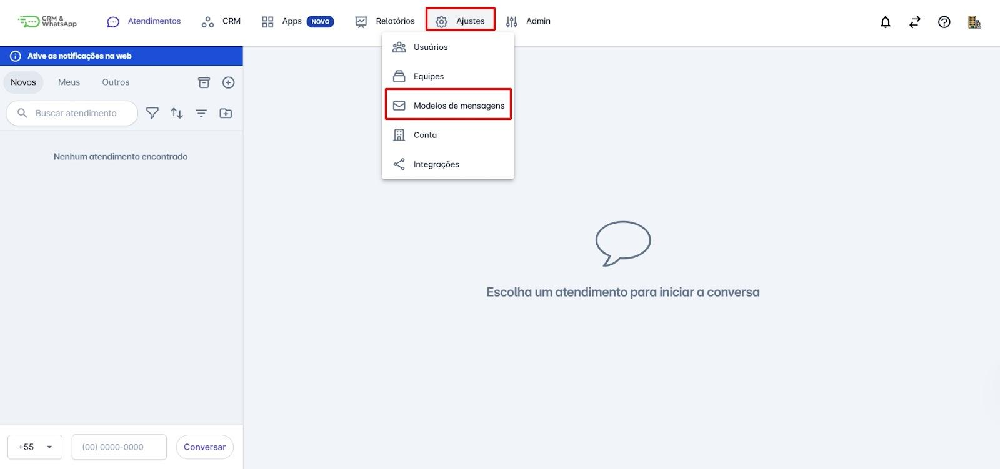
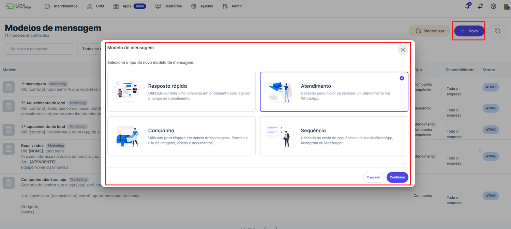
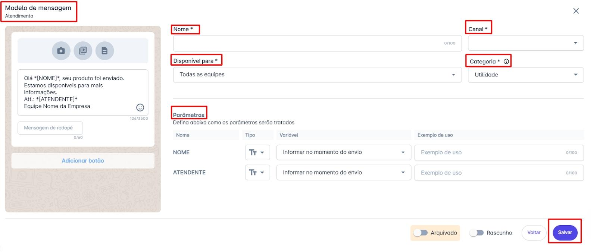
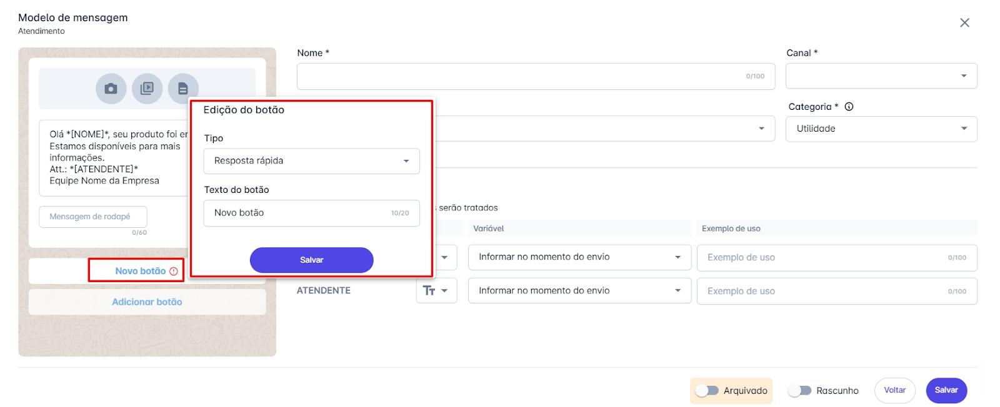
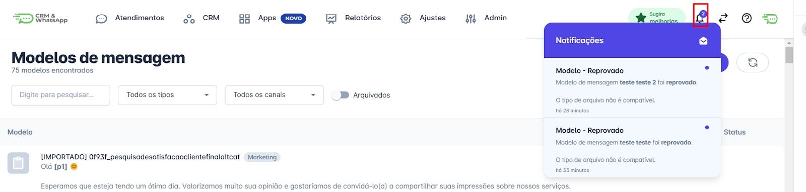

# Como criar modelo de mensagem

Criar e utilizar modelos de mensagem na a plataforma é essencial para padronizar e agilizar a comunicação com seus clientes. Eles podem ser aplicados em diversos contextos, como atendimentos, campanhas de marketing, notificações, atualizações e outros tipos de interação. Com isso, você garante uma comunicação mais consistente, eficiente e profissional.

::: tip Pré-requisitos
* **Acesso à plataforma a plataforma.**
* Somente os usuários com perfil de **Administrador** podem cadastrar modelos de mensagens do tipo **Campanha**, **Atendimento, Sequência e Resposta Rápida.**
:::

### Passo 1: Acessar Modelos de Mensagens

Na tela inicial da plataforma, **clique** na opção **"Ajustes"**, o menu de opções se abrirá. **Clique** em **"Modelos de Mensagens"**.

### Passo 2: Selecionar Modelo

**Selecione** o modelo de mensagem que deseja criar e **clique** em **continuar**.

### Passo 3: Preencher Campos

**Preencha os campos necessários para criar seu modelo de mensagem:**

* **Nome do Modelo:** Escolha um nome único e descritivo que identifique facilmente o conteúdo ou a finalidade do modelo.
  * *Exemplo:* "Boas-vindas Cliente Novo".
* **Canal:** Indique o canal por onde a mensagem será enviada. Pode incluir um ou mais números de WhatsApp conectados à API Oficial, entre outros meios disponíveis na plataforma.
* **Categoria:** Selecione a categoria que melhor representa o tipo de mensagem. Por exemplo, para campanhas promocionais, a categoria mais indicada é **Marketing**.

**Veja abaixo alguns exemplos de uso comuns para modelos de mensagem:**

* **Mensagens de boas-vindas para novos clientes**
* **Lembretes de agendamento**
* **Confirmações de compra ou pagamento**
* **Notificações de atualização de status**
* **Mensagens promocionais ou informativas**
* **Lançamentos de Produtos**: Anunciar novos produtos ou serviços aos clientes.
* **Promoções e Ofertas**: Informar sobre descontos, promoções especiais e ofertas exclusivas.
* **Atualizações e Notícias**: Manter os clientes informados sobre novidades da empresa, eventos ou mudanças importantes.
* **Nutrição de Leads**: Enviar conteúdo educativo ou informativo para guiar os leads pelo funil de vendas.

**Disponível para:**

* **Descrição**: É possível definir para quais **equipes** este modelo de mensagem ficará disponível.

**Adicione o texto da mensagem**. É possível utilizar **parâmetros** no texto para automatizar a personalização da mensagem. Para definir um campo personalizado, basta adicionar o nome do campo entre **colchetes** `[]`. Por exemplo: `[NOME]`.

Além do **texto**, é possível adicionar **foto**, **vídeo**, **anexar arquivo** e adicionar **botões**.

São dois tipos de botões: **Resposta rápida** e **Abrir página**. O botão de **resposta rápida** é utilizado para dar sequência na conversa, facilitando o fluxo da conversa com o atendente. O botão **Abrir página** permite adicionar um **link** para direcionar o contato para uma nova página.

### Passo 4: Salvar e Aprovação

**Clique em salvar** e o modelo de mensagem será enviado automaticamente para **aprovação**. A **Meta** analisará e aprovará ou rejeitará o modelo.

### Passo 5: Monitorar o Status do Modelo

Após enviar o modelo, você poderá monitorar seu status (**Ativo**, **Em Análise**, **Reprovado**) diretamente na **plataforma**.

Caso o modelo seja **reprovado**, revise e faça as alterações necessárias antes de enviar novamente.

## Considerações Adicionais

* O **tempo de aprovação** do modelo de mensagem é definido pela **META**. Contas mais novas e com menor taxa de feedback tendem a demorar mais para ter seus modelos aprovados, enquanto contas mais antigas com maior taxa de feedback geralmente têm um processo de aprovação mais rápido. Existem muitas outras variáveis que também influenciam esse resultado.
* Os **status** dos modelos de mensagens são enviados na **barra de notificações** da plataforma, conforme na imagem abaixo.

* **Segmentação**: Utilize a **segmentação** para enviar mensagens mais **relevantes** e **direcionadas** ao público correto.
* Os disparos de campanhas são cobrados pela **META**, por isso a segmentação é um fator muito importante.
* O limite para criar um modelo de mensagem é de **1024 caracteres**.
