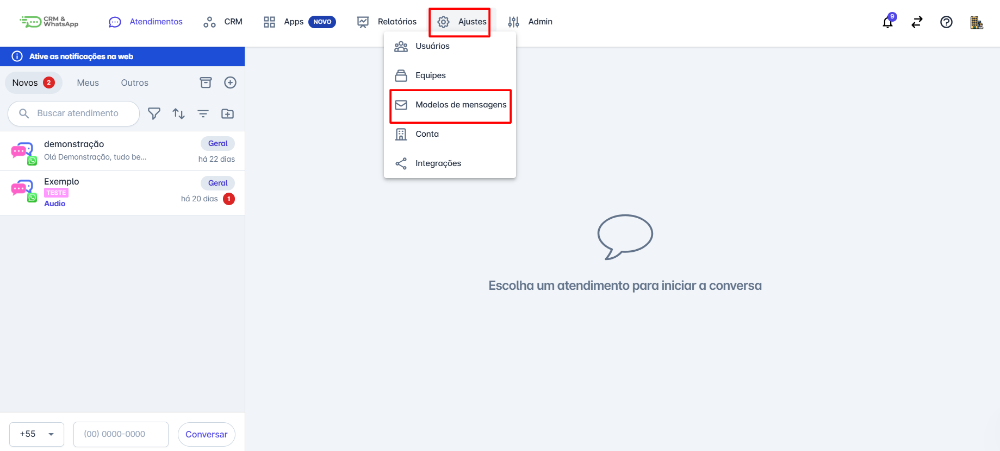
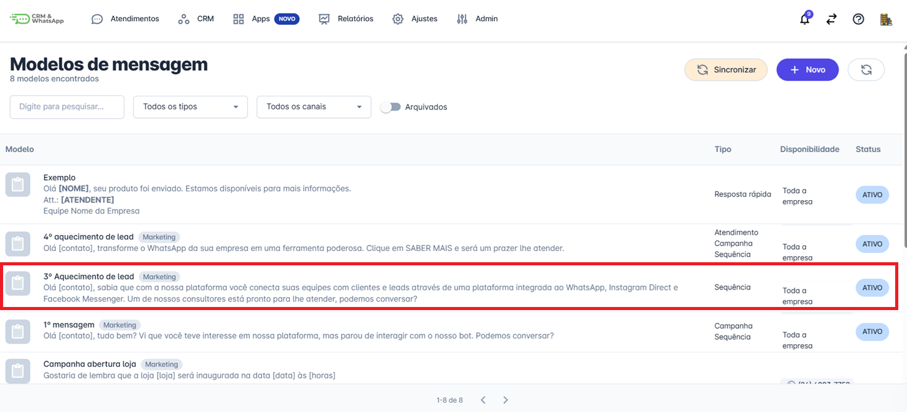
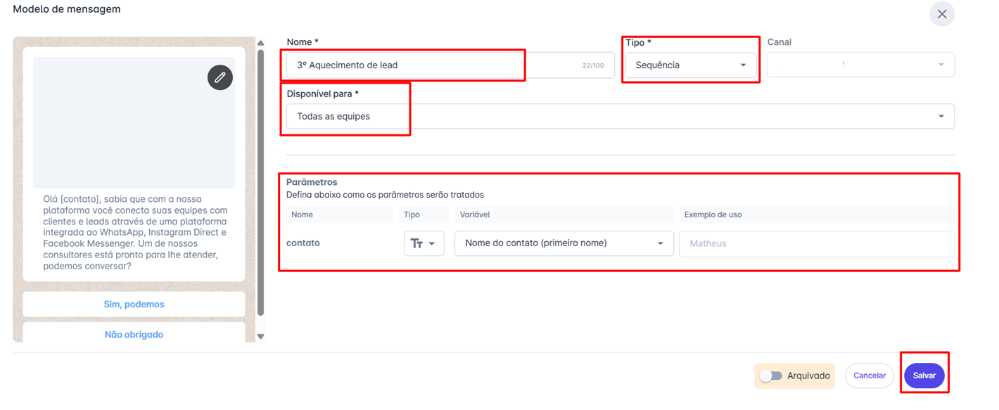
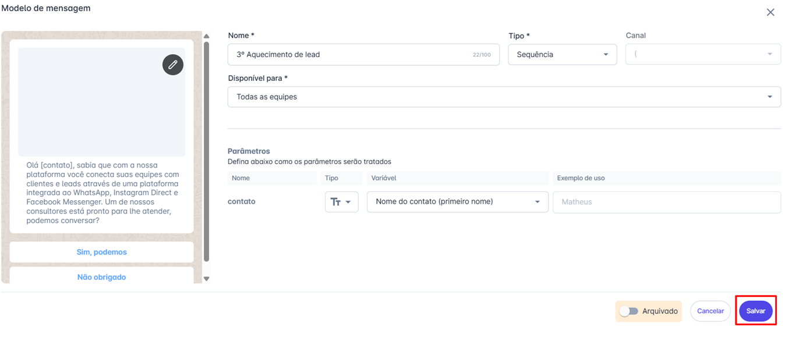

# Editar modelos de mensagem

Manter seus modelos de mensagem atualizados é fundamental para garantir uma comunicação eficiente e alinhada com os objetivos da empresa. A **plataforma** permite a edição de determinados campos nos modelos cadastrados, facilitando ajustes rápidos sem a necessidade de aprovação pela **Meta**.

::: tip Pré-requisitos
* **Acesso** à conta na **plataforma**.
* Apenas **Administradores** podem editar modelos de mensagem do tipo **Atendimento, Campanha e Sequência**.
:::

### Passo 1: Acessar os modelos de mensagem

Na tela inicial da plataforma, clique em **"Ajustes"**. No menu que se abrir, clique em **"Modelos de Mensagem"**.

### Passo 2: Selecionar o modelo a ser editado

Localize o modelo desejado na lista. Clique sobre ele para abrir a tela de edição.

### Passo 3: Edite os campos permitidos

* **Nome do modelo**
* **Tipo do modelo**
* **Disponível para**
* **Parâmetros já existentes**

### Passo 4: Salve as alterações

Após realizar as edições necessárias, clique em **"Salvar"**. O modelo atualizado estará pronto para uso imediatamente.

## Considerações Adicionais

* **Não é necessário** um novo processo de aprovação pela **Meta**, desde que as alterações não envolvam o conteúdo da mensagem.
* Caso seja necessário modificar o **texto da mensagem**, a recomendação é **duplicar o modelo**, fazer as alterações e enviá-lo para **nova aprovação da Meta**.
* O **tempo de aprovação** de novos modelos varia conforme o histórico da conta. Contas mais antigas e com boa taxa de feedback tendem a ter aprovações mais rápidas.
