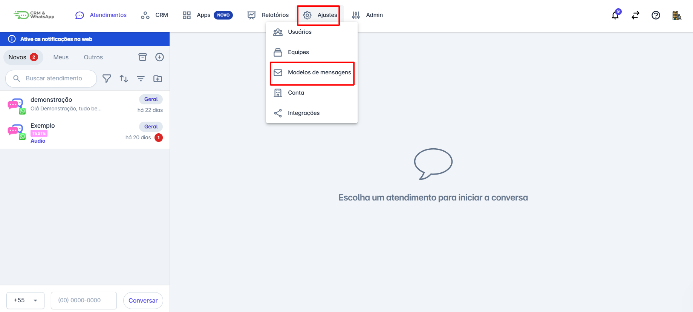
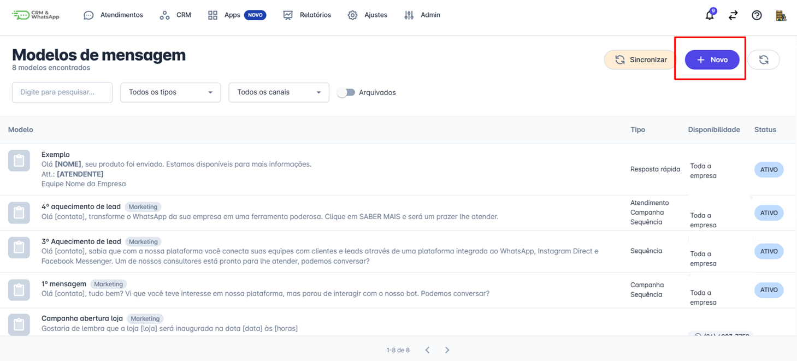
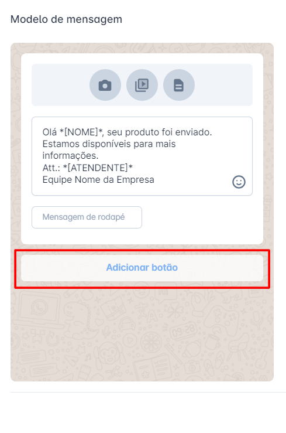
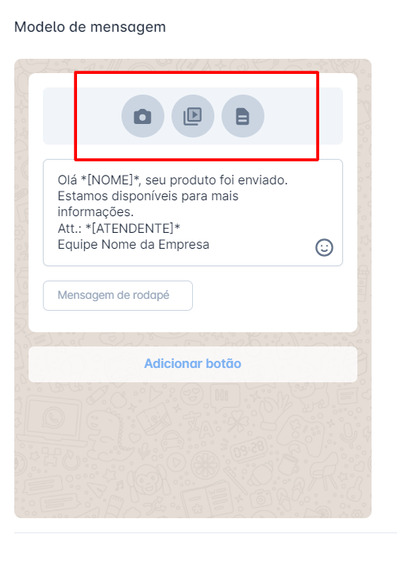
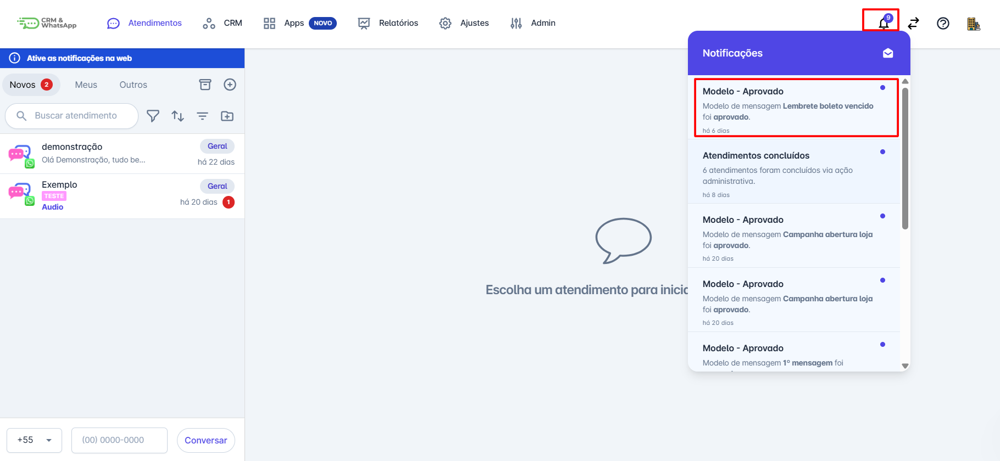

# Mensagens com botões, imagem, vídeo e documento

A criação de **mensagens interativas** na **plataforma** melhora a comunicação com os clientes, tornando-a mais **engajadora e dinâmica**. Com **botões, imagens, vídeos e documentos**, suas mensagens ficam mais atrativas e aumentam a taxa de interação.

::: tip Pré-requisitos
* **Acesso** à conta na **plataforma**.
* Apenas **Administradores** podem cadastrar modelos de mensagens do tipo **Atendimento, Campanha e Sequência**.
* Arquivos de mídia devem estar no **formato correto** e dentro do **tamanho permitido** pela plataforma.
:::

### Passo 1: Acessar Modelos de Mensagens

No menu **"Ajustes"**, clique em **"Modelos de Mensagens"**.

### Passo 2: Novo Modelo

Clique no ícone **"+ Novo"**, escolha o tipo de modelo de mensagem e adicione os elementos desejados.

### Passo 3: Adicionar Mídia e Botões

Além do texto, você pode incluir **imagens, vídeos, documentos e botões** para tornar a mensagem mais interativa.

📷 **Inserir Imagem**
* Clique no ícone de **imagem** e faça o **upload** do arquivo.
* Recomendado: **proporção 1:1** (800x800px ou 1200x1200px) para melhor exibição.

🎥 **Inserir Vídeo**
* Clique no ícone de **vídeo** e envie o arquivo.
* O vídeo deve estar no **formato correto** e dentro do **tamanho permitido**.

📄 **Inserir Documento**
* Clique no ícone de **documento** e envie arquivos **PDF, DOCX, entre outros**.

🔘 **Inserir Botões**
* Clique na opção **"Adicionar botões"** abaixo da caixa de texto.
* Escolha entre dois tipos de botões:
  * **Resposta Rápida** → Permite continuar a conversa sem precisar digitar.
  * **Abrir Página** → Direciona o cliente para um link externo.

Existem dois tipos de botões: **Resposta Rápida** e **Abrir Página**.

* **Resposta Rápida**: Utilizado para dar continuidade à conversa, facilitando a interação com o atendente.
* **Abrir Página**: Permite adicionar um link que direciona o contato para uma nova página.

### Passo 4: Salvar e Enviar para Aprovação

Após configurar a mensagem, clique em **"Salvar"**. O modelo será enviado automaticamente para **aprovação da Meta**.

## Considerações Adicionais

* **O tempo de aprovação** varia conforme a conta. Contas mais novas ou com menor taxa de feedback podem demorar mais.
* O **status do modelo** é atualizado na **barra de notificações** da plataforma.

