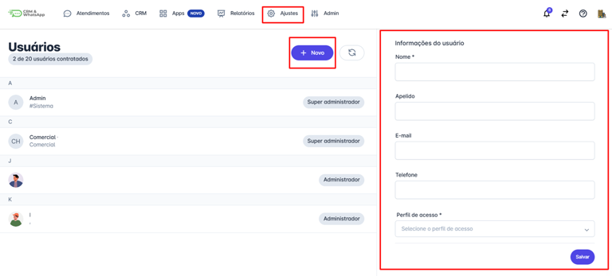
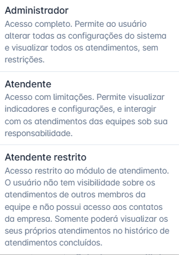
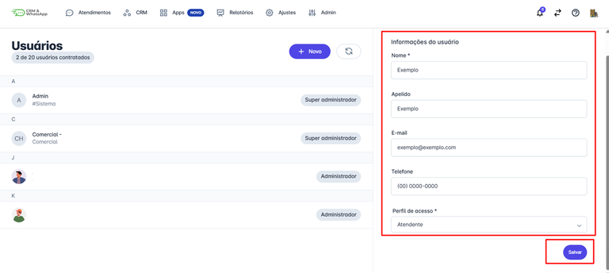
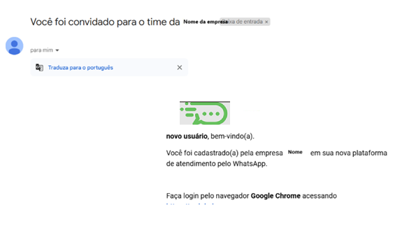

# Cadastrar usuários

O cadastro de novos usuários na **plataforma** permite incluir membros da equipe, garantindo que cada um tenha acesso às ferramentas e informações essenciais para suas atividades. Esse processo é fundamental para manter a **organização, segurança dos dados e facilitar a colaboração** entre os membros da equipe.

::: tip Pré-requisitos
* Apenas **usuários com perfil de administrador** podem cadastrar novos usuários.
* Cada plano da **plataforma** possui um limite de usuários. Caso seja necessário adicionar mais, entre em contato com o **CS responsável pela sua conta** para verificar valores.
* O usuário deve possuir um **e-mail ou um número de WhatsApp** para receber o código de acesso à plataforma.
:::

### Passo 1: Acessar o menu de Usuários

Na tela inicial, clique em **"Ajustes"** e, em seguida, em **"Usuários"**. Em seguida clique em **"+ Novo"** para iniciar o cadastro.

### Passo 2: Preencher as informações do usuário

Todos os campos marcados com **`*`** são obrigatórios e devem ser preenchidos.

* **Nome:** Nome que será usado apenas internamente.
* **Apelido:** Nome que será exibido nos atendimentos realizados pelo usuário. Se não quiser exibir nenhum nome, deixe em branco.
* **E-mail e Telefone:** Informações utilizadas para login. É possível cadastrar **apenas um ou ambos**.
* **Perfil de acesso:** Defina um dos seguintes perfis conforme a necessidade:
  * **Administrador:** Acesso completo. Permite ao usuário alterar todas as configurações do sistema e visualizar todos os atendimentos, sem restrições.
  * **Atendente:** Acesso limitado. Permite visualizar indicadores e configurações, e interagir com os atendimentos das equipes sob sua responsabilidade.
  * **Atendente restrito:** Acesso restrito ao módulo de atendimento. O usuário não tem visibilidade sobre os atendimentos de outros membros da equipe e não possui acesso aos contatos da empresa. Somente poderá visualizar os seus próprios atendimentos no histórico de atendimentos concluídos.

### Passo 3: Finalizar o cadastro

Após preencher todas as informações, clique em **"Salvar"** no canto direito inferior da tela.

## Considerações Adicionais

* Ao excluir usuários é feita uma exclusão lógica. Ele permanecerá no sistema, mas não fica visível e não terá acesso online.
* O campo **disponibilidade** não é para informar se o usuário está logado ou não, serve para que ele seja marcado como indisponível em momentos em que estiver com ausência longa, como licença médica ou férias, e assim não entrará em rodízios de distribuição automática.
* Ao associar a uma equipe, você pode definir como apenas usuário, apenas supervisor ou os dois.

### Diferenças entre associar um usuário à equipe como Usuário ou Supervisor

| Recurso | Usuário | Supervisor |
| :--- | :--- | :--- |
| **Envio de mensagens** | Apenas em conversas que ele assume. | Em suas conversas ou em conversas de outros usuários. |
| **Transferência** | Apenas conversas que assumem. | Podem transferir suas próprias conversas ou de outros usuários. |
| **Notificação sonora** | Recebem quando novas conversas chegam. | Não recebem notificação sonora quando novas conversas chegam. |
| **Distribuição automática** | Entram na distribuição quando o recurso estiver ativado. | Não participam da distribuição automática. |

Ao cadastrar um novo usuário, um e-mail será enviado convidando para acessar a plataforma.

