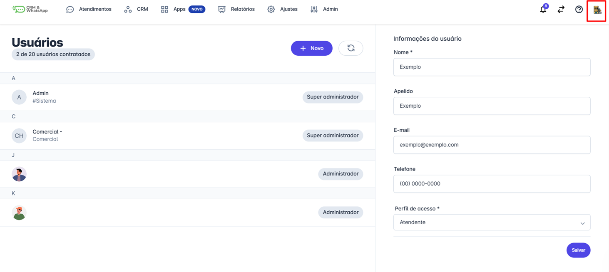
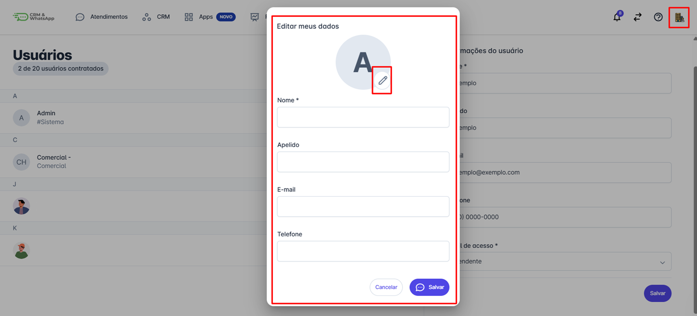

# Editar foto do usuário

Manter sua **foto de perfil atualizada** não apenas personaliza sua experiência na plataforma, mas também facilita a **identificação e comunicação** entre os membros da equipe.

::: tip Pré-requisitos
* Apenas o **próprio usuário** pode alterar sua foto de perfil na plataforma.
:::

### Passo 1: Acessar as configurações do perfil

Clique na **logo da empresa** no canto superior da tela para abrir as informações do usuário.

### Passo 2: Editar a foto de perfil

Clique no **ícone de caneta** para ativar a edição.

Selecione uma nova foto e, caso necessário, atualize outras informações do perfil.

Após as alterações, clique em **"Salvar"** para confirmar.

