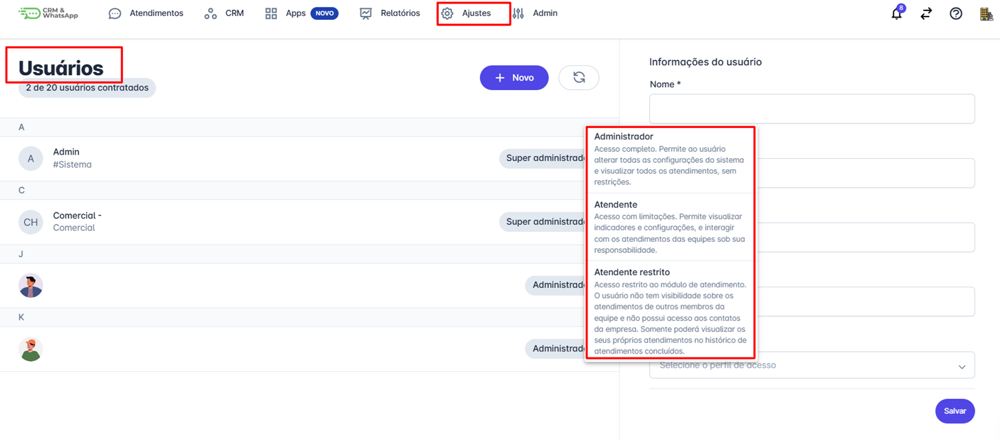

# Tipos de perfis de usuários

Neste artigo, você encontrará informações detalhadas sobre os diferentes tipos de perfis de usuários disponíveis na nossa plataforma. Entender os diversos perfis de usuários e suas permissões é essencial para gerenciar de forma eficiente e segura a utilização dos recursos da nossa plataforma.

::: tip Pré-requisitos
* Apenas usuários com perfil de **administrador** podem cadastrar novos usuários e definir seus perfis e/ou alterá-los.
:::

## Tipos de Perfis de Usuários

### Administrador

* **Descrição**: Usuários com perfil de administrador têm acesso completo a todas as funcionalidades e configurações da plataforma.
* **Permissões**: Podem adicionar e remover usuários, gerenciar permissões, configurar integrações, acessar todos os relatórios, visualizar todos os atendimentos, sem restrições e definir configurações gerais da conta.
* **Recomendado Para**: Gestores, líderes de equipe e administradores de TI.

### Atendente

* **Descrição:** Usuários com perfil de atendente têm acesso às funcionalidades essenciais da plataforma para realizar suas tarefas diárias.
* **Permissões:** Visualizar e editar dados dos contatos, indicadores e configurações do próprio perfil. Acessar e gerenciar o painel "Minhas Tarefas" no menu CRM. Interagir com os atendimentos das equipes sob sua responsabilidade.
* **Recomendado Para:** Membros de equipes operacionais e funcionários que utilizam a plataforma para executar tarefas específicas.

### Atendente restrito

* **Descrição**: Usuários com perfil de atendente restrito têm acesso restrito ao módulo de atendimento.
* **Permissões:** O usuário não tem visibilidade sobre os atendimentos de outros membros da equipe e não possui acesso aos contatos da empresa. Somente poderá visualizar os seus próprios atendimentos no histórico de atendimentos concluídos.
* **Recomendado Para:** Colaboradores externos, clientes e parceiros que necessitam de acesso temporário.

## Importância de Gerenciar Perfis de Usuários

Gerenciar os perfis de usuários de forma adequada é crucial para:

* **Segurança**: Garantir que cada usuário tenha acesso apenas às informações e funcionalidades necessárias para suas tarefas, protegendo dados sensíveis.
* **Eficiência**: Facilitar a organização e a distribuição de tarefas, melhorando a produtividade e colaboração das equipes.
* **Controle**: Permitir que os administradores mantenham o controle sobre as operações e configurações da plataforma.
