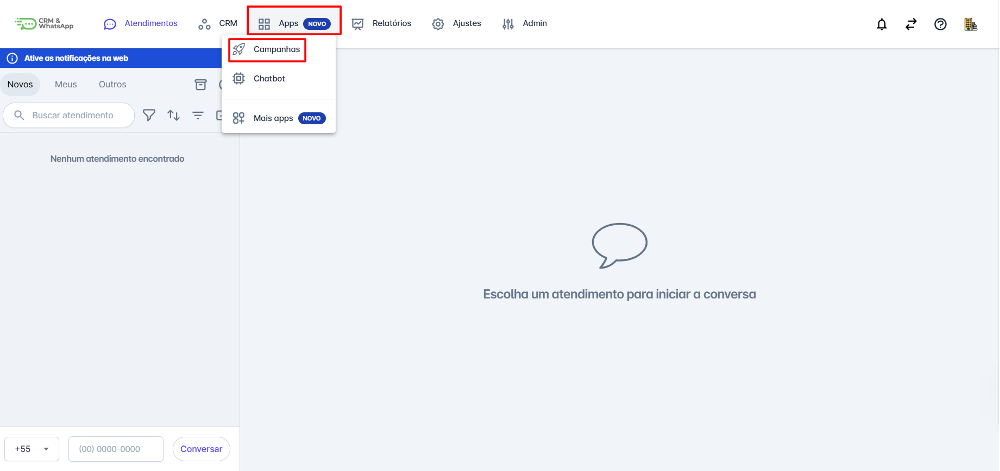
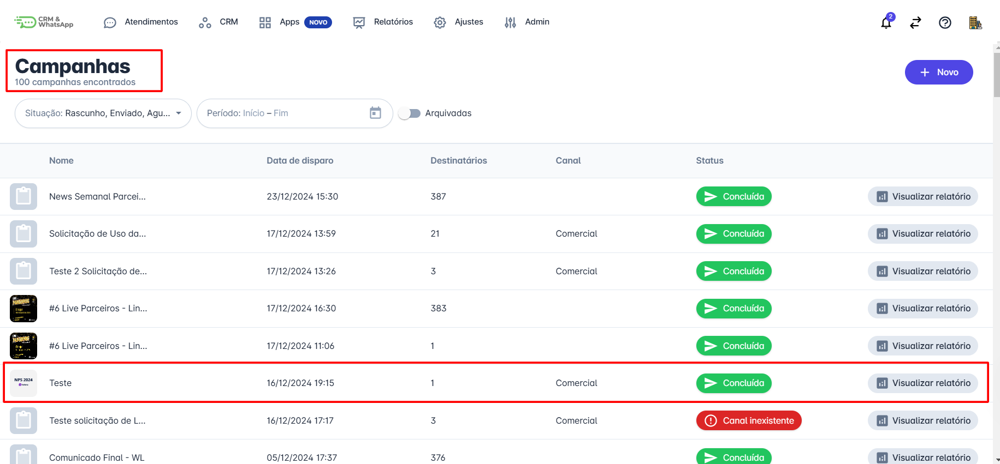
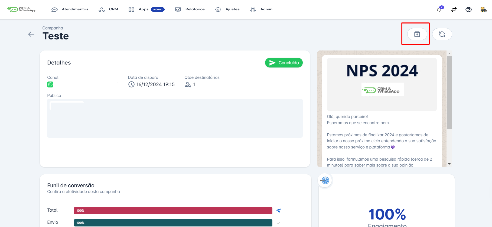
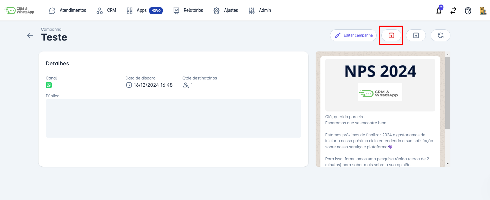

# Arquivar campanha

**Arquivar campanhas na plataforma** é um processo simples e importante para manter a organização e o histórico das atividades de marketing. O arquivamento permite que as campanhas concluídas ou não ativas sejam armazenadas de forma segura, facilitando o acesso futuro para análise e referência. Este guia irá ajudá-lo a entender como **arquivar suas campanhas** de forma eficaz e organizada.

::: tip Pré-requisitos
* **Acesso à plataforma.**
* Somente os usuários com **perfil de Administrador** podem **arquivar campanhas**.
:::

## Passo 1: Acessar o menu de campanhas

Na tela inicial da plataforma, clique em **"Apps"**. O menu de opções será aberto; em seguida, clique em **"Campanhas"**.

## Passo 2: Selecionar a campanha

Uma tela com todas as campanhas realizadas será aberta. **Selecione a campanha** que deseja arquivar e clique sobre ela.

## Passo 3: Arquivar a campanha

A tela com os dados da campanha selecionada será aberta. Para **arquivar**, basta clicar no **ícone de arquivo** , localizado no canto superior direito.

Uma mensagem de confirmação aparecerá no rodapé, informando que a campanha foi **arquivada com sucesso**.

## Passo 4: Visualizar campanhas arquivadas

Para visualizar as campanhas **arquivadas** ou, se desejar, desarquivar alguma, basta clicar na opção **"Arquivadas"**. Uma nova janela contendo **somente** as campanhas arquivadas será aberta.

## Passo 5: Desarquivar campanha

Para visualizar ou desarquivar uma campanha, basta clicar sobre ela para abrir seus detalhes. Se você clicar no ícone de **arquivo**, a campanha será desarquivada e uma mensagem de **"Campanha desarquivada com sucesso"** aparecerá. A campanha, então, voltará para a tela inicial de **Campanhas**.

::: info Considerações Adicionais
* É possível **arquivar** e **desarquivar** qualquer campanha, independentemente de seu **status**.
:::
