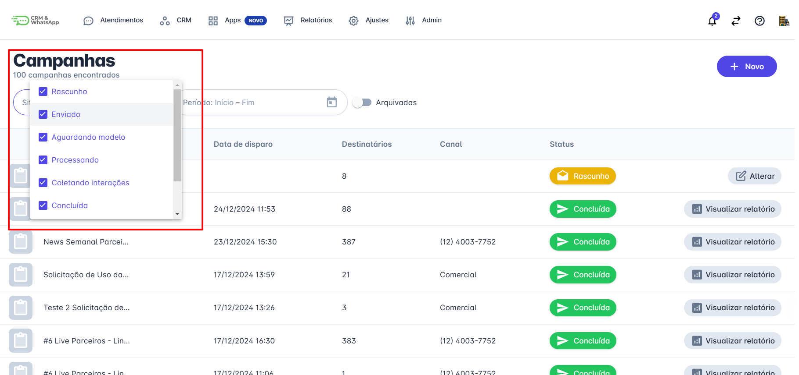
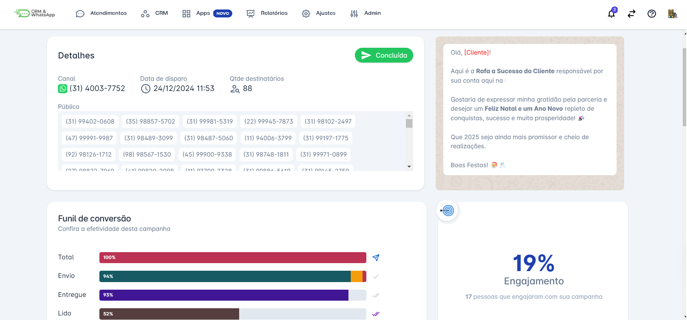
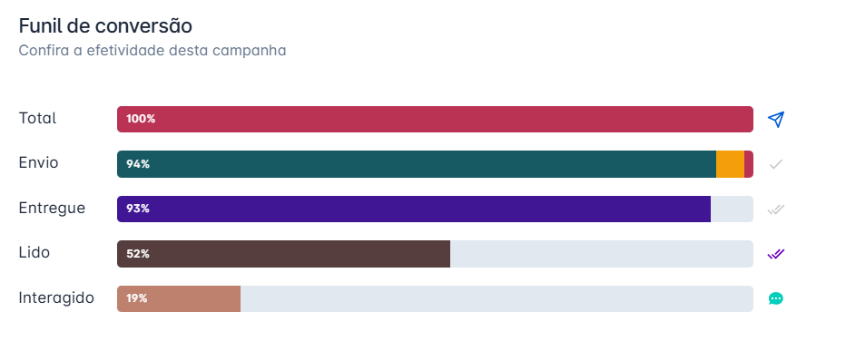
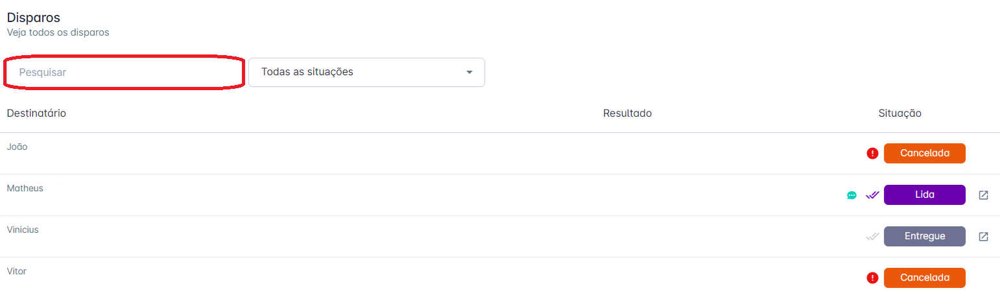

# Consultar campanha

A funcionalidade de **consulta de campanhas** na **plataforma** permite que as empresas gerenciem suas **estratégias de marketing** de forma eficaz. Este processo facilita o **monitoramento** de seu desempenho, garantindo uma **comunicação consistente** e **impactante** com os clientes.

::: tip Pré-requisitos
* **Acesso à plataforma.**
* Qualquer usuário pode consultar as **Campanhas**.
:::

## Passo 1: Acessar Campanhas

Na tela inicial da plataforma, clique em **"Apps"**. O menu de opções será exibido. Em seguida, clique em **"Campanhas".**

## Passo 2: Localizar Campanha

**Localize a campanha que deseja consultar.** Para isso, você pode utilizar os filtros disponíveis, como o filtro por **período** ou **situação da campanha**.

## Passo 3: Visualizar Detalhes

**Clique na campanha** que deseja consultar. Uma nova tela será aberta, exibindo todas as informações detalhadas relacionadas ao **disparo da campanha**.

### Funil de conversão

Acompanhe de forma gráfica a efetividade da campanha disparada, analisando parâmetros como: o número de pessoas para as quais a campanha foi enviada, a porcentagem de pessoas que leram a campanha e a quantidade de interações com a campanha, também expressa em **porcentagem**.

### Disparos

**Acompanhe cada disparo de forma individualizada.**
Aplique filtros para buscar disparos com base na **situação** (Cancelada, Na Fila, Enviada, Entregue, Lida, Falha) ou pelo **nome do contato**, conforme mostrado na imagem abaixo.

::: info Considerações Adicionais
* Ao cancelar uma campanha, **não é possível reverter** as campanhas que já foram disparadas, apenas as que estão na fila.
* O intervalo de disparo entre uma mensagem e outra é de **aproximadamente 3 segundos**.
* Após o início da campanha, há um **período de até 5 dias** para a coleta dos dados.
* Após 5 dias, as **conversas inativas** são concluídas automaticamente.
* **Recomenda-se** o uso de imagens quadradas ou com proporção próxima a **1:1**, como **800x800px** ou **1200x1200px**, para garantir uma boa exibição.
:::
