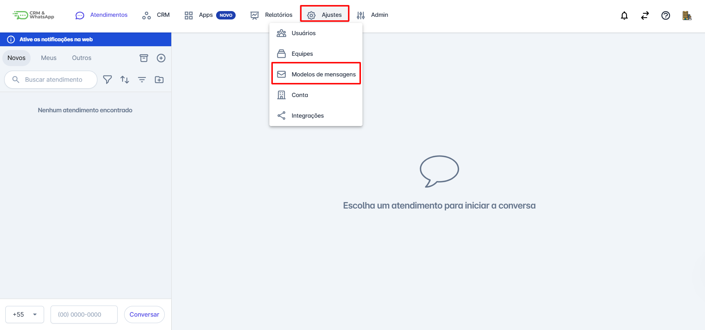
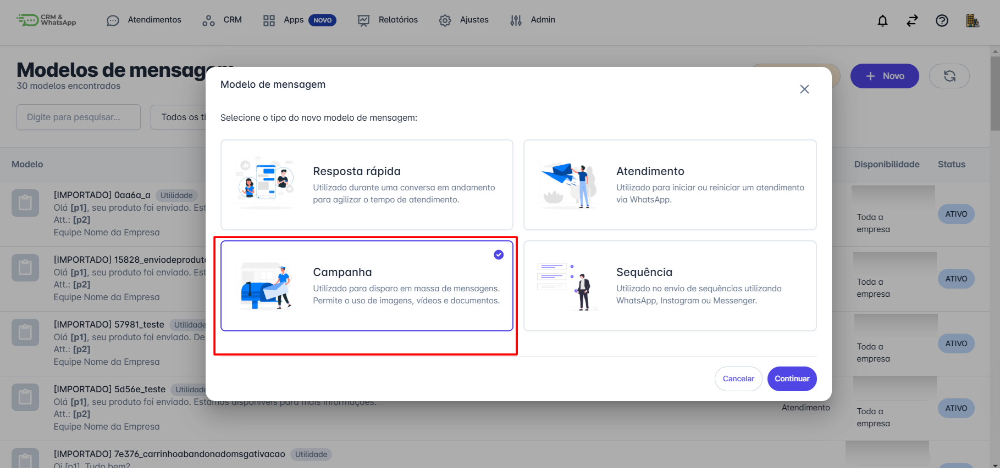
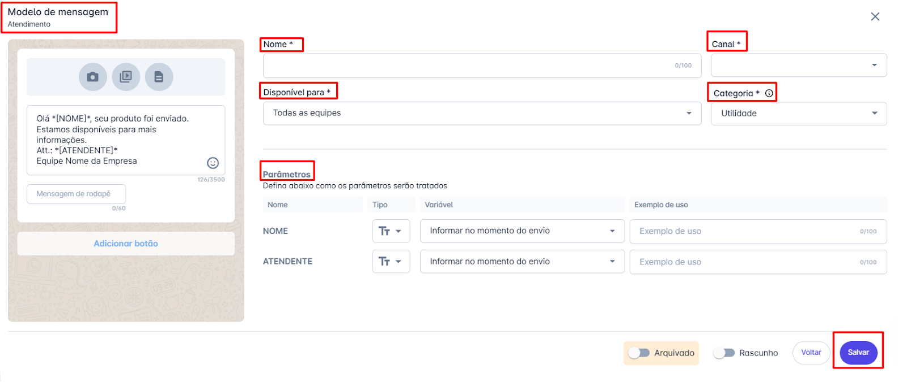
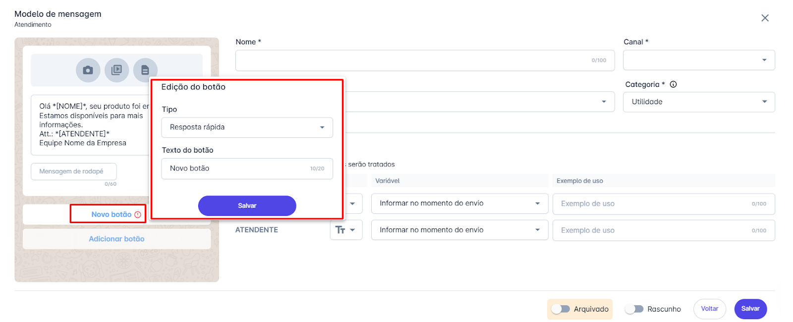
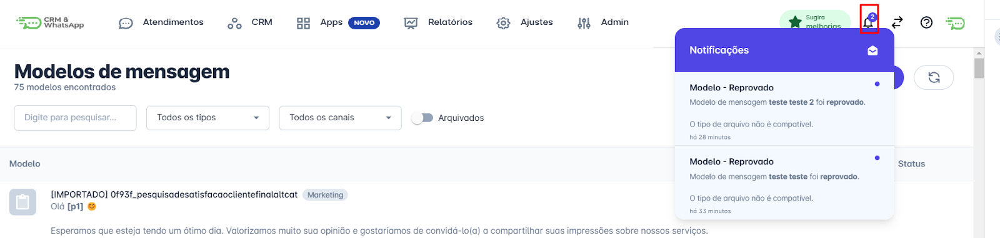

# Criar modelo de mensagem para campanha

**Criar e utilizar modelos de mensagem** do tipo **campanha** na **plataforma** é fundamental para automatizar e padronizar a comunicação com seus clientes. Esses modelos podem ser usados para **campanhas de marketing**, **notificações**, **atualizações** e muito mais, garantindo que sua mensagem seja **consistente** e **profissional**.

::: tip Pré-requisitos
* **Acesso à plataforma**.
* Somente os usuários com perfil de **Administrador** podem cadastrar modelos de mensagens do tipo **Campanha**.
:::

## Passo 1: Acessar Modelos de Mensagens

Na tela inicial da plataforma, **clique** na opção **"Ajustes"**, o menu de opções se abrirá. **Clique** em **"Modelos de Mensagens"**.

## Passo 2: Selecionar Tipo de Campanha

**Selecione** o modelo de mensagem do tipo **campanha** e **clique** em **continuar**.

## Passo 3: Preencher Campos

**Preencha os campos necessários do modelo de mensagem.**

* **Nome do Modelo**: Nome único que identifica o modelo de mensagem.
  * *Exemplo*: "Boas-vindas Cliente Novo".
* **Canal**: Este campo especifica o meio pelo qual a mensagem será enviada. Pode conter um ou mais número(s) de **WhatsApp** conectado(s) na **API Oficial**.
* **Categoria**: Para **Campanhas**, a categoria mais indicada é a de **Marketing**.

### Exemplos de aplicações comuns:
* **Lançamentos de Produtos**: Anunciar novos produtos ou serviços aos clientes.
* **Promoções e Ofertas**: Informar sobre descontos, promoções especiais e ofertas exclusivas.
* **Atualizações e Notícias**: Manter os clientes informados sobre novidades da empresa, eventos ou mudanças importantes.
* **Nutrição de Leads**: Enviar conteúdo educativo ou informativo para guiar os leads pelo funil de vendas.

### Disponibilidade e Conteúdo

* **Descrição**: É possível definir para quais **equipes** este modelo de mensagem ficará disponível.

**Adicione o texto da mensagem**. É possível utilizar **parâmetros** no texto para automatizar a personalização da mensagem. Para definir um campo personalizado, basta adicionar o nome do campo entre **colchetes** `[]`. Por exemplo: `[NOME]`.

Além do **texto**, é possível adicionar **foto**, **vídeo**, **anexar arquivo** e adicionar **botões**.

São dois tipos de botões: **Resposta rápida** e **Abrir página**.
* **Resposta rápida**: Utilizado para dar sequência na conversa, facilitando o fluxo com o atendente.
* **Abrir página**: Permite adicionar um **link** para direcionar o contato para uma nova página.

## Passo 4: Salvar e Enviar para Aprovação

**Clique em salvar** e o modelo de mensagem será enviado automaticamente para **aprovação**. A **Meta** analisará e aprovará ou rejeitará o modelo.

## Passo 5: Monitorar o Status

Após enviar o modelo, você poderá monitorar seu status (**Ativo**, **Em Análise**, **Reprovado**) diretamente na **plataforma**.
Caso o modelo seja **reprovado**, revise e faça as alterações necessárias antes de enviar novamente.

::: info Considerações Adicionais
* O **tempo de aprovação** do modelo de mensagem é definido pela **META**. Contas mais novas e com menor taxa de feedback tendem a demorar mais, enquanto contas mais antigas com maior taxa de feedback geralmente têm um processo mais rápido.
* Os **status** dos modelos de mensagens são enviados na **barra de notificações** da plataforma.
* **Segmentação**: Utilize a segmentação para enviar mensagens mais relevantes.
* Os disparos de campanhas são cobrados pela **META**, por isso a segmentação é importante.
* O limite para criar um modelo de mensagem é de **1024 caracteres**.
:::

