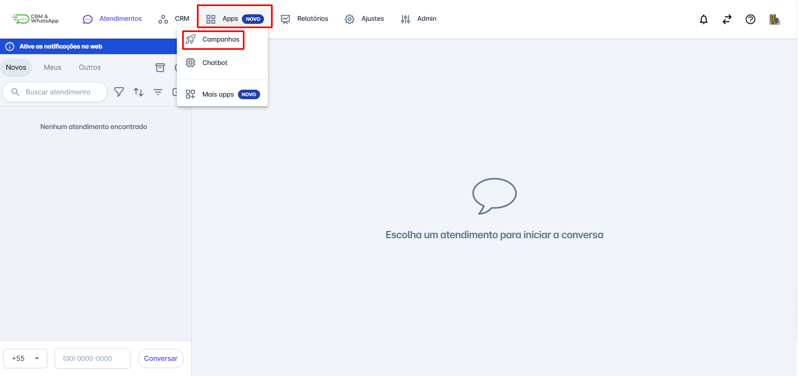
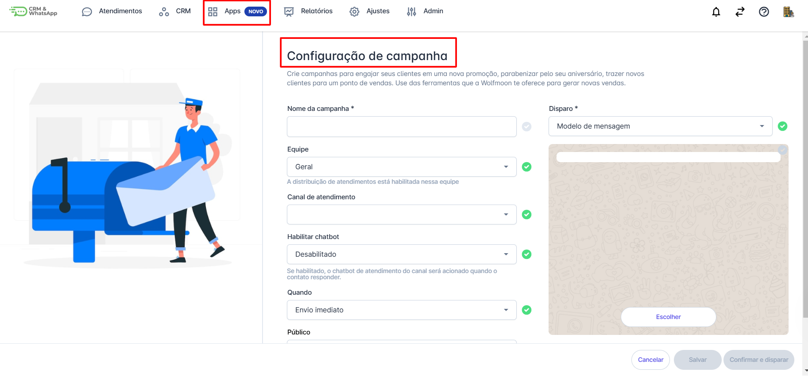
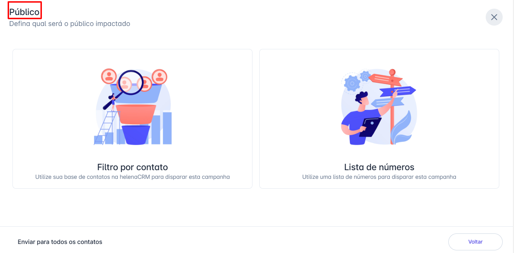
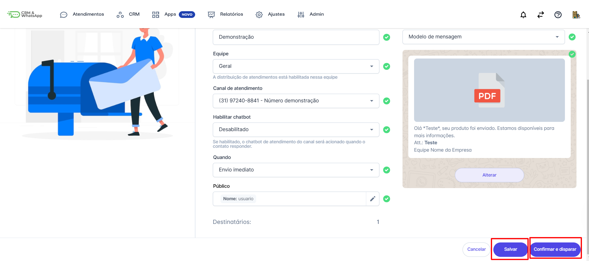
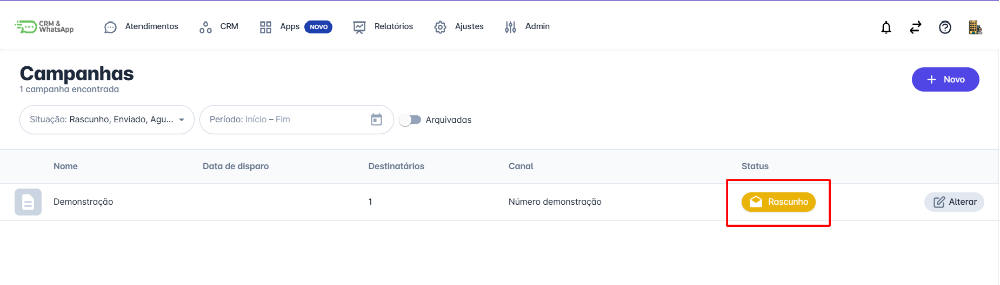

# Criar nova campanha

A criação de campanhas na **plataforma** é fundamental para organizar e gerenciar suas atividades de marketing. Com elas, você pode alcançar seu **público-alvo de forma eficaz** e acompanhar de perto o **desempenho das suas estratégias**, garantindo melhores resultados e otimização contínua.

::: tip Pré-requisitos
* Ter acesso à conta com perfil de administrador para criar e enviar campanha, demais perfis podem apenas criar.
* Ter modelo de mensagem do tipo campanha aprovado pela META.
:::

## Passo 1: Iniciar criação

Na **tela inicial** da plataforma, clique na opção **“Apps”**. Em seguida, no menu que será exibido, selecione **“Campanhas”** e clique em **“Novo”** para criar uma nova campanha.

## Passo 2: Configuração inicial

Uma tela para **configuração** da **nova campanha** será exibida.

## Passo 3: Preencher dados

Preencha os campos de acordo com as necessidades da campanha que será realizada.

* **Nome da campanha**;
* Para qual **equipe** serão direcionadas as respostas dos contatos;
* **Qual canal** será utilizado para o disparo da campanha (caso tenha mais de um número conectado na plataforma);
* Se terá um **chatbot habilitado** ou não (caso tenha, este deve estar pronto para ser associado à campanha);
* **Quando será feito o envio** (pode ser imediato ou agendado);
* **Defina o público**.

* Selecione um modelo de mensagem aprovado pela **META** ou escolha um **chatbot de automação**.

## Passo 4: Salvar ou Disparar

Após todo o preenchimento, você pode optar por **salvar a campanha e enviar depois** ou **confirmar e disparar**. **Clique** na opção desejada.

## Passo 5: Gerenciar envio

Caso **clique** em **salvar**, a campanha aparecerá na listagem com as demais campanhas, porém com o **status de rascunho**.

Para enviá-la, basta **clicar** na campanha e, ao abrir a janela com os detalhes, **clique** em **"Confirmar"** e depois em **"Disparar"**.

## Passo 6: Acompanhar status

Ao **clicar** em **"Configurar e Disparar"**, o status será alterado para **"Processando"** e, em seguida, para **"Coletando Interação"**.

Lembre-se de que esse processo de coleta acontecerá por **5 dias**. Após todo o processo, o status mudará para **"Concluída"**.

::: info Considerações Adicionais
* O **tempo de aprovação** do modelo de mensagem é definido pela **META** e pode levar até **24h**.
* O intervalo de disparo entre uma mensagem e outra é de aproximadamente **5 segundos**.
* Após o início da campanha, temos um período de até **5 dias** para coleta dos dados.
* Após **5 dias**, as conversas inativas são **concluídas automaticamente**.
* **Recomenda-se** o uso de **imagens quadradas** ou próximas da proporção **1:1**, como **800x800px** ou **1200x1200px**, para garantir uma boa exibição.
* Ao **cancelar** uma campanha, não é possível reverter as conversas que foram disparadas, somente as que estão na fila.
:::
