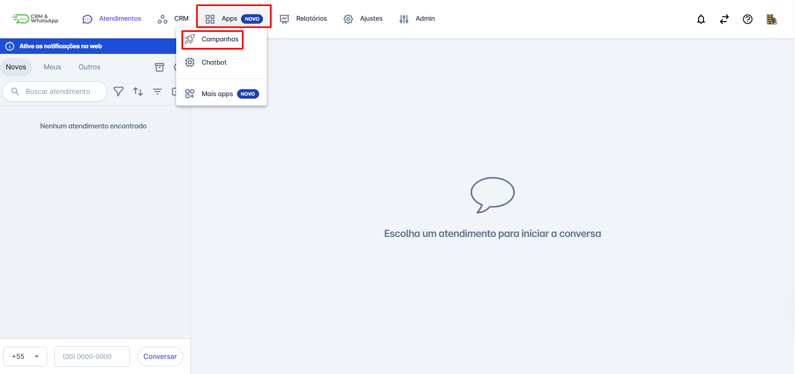
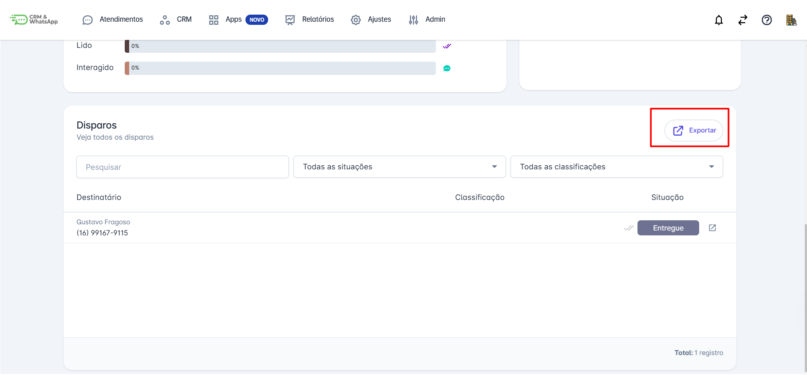
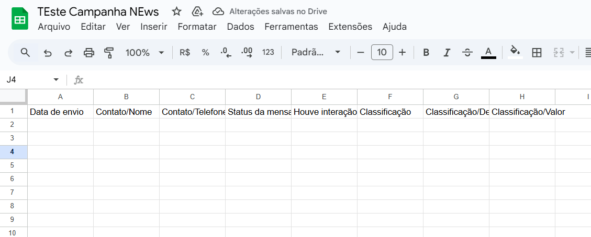

# Exportar campanha

Na **plataforma**, entendemos que a flexibilidade na gestão de campanhas é essencial para otimizar seus processos de vendas e marketing. Por isso, a funcionalidade de **exportação de campanha** permite que você extraia dados valiosos de suas campanhas em formatos fáceis de manipular e analisar.

::: tip Pré-requisitos
* **Acesso à plataforma.**
* Somente os usuários com perfil de **Administrador** podem exportar dados de **Campanhas** realizadas.
:::

## Passo 1: Acessar Campanhas

Na tela inicial da plataforma, clique em **"Apps"**. O menu de opções será aberto; em seguida, clique em **"Campanhas"**.

## Passo 2: Selecionar e Exportar

Selecione a campanha da qual deseja exportar os dados. A tela da campanha será aberta.

Em seguida, role o cursor até o fim da tela e clique na opção **"Exportar"** .

## Passo 3: Dados Gerados

Em seguida, uma planilha será gerada com as **informações da campanha**.

::: info Considerações Adicionais
* Vale destacar que **somente campanhas com status "Concluídas"** podem ser exportadas.
:::
