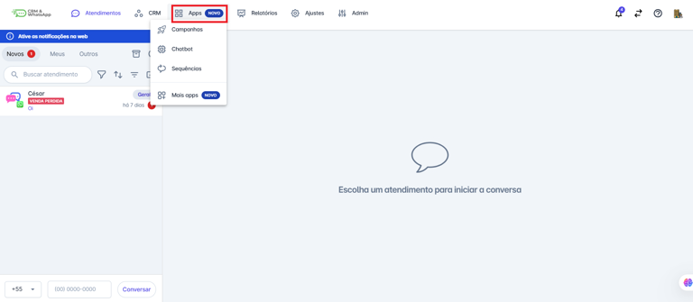
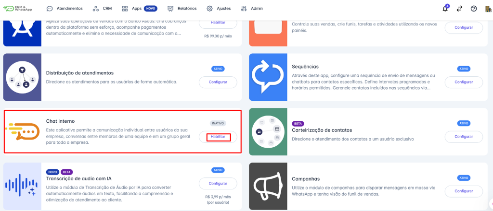
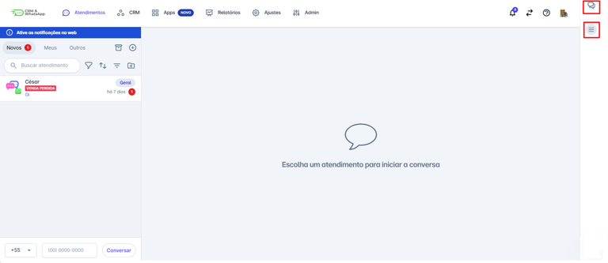
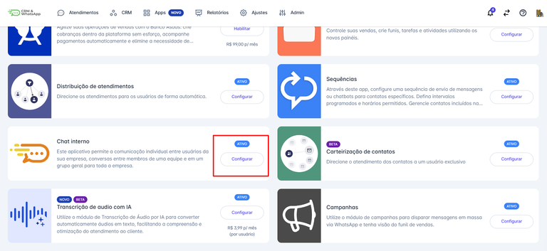
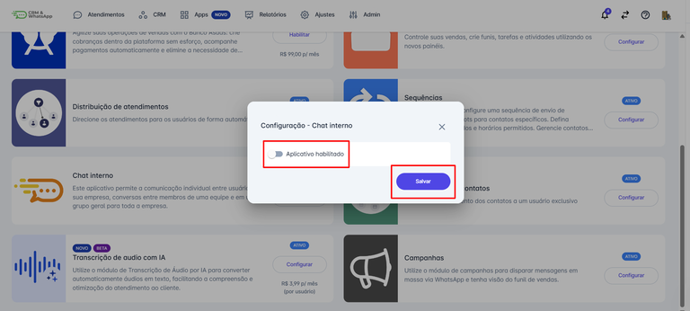

# Ativar e Desativar Funcionalidade

O Chat Interno da **plataforma** permite que os membros da equipe de atendimento se comuniquem de forma rápida e eficiente dentro do próprio sistema. Essa funcionalidade facilita a troca de informações sem a necessidade de utilizar canais externos, garantindo maior agilidade e organização na resolução de chamados.

Neste artigo, explicamos como ativar e desativar o **Chat Interno** de acordo com a necessidade da equipe.

::: tip Pré-requisitos
* Acesso à conta na **plataforma**.
* Permissão de **administrador** para gerenciar configurações da equipe.
:::

## Como Ativar o Chat Interno

### Passo 1: Acessar Mais Apps

Na tela inicial, clique no menu **“Apps”** e em seguida clique na opção **“Mais apps”.**

### Passo 2: Habilitar Chat Interno

Localize o aplicativo **"Chat interno"** e clique em **habilitar**.

### Passo 3: Configurar e Salvar

Em seguida, será exibida uma tela de configuração. Ative a chave para habilitar o aplicativo. Clique em "**Salvar**" para finalizar a ativação.

### Passo 4: Acessar o Chat

Após essa configuração, todos os usuários da equipe poderão utilizar o Chat Interno para se comunicar diretamente na plataforma. Ele fica localizado na lateral direita da plataforma, para abrir, basta clicar no **ícone** .

## Como Desativar o Chat Interno

Caso seja necessário desativar essa funcionalidade, siga os passos abaixo:

### Passo 1: Acessar Mais Apps

Na tela inicial, clique no menu **“Apps”** e em seguida clique na opção **“Mais apps”.**

### Passo 2: Configurar Chat Interno

Localize o aplicativo **"Chat interno"** e clique em **configurar**.

### Passo 3: Desabilitar e Salvar

Em seguida, será exibida uma tela de configuração. Desative a chave para desabilitar o aplicativo. Clique em "**Salvar**" para finalizar a desativação.

Ao desativar o Chat Interno, os usuários da equipe não poderão mais enviar mensagens dentro da plataforma.

## Benefícios do Chat Interno

* **Agilidade** na comunicação entre atendentes e supervisores.
* **Centralização** de informações, evitando a necessidade de usar aplicativos externos.
* **Histórico acessível**, garantindo um registro organizado das interações internas.
* **Melhor colaboração**, permitindo um atendimento mais eficiente ao cliente.

## Considerações Finais

* A funcionalidade de **Chat Interno** é uma ferramenta valiosa para a equipe de atendimento da **plataforma**, permitindo um fluxo de trabalho mais **eficiente e organizado**.
* O controle de ativação e desativação oferece flexibilidade para ajustar a ferramenta conforme a necessidade da equipe.
* A funcionalidade está disponível para todos os planos da **plataforma**.
