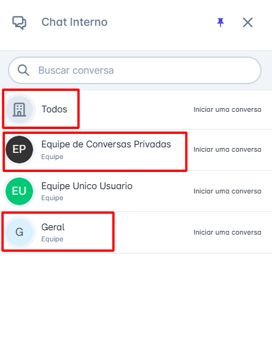

# Tipos de Conversa (usuário x equipe x todos)

O **Chat Interno** da **plataforma** é uma ferramenta essencial para a comunicação eficiente entre os membros da equipe. Para garantir que as mensagens sejam direcionadas corretamente, o chat interno oferece diferentes **tipos de conversa**, permitindo que os atendentes escolham a melhor forma de interação com os colegas.

Neste artigo, explicaremos a diferença entre os tipos de conversa **Usuário, Equipe e Todos** e como cada um pode ser utilizado.

## Tipos de Conversa no Chat Interno

### Usuário

O modo **Usuário** permite que a conversa ocorra de forma privada entre dois atendentes. Esse tipo de conversa é ideal para:

* Troca de informações entre colegas sobre um atendimento específico;
* Dúvidas ou orientações que não precisam ser compartilhadas com toda a equipe;
* Mensagens confidenciais ou direcionadas.

### Equipe

No modo **Equipe**, a conversa fica visível para todos os membros de uma mesma equipe dentro da plataforma. Esse tipo de conversa é indicado para:

* Compartilhamento de atualizações relevantes sobre um atendimento;
* Dúvidas que podem ser respondidas por qualquer membro da equipe;
* Coordenação e organização de tarefas internas.

### Todos

A opção **Todos** permite que a mensagem seja visível para todos os usuários da **plataforma**, independentemente da equipe a que pertencem. É recomendada para situações como:

* Comunicados gerais para toda a empresa;
* Alerta sobre mudanças nos processos de atendimento;
* Mensagens urgentes que precisam ser vistas por todos.

## Considerações Finais

* O Chat Interno da **plataforma** é uma ferramenta poderosa para otimizar a comunicação e a colaboração entre os atendentes.
* Ao compreender e utilizar corretamente os diferentes tipos de conversa, é possível garantir um fluxo de trabalho mais organizado e eficiente, melhorando o atendimento ao cliente.
* O perfil de Administrador não consegue visualizar as conversas entre os usuários e equipes, a menos que ele faça parte da equipe.
