# Criando um chatbot

A automação no atendimento ao cliente se tornou uma das estratégias mais eficazes para melhorar a experiência do usuário, reduzir o tempo de resposta e otimizar recursos. Na **plataforma**, é possível criar **chatbots personalizados** para responder automaticamente perguntas frequentes, direcionar atendimentos e garantir agilidade no contato com seus clientes, tudo isso integrado aos canais oficiais como **WhatsApp**, Instagram e Facebook.

Neste artigo, você vai aprender como configurar um chatbot na **plataforma** de forma prática e eficiente.

::: tip Pré-requisitos
* Uma conta ativa na **plataforma**;
* Permissão de administrador para configurar o chatbot;
* Um **canal de atendimento** configurado (WhatsApp, Instagram ou Facebook);
* Mapeamento das perguntas e respostas que deseja automatizar;
* Clareza sobre o objetivo do bot (ex: triagem de atendimento, envio de informações, direcionamento por setor).
:::

## Passo a passo para criar um chatbot na plataforma

### Passo 1: Acessar o menu Chatbot

No painel da **plataforma**, clique no menu **"Apps"** e em seguida selecione **"Chatbot"**.

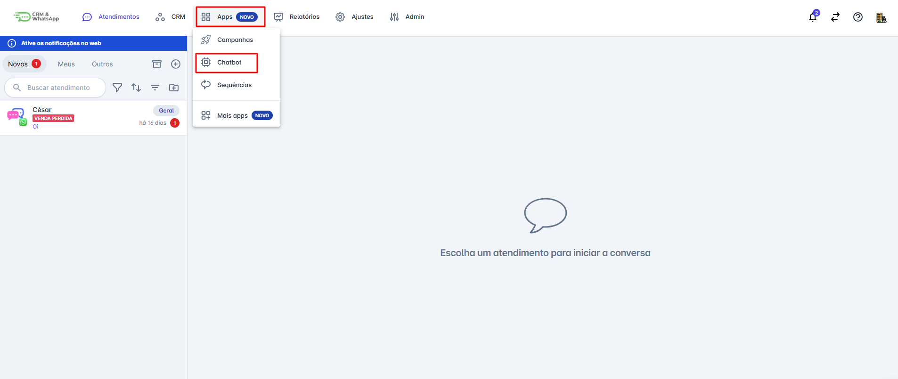

### Passo 2: Novo Chatbot

Defina o **tipo de Chatbot** (Atendimento ou Automação), em seguida clique em **“+ Novo”** para iniciar a criação de um fluxo.

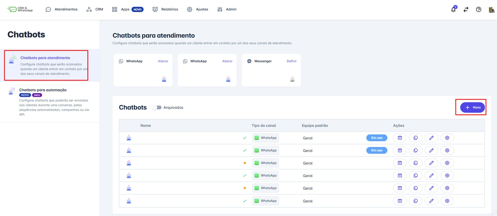

### Passo 3: Configurações Iniciais

Escolha um nome que represente a função do bot (ex: "Bot de Suporte", "Bot Comercial").
Selecione o canal no qual o **chatbot** será ativado (WhatsApp, Instagram ou Facebook), e qual a equipe padrão onde todas as conversas que se iniciarem serão criadas. Clique no botão **"salvar"**.

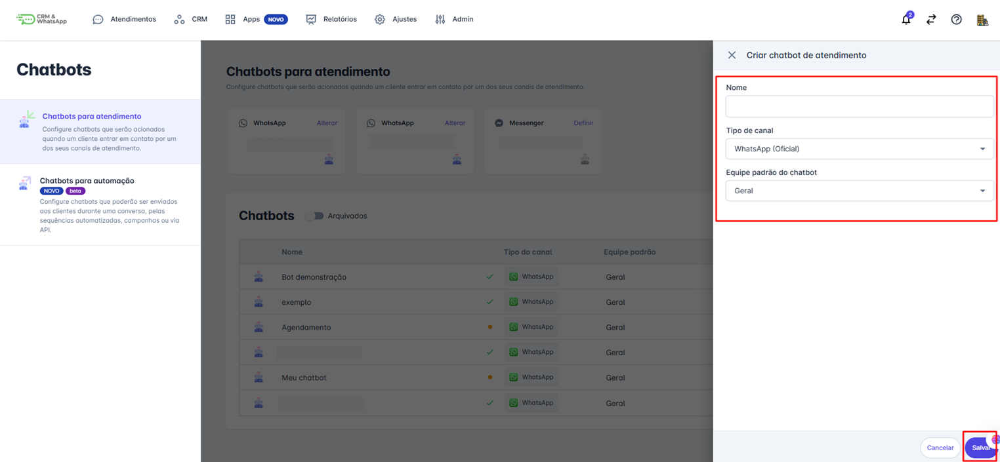

### Passo 4: Editor de Fluxo

O sistema vai apresentar a tela de edição do seu **chatbot**. No centro da tela serão exibidos os componentes de execução do chatbot, à direita será exibida a apresentação do seu chatbot, ou seja, como ele será exibido no **WhatsApp** do seu cliente.

Abaixo, no centro da tela, tem um botão de **salvar as alterações**. Do lado esquerdo tem um botão para **testar** e do lado direito um botão para **publicar a versão em produção**.

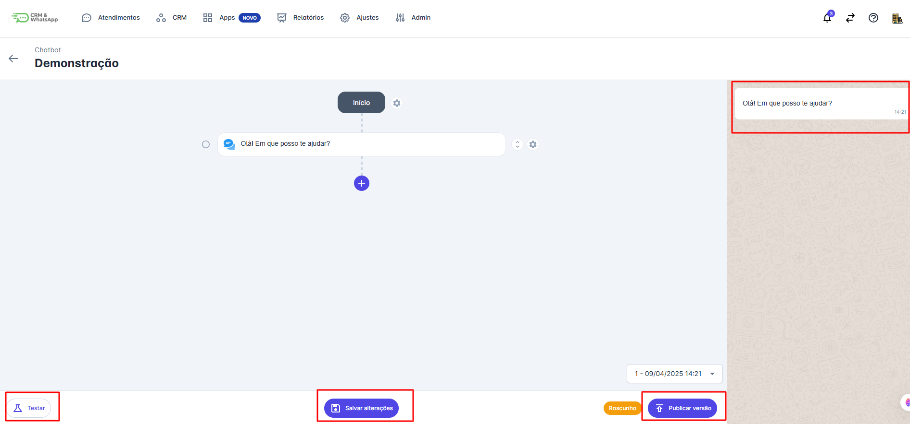

::: danger Observação
* O botão **"Testar"** deve ser utilizado para validar o funcionamento do chatbot **antes da publicação oficial**. Ao realizar essa publicação de teste, o chatbot **não ficará visível no canal de atendimento escolhido**, ou seja, apenas você poderá testá-lo.
* Ao clicar em **"Testar"**, a plataforma gera um **código com hashtag** exclusivo. Esse código, ao ser enviado no canal de atendimento (como o WhatsApp, por exemplo), **ativa o chatbot em modo de teste**, permitindo que você simule a experiência do cliente e avalie o fluxo ainda em fase de desenvolvimento.
* Para isso, é necessário clicar em **"Testar"** e, em seguida, **confirmar a ação clicando em "Publicar alterações"** na janela (modal) exibida na tela.
* Quando o seu chatbot estiver pronto para uso, clique no botão **"Publicar versão"**, localizado no canto inferior direito da tela. Ao realizar essa ação, o chatbot será disponibilizado oficialmente e, caso já esteja associado a um canal de atendimento, **passará a responder automaticamente às conversas recebidas**.
:::

### Passo 5: Adicionar Instruções

Agora é o momento de definir as **instruções que o seu chatbot deverá executar**. Para isso, clique no botão **“+”** e selecione uma das opções disponíveis a seguir:

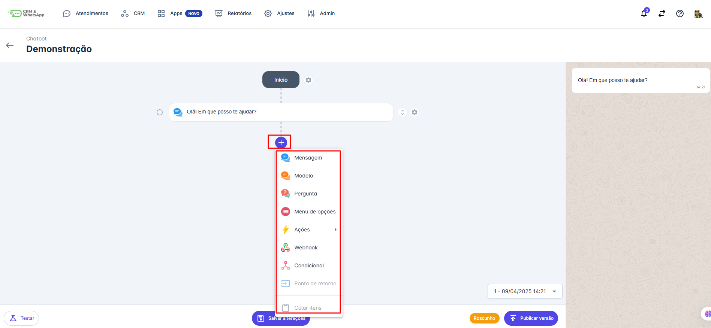

#### Tipos de Instruções

* **Mensagem**: instrução que vai disparar uma mensagem tão logo chegue a vez dela no fluxo do seu chatbot. Essa mensagem pode ser uma mensagem de texto apenas, um áudio, uma mensagem de texto com imagem / vídeo ou pode ser um documento um PDF. Durante a execução o chatbot vai exibir essa mensagem e vai passar para a próxima instrução.

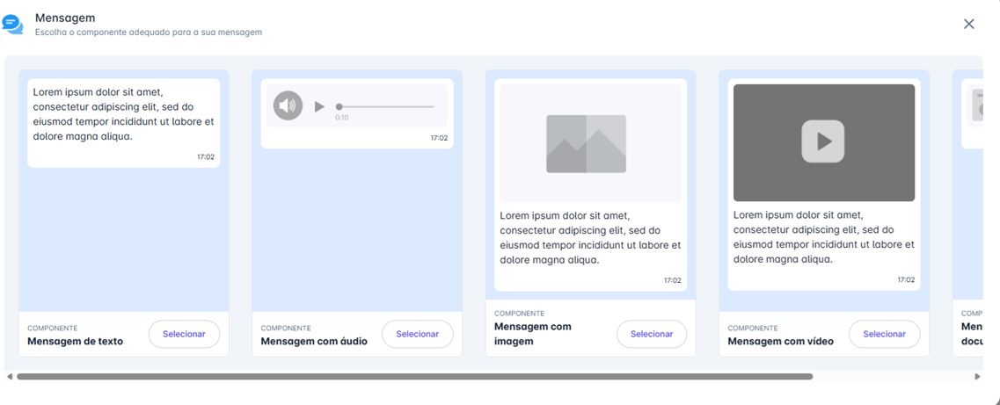

* **Modelo de mensagem**: você pode escolher uma mensagem do tipo marketing ou do tipo utilidade que tenha sido previamente cadastrada e aprovada pela meta, e enviar para o seu contato. Esse tipo de mensagem é imprescindível que seja utilizado quando você estiver configurando um chatbot de automação, por exemplo. Em uma campanha ou em uma sequência como não se sabe se a janela de 24h estará aberta no momento do disparo, o ideal é que coloque uma mensagem modelo, assim garantirá que essa mensagem chegue até o contato.

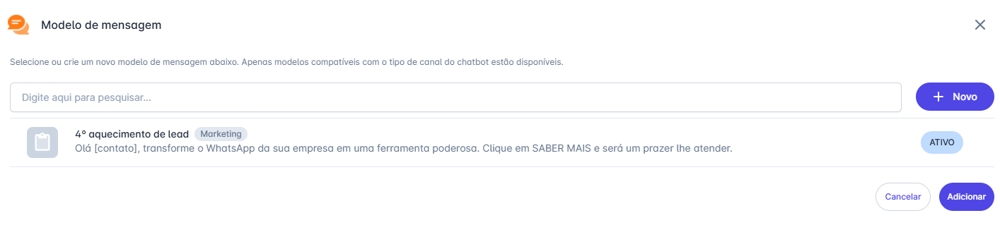

* **Pergunta**: a pergunta pode ser apenas uma pergunta com texto, com menu de botões ou uma pergunta com uma lista de opções. Independente do modelo que você selecionar o sistema vai ficar aguardando a resposta do seu contato. Assim que o contato responder o sistema vai executar o próximo comando da configuração.

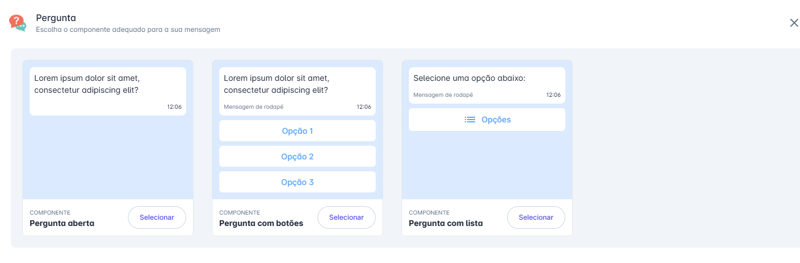

Uma pergunta ainda pode ser configurada para:

* **Resposta inválida**: a pergunta é com botões ou lista, por exemplo, e seu contato equivocadamente encaminhar um áudio ou um texto. Neste caso é possível configurar o envio de uma mensagem alertando o contato.

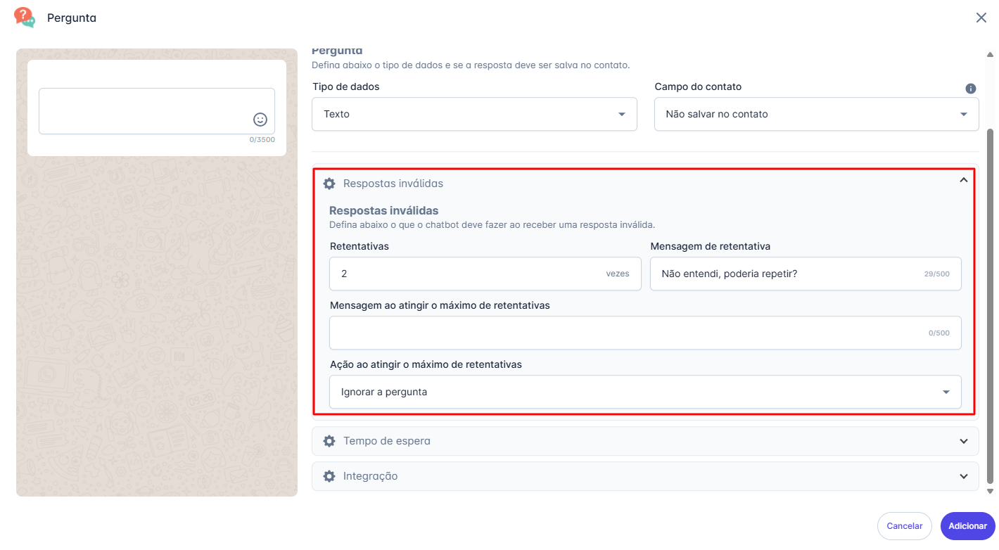

* **Tempo de espera**: configure o tempo de espera a ser aguardado entre o envio de mensagens ou o tempo total de espera.
  * O tempo limite de espera é o tempo máximo que você vai esperar até que o usuário responda. Se ele não responder naquele tempo máximo o sistema vai executar o subfluxo de tempo limite de espera.
  * Tempo de tolerância é o tempo entre uma mensagem e outra enviada pelo usuário. É ideal para que agrupe todas as mensagens enviadas e as trate como uma só (por exemplo, para enviar para processamento de uma Inteligência Artificial).

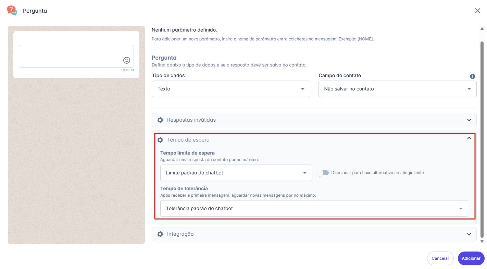

* **Integração**: pode ser utilizado para disparo juntamente com webhook que vai encaminhar um arquivo JSON para uma sistema externo.

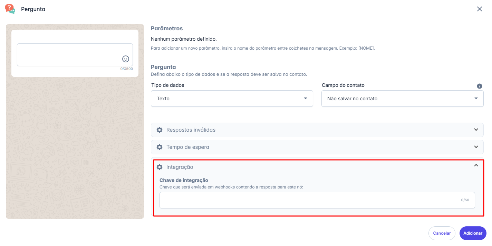

* **Webhooks**: são comandos enviados para ferramentas/sistemas externos (ex.: n8n ou Make). Envia um JSON para uma url externa à plataforma. Nesta URL você vai receber um arquivo com todas as informações sobre o atendimento e sobre o contato com qual você está interagindo naquele momento. Ao devolver uma informação com o código 200 ou 400, o chatbot sistema vai iniciar um fluxo de sucesso ou falha da execução do webhook. Você também pode programar fluxos de retorno ao invés de códigos, como por exemplo retornar um “OK”, “CPF INVÁLIDO”, “NENHUM PAGAMENTO ABERTO”, etc. Com isso você pode criar fluxos alternativos no chatbot que serão executados caso após receber o retorno.

* **Condicionais**: são estruturas utilizadas para **testar informações** e, com base no resultado desse teste, direcionar o fluxo para um caminho específico.

  Cada condicional pode conter **vários casos**, e dentro de cada caso é possível definir **condições** que precisam ser atendidas. Essas condições podem ser:
  * Do tipo **“E”**: todas as condições devem ser verdadeiras ao mesmo tempo.
  * Do tipo **“OU”**: apenas uma das condições precisa ser verdadeira.

  Para alterar o tipo da condicional (**E/OU**), clique no **canto superior direito do agrupamento**.
  No **canto superior esquerdo**, você pode clicar em **“Caso 1”** para **renomear a condicional**, facilitando a leitura e organização.

  É possível adicionar **outros casos** ao grupo de condicionais. O sistema executa os casos **de forma sequencial**:
  * Testa o primeiro caso.
  * Se nenhuma condição for satisfeita, passa para o segundo.
  * Continua testando os casos seguintes, um a um.

  Se **nenhum caso for atendido**, o sistema segue para o **caso padrão**, que representa o **fluxo final** da condicional.

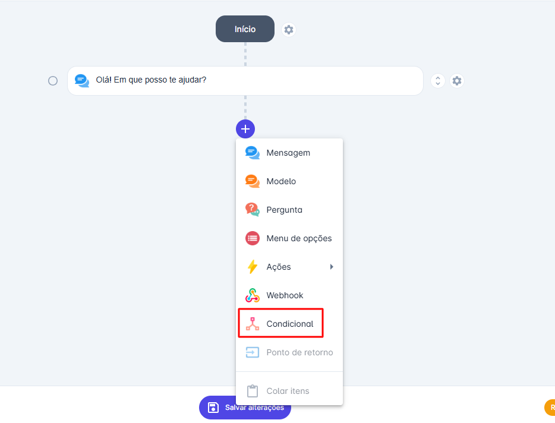

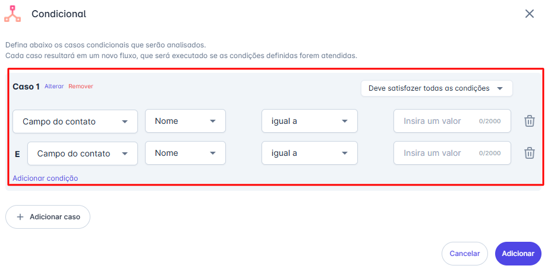

Atualmente, você pode validar dentro de uma **condicional**:

* **Horário de funcionamento**
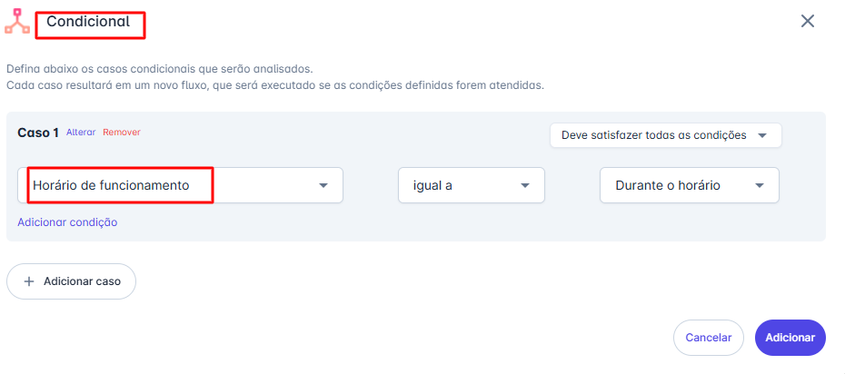

* **Uma resposta a uma pergunta feita**

* **A uma resposta a um modelo de mensagem**
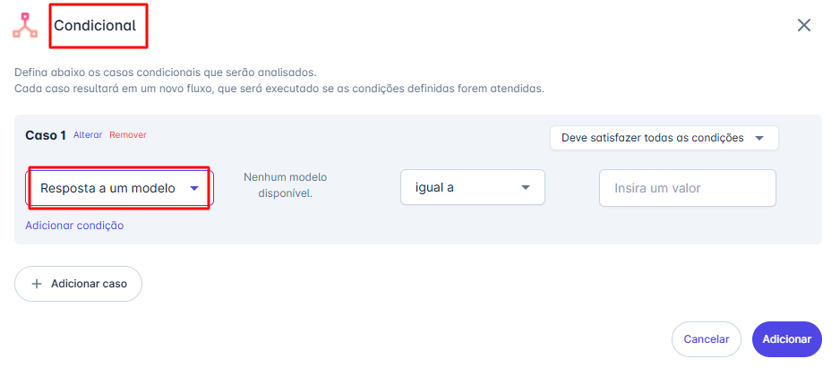

* **Teste de valor de um campo personalizado do contato**
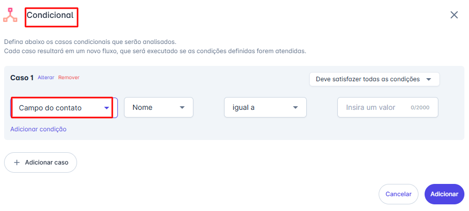

* **Etiqueta associada a um contato**
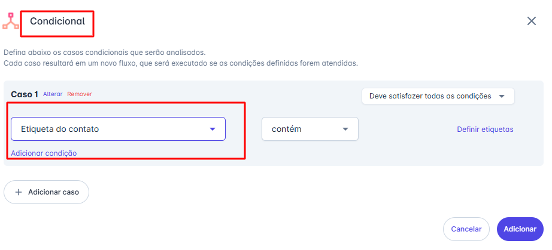

* **Última mensagem enviada pelo contato**
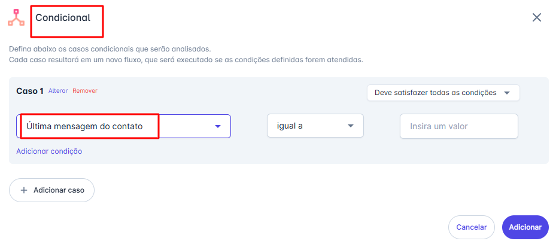

* **Metadados do contato ou do atendimento**
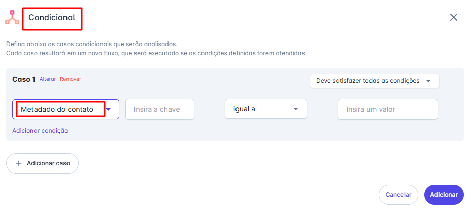
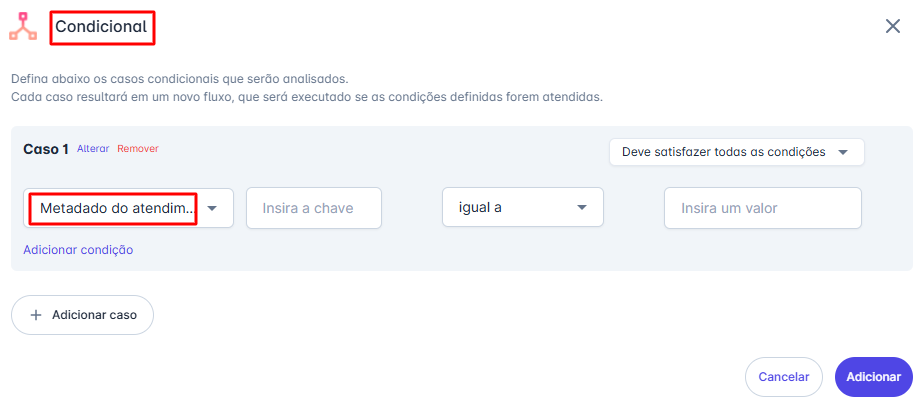

* **Data atual**
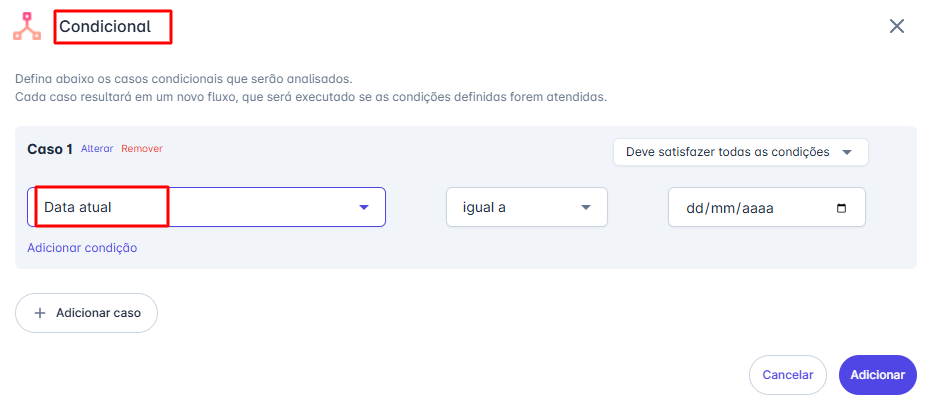

* **Dia da semana atual**
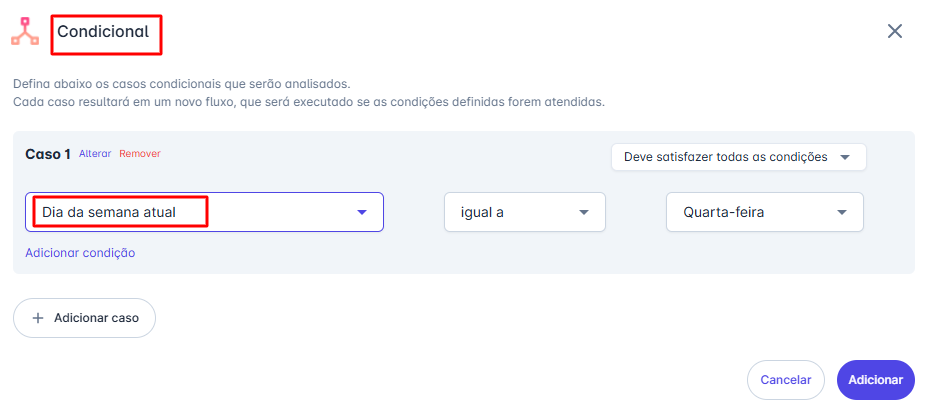

* **Horário atual**
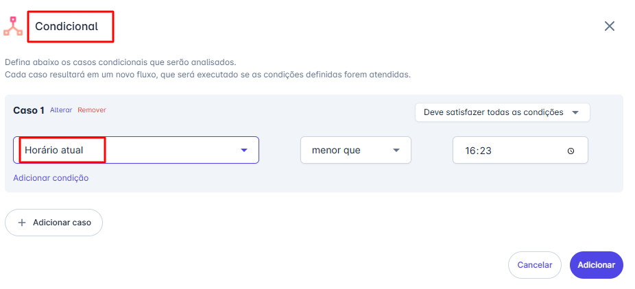

* **Ponto de retorno**: são utilizados para que você desvie o fluxo de execução do seu chatbot para qualquer outro ponto do próprio chatbot. Isso faz com que você não precise ficar copiando e duplicando fluxos, é possível marcar uma um ponto de retorno naquele ponto do seu código do chatbot e então, em qualquer local, você pode desviar o fluxo para aquele ponto de retorno.

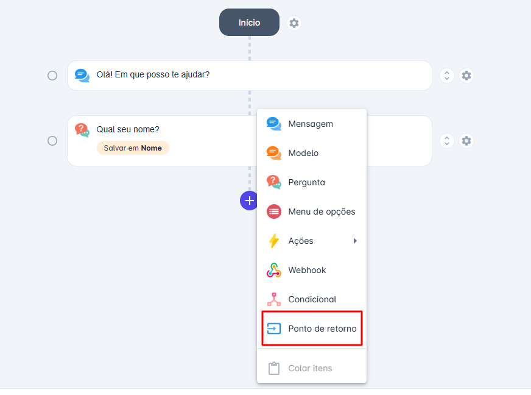

* **Ações**: escolha ações dentre as seguinte possíveis:
  * Adicionar ou remover uma etiqueta ao contato.
  * Adicionar o seu contato ou remover contato de uma sequência.
  * Aguardar mensagens do contato.
  * Espera por alguns segundos.
  * Direcionar para outro chatbot.
  * Direcionar para um ponto de retorno.
  * Retornar para o menu anterior.
  * Encaminhar o atendimento para uma equipe.
  * Encerrar um atendimento.
  * Modificar meta dados internos do contato ou do atendimento.

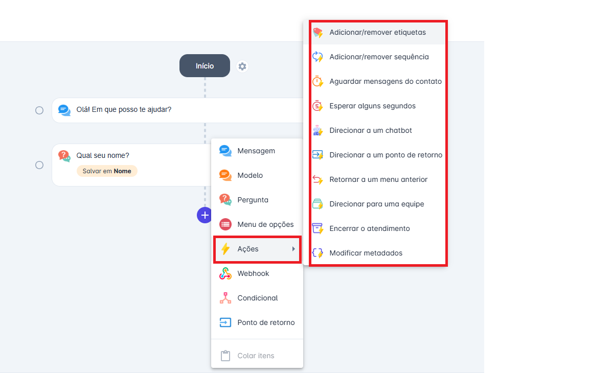

Ao final você clique no botão **salvar alterações**. Após os testes você clica no botão **publicar versão** para que este chatbot fique disponível e comece a responder ao canal de atendimento para o qual ele foi associado.

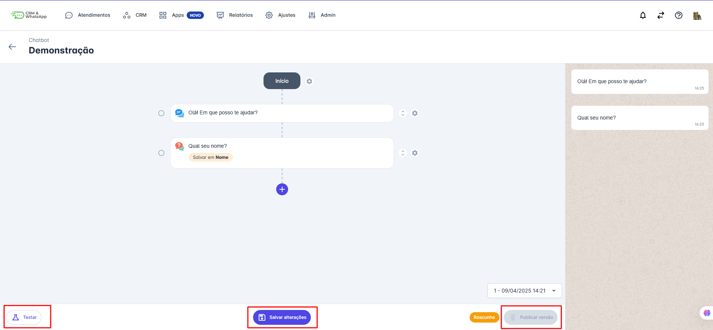

### Considerações finais

* Criar um chatbot na **plataforma** é uma forma inteligente de oferecer **atendimento 24/7**, qualificar seus leads e garantir mais agilidade no suporte. Além disso, você pode monitorar os resultados através de **relatórios de atendimento**, acompanhando quantos contatos foram atendidos pelo bot e onde os clientes mais interagem.
* É possível ainda ver o fluxo de um atendimento no **Log de Atendimento.**
* Lembre-se: um chatbot eficiente depende de **mensagens claras, fluxos bem estruturados** e constante **análise de performance**.
