# Tipos de Chatbot

Na **plataforma**, buscamos sempre oferecer soluções que otimizem o tempo da sua equipe e melhorem a experiência do seu cliente. Entre essas soluções, os **chatbots** ganham destaque por sua versatilidade e eficiência. No entanto, é comum surgirem dúvidas sobre as diferenças entre o **chatbot voltado para atendimento** e o **chatbot utilizado para automações** dentro da plataforma.

Enquanto o **chatbot de atendimento** tem como foco principal **interagir diretamente com o cliente**, respondendo dúvidas frequentes, direcionando para os setores corretos e agilizando o suporte, o **chatbot de automação** é utilizado para **executar processos internos automaticamente**, como disparar mensagens, atualizar informações em cadastros ou iniciar fluxos de venda e pós-venda.

Neste artigo, vamos explicar de forma simples e objetiva as principais diferenças entre esses dois tipos de chatbot, mostrando como cada um pode ser aplicado na **plataforma** para trazer mais produtividade, organização e resultados para o seu negócio.

## Gerenciamento de Chatbots

Dentro da **plataforma**, você pode **criar um chatbot** e disponibilizá-lo para responder às mensagens recebidas no **número de WhatsApp conectado** à sua conta.

Para gerenciar seus chatbots, acesse o menu **"Apps"** e clique em **"Chatbot"**. Na tela que será exibida, você verá, no lado esquerdo, a **listagem de todos os chatbots cadastrados**, sejam eles **chatbots para atendimento** ou **chatbots para automação**.

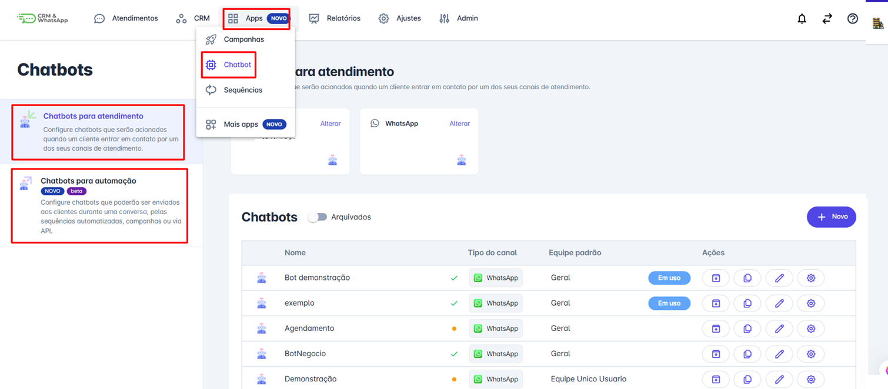

### Diferenças Principais

* **Chatbots para atendimento**: são aqueles que você utilizará no dia a dia para responder a seu usuário quando ele enviar uma mensagem para o seu canal de atendimento.

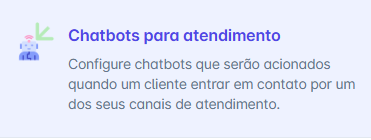

* **Chatbot de automação**: são chatbots que podem ser utilizados em disparados de mensagem em massa, via api ou mesmo dentro de uma conversa já em andamento.

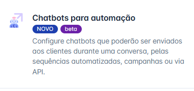

## Chatbot para Atendimento

Ao clicar na aba **"Chatbot para Atendimento"**, na parte superior da tela serão exibidos todos os **canais de atendimento** associados à sua conta, como **números de WhatsApp**, **perfis do Instagram** e **contas do Facebook Messenger**.

Esses canais representam os meios pelos quais o chatbot poderá interagir diretamente com seus clientes.

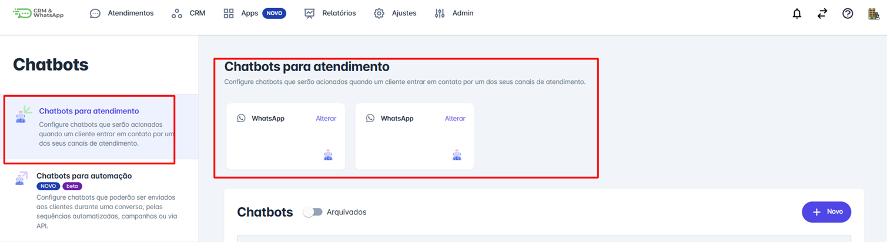

### Configuração por Horário

Clicando no link **"Alterar"**, localizado no quadrinho do canal de atendimento, você pode **definir qual chatbot será acionado durante o horário de trabalho** e **qual será utilizado fora do horário de trabalho**.

### Palavras-chave

Além disso, é possível configurar **palavras-chave** clicando no link **"Adicionar mais"**. Esse recurso permite que você defina **termos específicos que disparam um chatbot determinado**. Ele é especialmente útil em casos como **campanhas de anúncios**, em que você deseja acionar um fluxo personalizado quando o cliente entra em contato a partir de um determinado link ou palavra-chave.

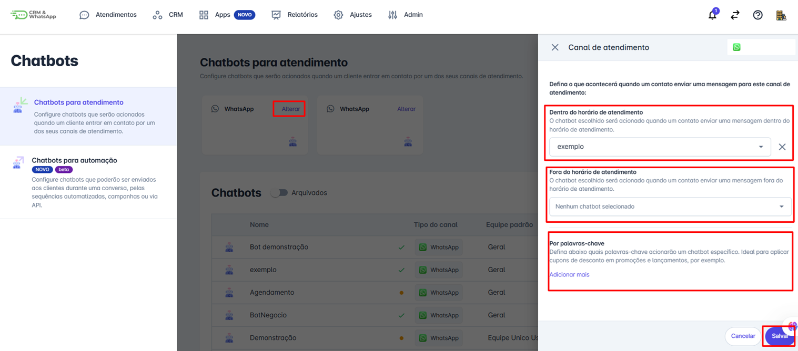

::: warning Observação
Se você utiliza o canal do **WhatsApp via API oficial**, é necessário **associar um chatbot criado especificamente para a API oficial**. Já nos casos em que o canal não é a API oficial do WhatsApp, como **Instagram** ou **Facebook Messenger**, é importante garantir que o **chatbot correspondente** esteja corretamente associado ao respectivo canal.
:::

### Lista de Chatbots de Atendimento

Na parte inferior da tela, são exibidos **todos os chatbots já criados**. Ao lado de cada um, o sistema mostra:

* O **tipo de canal** ao qual o chatbot está vinculado (WhatsApp, Instagram, Messenger, etc.);
* A **equipe padrão**, ou seja, para qual equipe a conversa será direcionada assim que for iniciada;
* A informação se o **chatbot está em uso** ou não;
* Um **conjunto de ações** disponíveis, como **arquivar**, **duplicar**, **editar** ou **alterar as configurações** do chatbot.

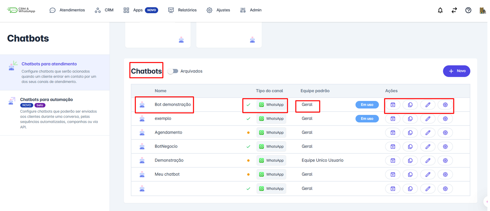

### Configurações do Chatbot

Ao clicar em **"Configurações"**, você pode **alterar o nome do chatbot** e definir ou atualizar a **equipe padrão**, ou seja, o setor responsável por receber as conversas iniciadas por esse chatbot.

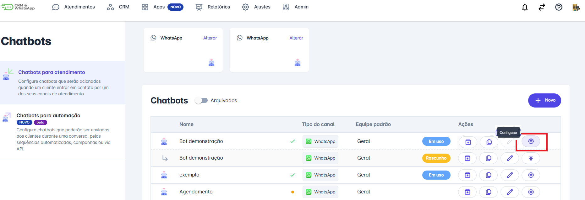

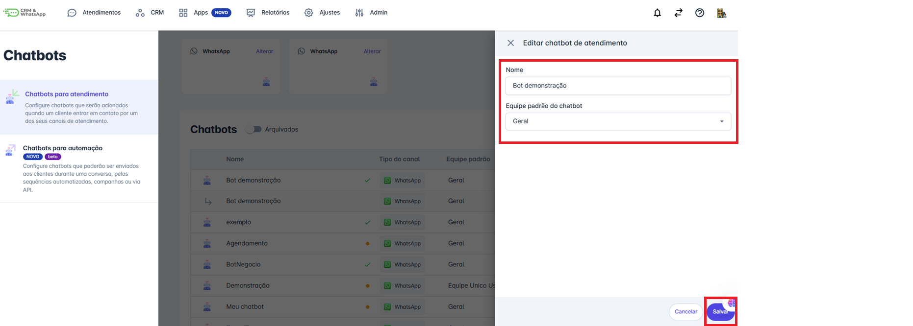

## Chatbots para Automação

Já ao acessar a aba lateral **"Chatbots para Automação"**, as informações exibidas seguem o mesmo padrão da aba de atendimento. A diferença é que aqui há uma **coluna adicional chamada "Disponibilidade"**, que indica **onde o chatbot está sendo utilizado**, como por exemplo: **API, Campanha, Conversa** ou **Sequência**.

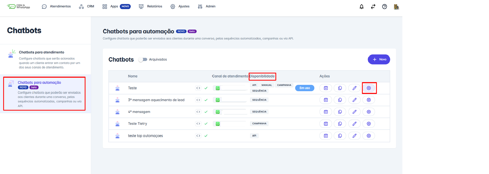

### Configurações de Automação

Ao clicar no **ícone de configurações** de um chatbot para automação, é possível ajustar diversas informações importantes:

* **Nome do chatbot**
* **Disponibilidade**, ou seja, **onde ele poderá ser utilizado** (API, Campanha, Conversa ou Sequência)
* **Canal de atendimento** no qual o chatbot será usado
* **Equipe padrão**, para a qual a conversa será direcionada no início
* **Equipes autorizadas** a utilizar aquele chatbot

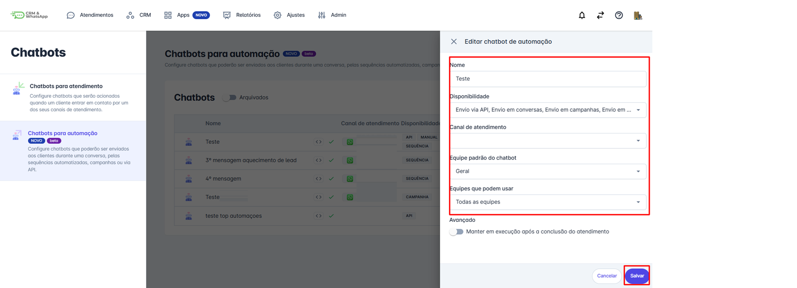

::: tip Configuração Avançada
Há a opção **"Avançada"** chamada **"Manter em execução após a conclusão do atendimento"**. Ao ativar essa opção, o chatbot continuará respondendo ao contato **mesmo após o encerramento do atendimento**, sem abrir uma nova conversa com a equipe. Essa funcionalidade é útil, por exemplo, para **enviar pesquisas de satisfação** ou mensagens de acompanhamento após o suporte.
:::

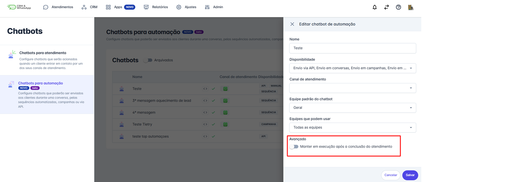
