# Copiar e Colar do Chatbot na plataforma

A funcionalidade de Copiar e Colar no Chatbot da **plataforma** permite duplicar rapidamente a estrutura de um bot para criar outro de forma eficiente. Com essa opção, os usuários podem **reaproveitar fluxos** já estruturados, facilitando a configuração de novos chatbots sem precisar recriar todas as etapas do zero.

Neste artigo, explicamos como utilizar essa funcionalidade e quais são os benefícios para a sua equipe.

::: tip Pré-requisitos
* Tenha acesso à sua conta na **plataforma.**
* Ter algum **Chatbot** já criado.
* Somente os usuários com **perfil de Administrador** podem criar, alterar e arquivar Chatbots.
:::

## Benefícios da Função Copiar e Colar

* **Agilidade** na criação de novos chatbots: permite duplicar estruturas existentes e ajustá-las conforme necessário.
* **Padronização dos fluxos:** mantém uma consistência nos atendimentos ao reutilizar modelos de chatbot.
* **Redução do tempo** de configuração: evita a necessidade de recriação manual de todos os passos do bot.
* **Facilidade na personalização**: possibilita ajustes rápidos sem comprometer a estrutura original.

## Como Copiar e Colar no Chatbot

### Passo 1: Acessar Chatbots

No menu principal clique em **“Apps”** e em seguida **"Chatbots”.**

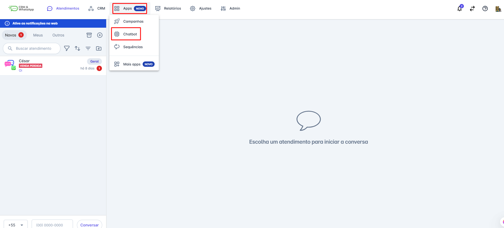

### Passo 2: Selecionar Bot

Selecione o tipo de bot que você deseja copiar informações (**Chatbot para Atendimento ou Chatbot para Automação**). A lista de Bots criados se abrirá, **selecione o Bot** que deseja copiar clicando sobre ele.

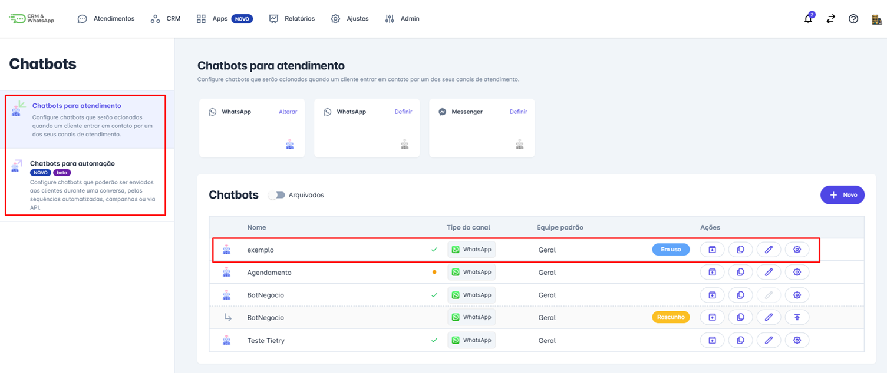

### Passo 3: Editar Bot

A tela com a estrutura do Chatbot se abrirá. Clique na opção “**Editar**”.

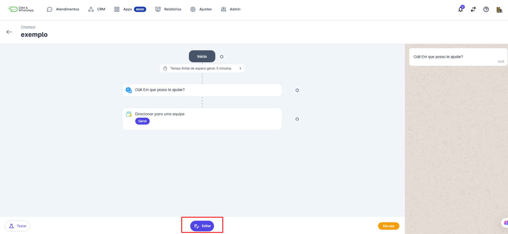

### Passo 4: Selecionar Etapas

Na tela de edição, aparecerá uma **bolinha ao lado** de cada etapa do chatbot, clique nas etapas que deseja copiar, conforme a imagem abaixo.

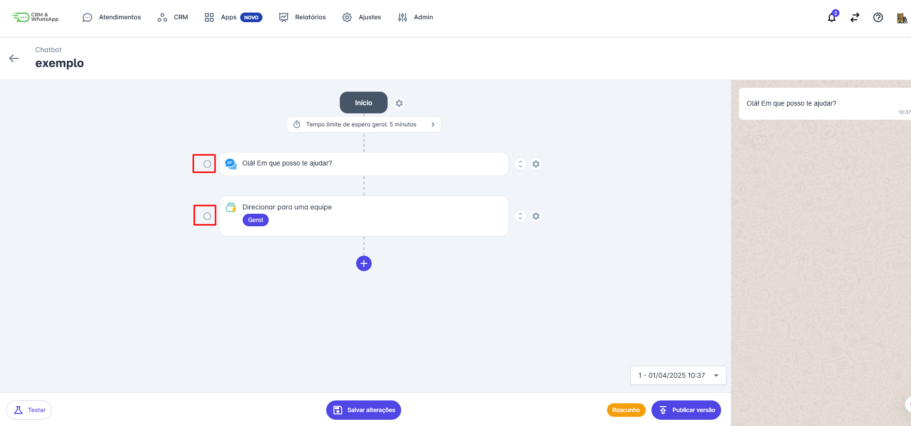

### Passo 5: Copiar Itens

Após selecionar as etapas que deseja copiar, clique em **“Copiar Itens”**.

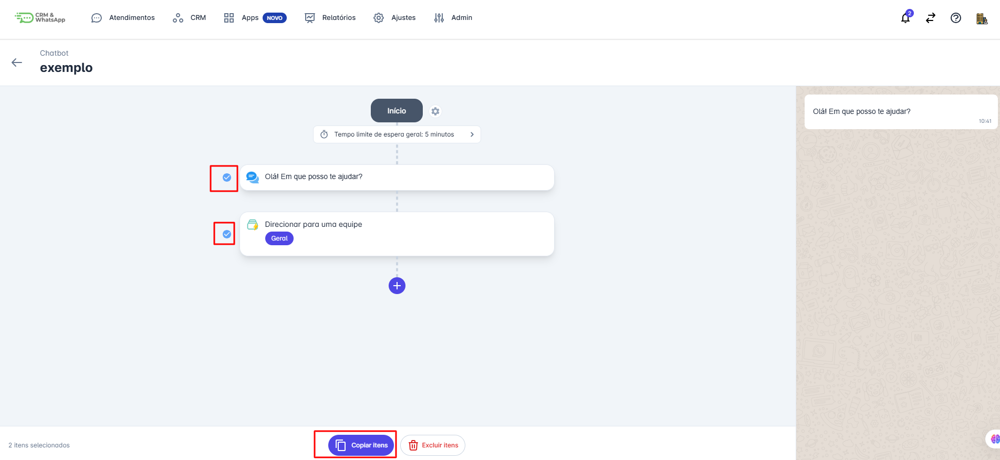

### Passo 6: Confirmação

Uma mensagem aparecerá na tela informando que os **itens foram copiados para a área de transferência.**

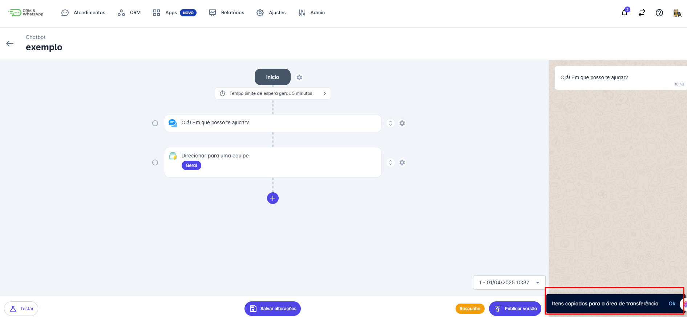

### Passo 7: Criar Novo Bot

Volte para a tela inicial do(s) Chatbot(s) e clique na opção **“+Novo”.**

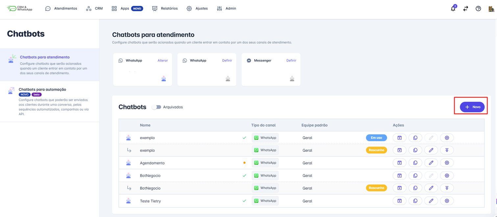

### Passo 8: Preencher Informações

Preencha as informações do novo Chatbot, como: **Nome, Tipo de Canal e Equipe**, e em seguida clique em **salvar** no final da página.

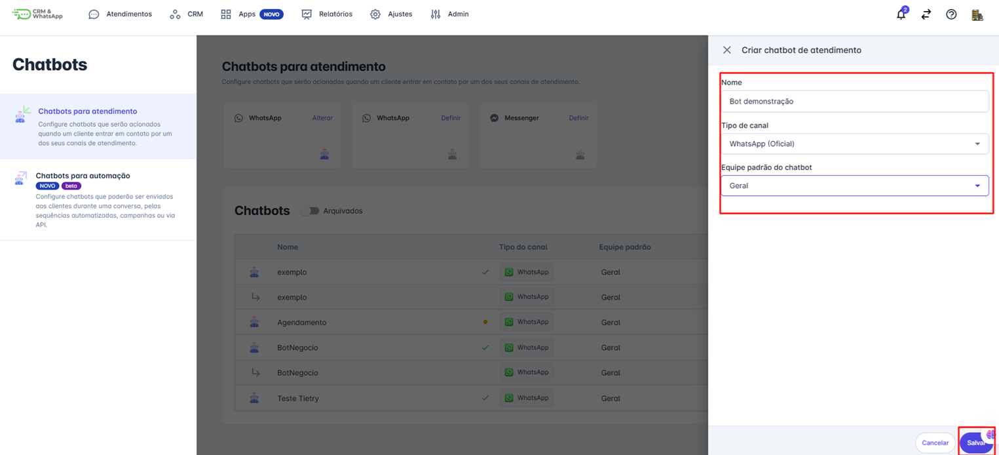

### Passo 9: Colar Itens

A tela para configurar o novo Bot se abrirá, clique no **ícone + e** clique na opção **“Colar Itens”**.

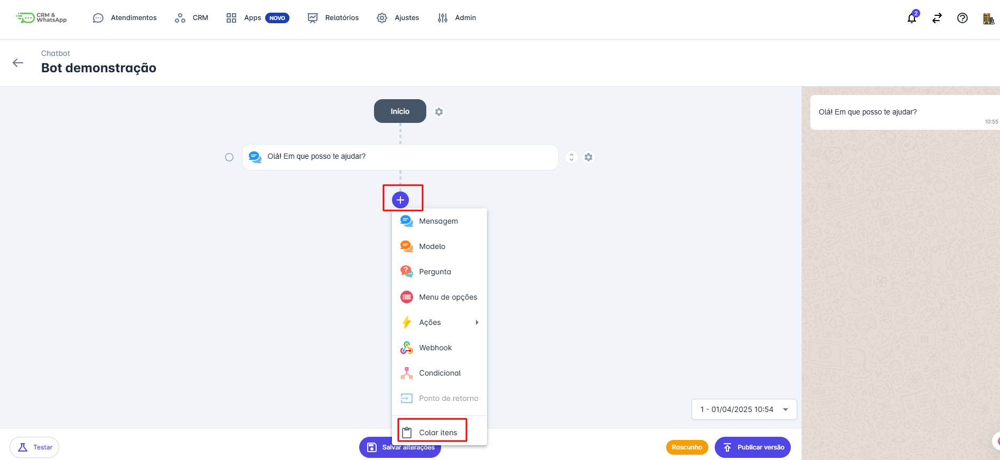

### Passo 10: Salvar Alterações

As etapas copiadas serão inseridas no novo Chatbot, você pode continuar criando e editando o chatbot. Após finalizar a estrutura do Bot, clique em **“Salvar Alterações”.**

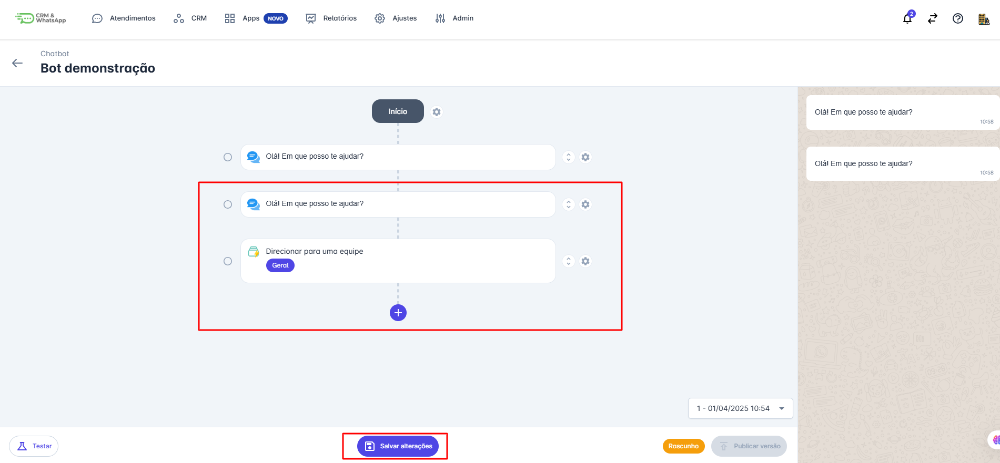

### Passo 11: Testar e Publicar

Na etapa final você pode “**Testar”** o Chatbot e/ ou **“Publicar versão”.**

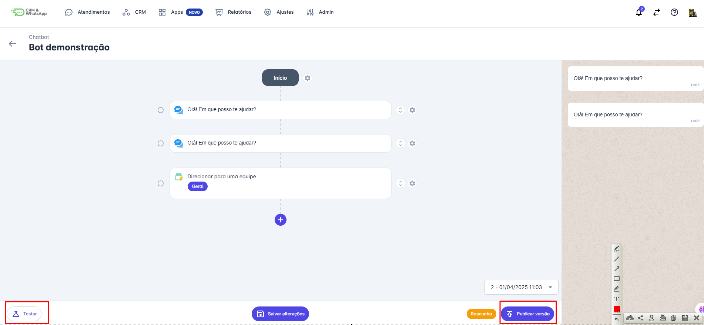

### Passo 12: Associar Canal

Após publicar a versão, o Chatbot estará disponível para ser utilizado atrelado a um canal.

Selecione o canal que deseja atrelar o Chatbot, clique em **“definir”.** Uma tela lateral se abrirá para que o Chatbot seja selecionado. Por fim clique em **“Salvar”.**

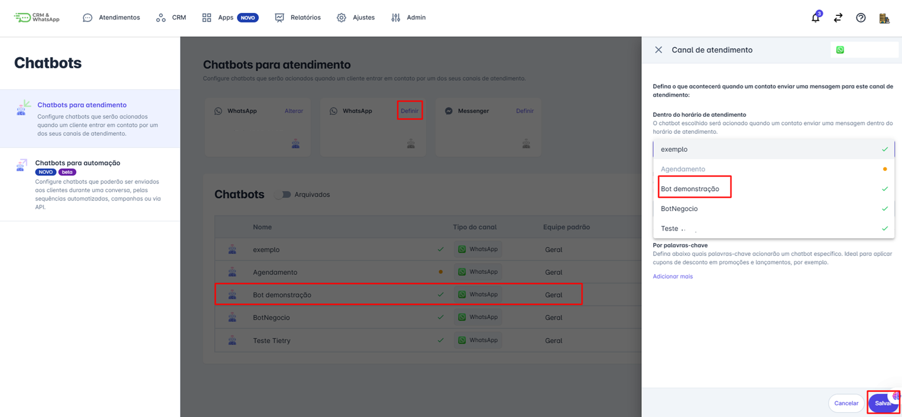

### Passo 13: Verificar Status

Após estar atrelada a um canal aparecerá a mensagem **“Em Uso”** ao lado do Chatbot.

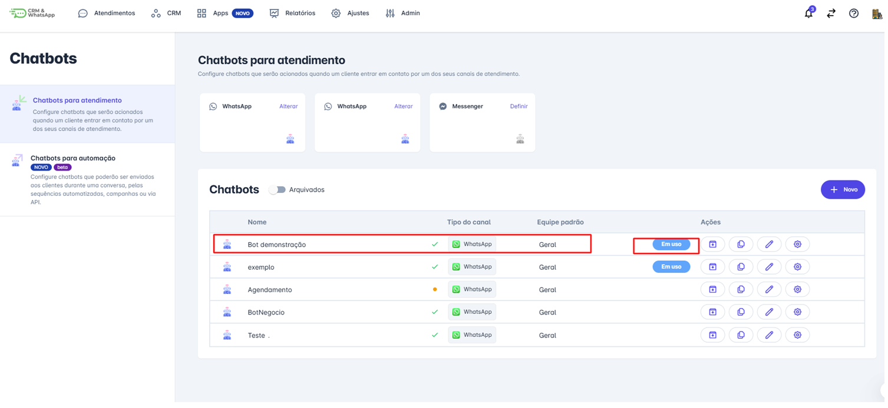

::: info Considerações Finais
* A funcionalidade de Copiar e Colar no Chatbot da **plataforma** é uma solução prática para equipes que desejam otimizar a criação e personalização de bots.
* Essa funcionalidade **reduz o tempo de configuração**, melhora a padronização dos atendimentos e facilita a adaptação de fluxos existentes para novas necessidades.
* É possível copiar fluxos de **Chatbots de automação** para criar um **Chatbot de Atendimento** e vice e versa.
:::
