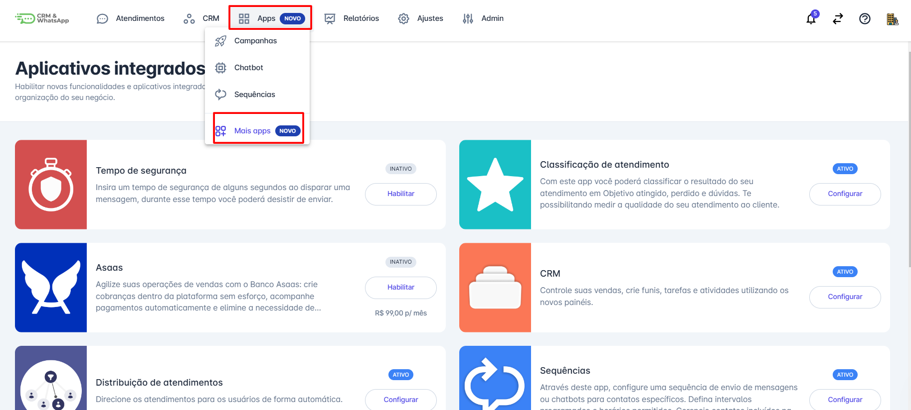
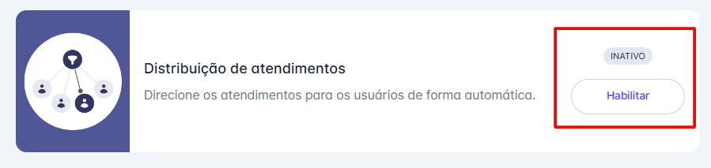
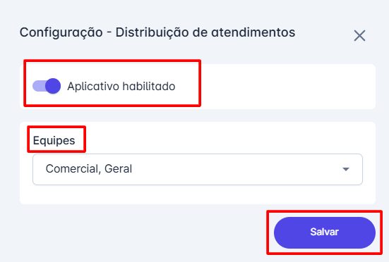
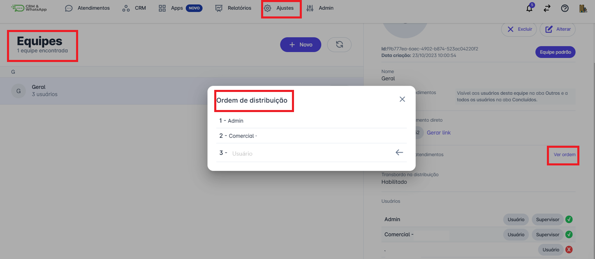
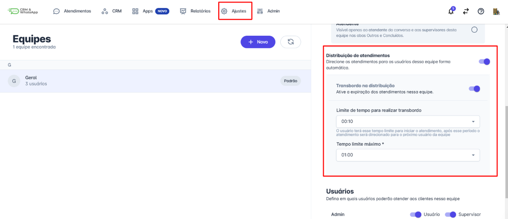
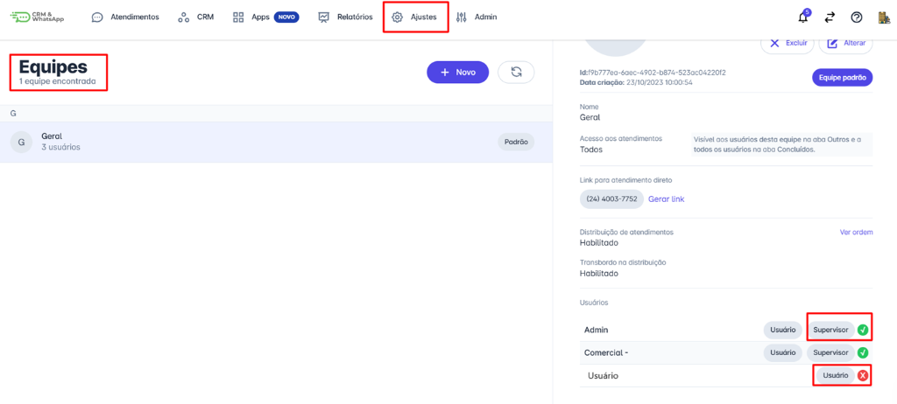
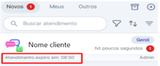

# Distribuição de atendimentos

A funcionalidade de Distribuição de Atendimento encaminha conversas para os atendentes de uma equipe de forma sequencial, garantindo que cada conversa seja direcionada a um atendente por vez, de acordo com uma ordem predefinida. Isso assegura que as interações sejam distribuídas uniformemente entre os membros da equipe, otimizando o atendimento e evitando sobrecarga de trabalho em um único atendente.

::: tip Pré-requisitos
* Ter acesso à plataforma com perfil de administrador.
* Habilitar a funcionalidade de distribuição de atendimento na plataforma.
* Ter pelo menos uma equipe cadastrada na plataforma com usuários inseridos.
:::

## Como Funciona

Quando a funcionalidade de Distribuição de Atendimento está habilitada, o encaminhamento das mensagens para os atendentes da equipe segue uma ordem específica:

* **Encaminhamento de Mensagens:** As mensagens são direcionadas para os atendentes da equipe com base na ordem de cadastro do usuário na plataforma. Esta ordem é fixa e não pode ser alterada.
* **Supervisores e Indisponíveis:** Usuários que estão associados à equipe apenas como supervisores não participam do rodízio de atendimento. Da mesma forma, usuários que estão com o status "Indisponível" também são excluídos do rodízio.
* **Fila "Novos":** As mensagens recebidas são colocadas na fila "Novos" e são visíveis apenas para o atendente designado.
* **Repasso após 10 Minutos:** Se o atendente designado não responder à mensagem dentro de 10 minutos, a conversa é automaticamente repassada para o próximo atendente disponível na ordem.
* **Disponível para Todos:** Se nenhum atendente responder à mensagem dentro do tempo configurado, a conversa se torna disponível para todos os membros da equipe, permitindo que qualquer um possa assumi-la.

## Para habilitar a funcionalidade

### Passo 1: Localizar o App

Na tela inicial, clique no menu "Apps" e localize o aplicativo "Distribuição de atendimentos".

### Passo 2: Habilitar

Clique em habilitar.

### Passo 3: Configurar Equipes

Uma tela de configuração será aberta. Ative a chave para habilitar o aplicativo e defina a(s) equipe(s) que terá(ão) a funcionalidade de distribuição de atendimentos. Finalmente, clique em "Salvar" para aplicar as configurações.

### Passo 4: Visualizar Ordem

Em Ajustes ⟶ Equipes é possível visualizar a ordem que os atendimentos são distribuídos e uma seta estará no próximo atendente que receberá o atendimento.

### Passo 5: Alterar Configurações da Equipe

É possível configurar as informações da distribuição de atendimento clicando em: Ajustes ⟶ Equipes ⟶ Selecione a equipe ⟶ Alterar

### Passo 6: Ajustes de Distribuição e Transbordo

Se abrirá a janela de ajustes, é possível desabilitar/ habilitar a função de distribuição de atendimentos e ativar a função de transbordo na distribuição, que determina um tempo de expiração dos atendimentos na equipe. O limite de tempo é entre 10 minutos e 1 hora.

### Passo 7: Configurar Disponibilidade

A disponibilidade do atendente pode ser configurada pelo administrador para evitar recebimento de mensagens durante férias ou folgas, Vá em Equipes ⟶ Selecione a Equipe que o usuário pertence ⟶ Clique no ícone "✅" junto ao nome do usuário ⟶ Selecione a opção "Indisponível".

## Visualização do Timer

Quando uma conversa é direcionada para um usuário, um timer será exibido, mostrando o tempo restante para iniciar o atendimento antes dele ser redirecionado a outro atendente.

## Considerações finais

* O transbordo é uma ferramenta que repassa o atendimento por cada atendente até que algum atendente inicie o atendimento.
* No caso de nenhum atendente iniciar o atendimento o transbordo reinicia seu fluxo até atingir o tempo limite configurado no transbordo, após atingir o tempo limite ele envia o contato a todos os atendentes da equipe.
* O Tempo Limite Máximo para a distribuição também pode ser configurado, respeitando o tempo de 10 minutos a 2 horas.
* Se estiver fora do horário de atendimento e a opção Resposta Automática estiver marcada, o cliente deverá receber uma mensagem automática que pode ser alterada conforme necessário.
* Se estiver fora do horário de atendimento, porém com Resposta Automática desmarcada, o cliente apenas ficará aguardando algum atendente iniciar o atendimento, o transbordo não acontece.
* A ordem de distribuição não é possível ser alterada, ela seguirá a ordem de criação dos usuários.
* Caso todos os usuários estejam indisponíveis o sistema deve ignorar a distribuição e lançar esse atendimento para toda equipe.
